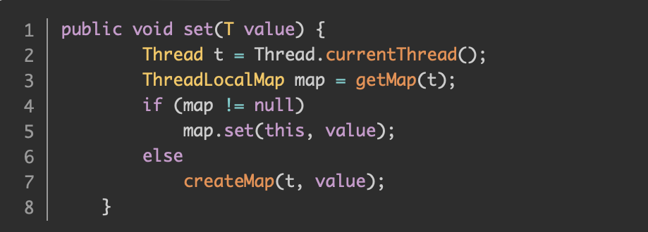
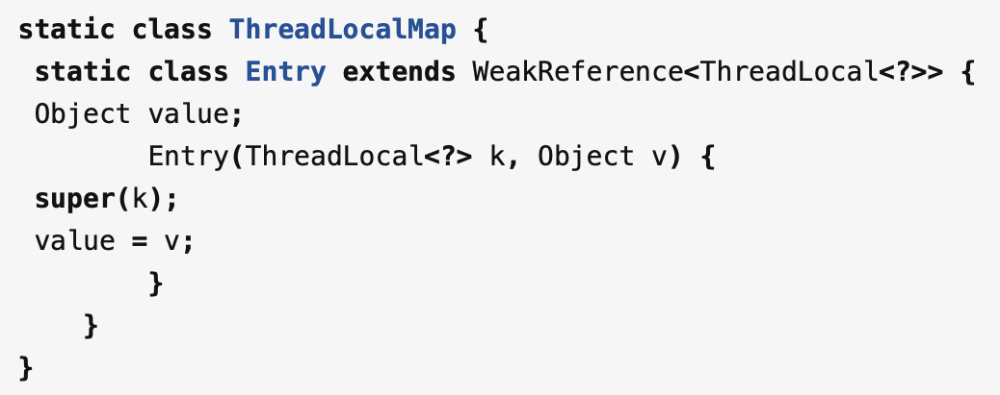

## ThreadLocal
概念：线程局部变量，一个ThreadLocal在一个线程中是共享的，在不同线程之间又是隔离的（每个线程智能看到自己线程的值）
- 源码解析：
    - set方法：通过Thread.currentThread()方法获取了当前的线程引用，并传给了getMap(Thread)方法获取一个ThreadLocalMap的实例
    - 每个Thread对象都有一个ThreadLocalMap，当创建一个ThreadLocal的时候，就会将该ThreadLocal对象添加到该Map中，其中键就是ThreadLocal，值可以是任意类型
### ThreadLocal内存泄露问题
为什么ThreadLocal会导致内存泄露
#### 前提需要了解
- 强引用：当JVM内存空间不足时，宁愿程序抛出OOM使程序异常终止也不愿回收具有强引用的存活者的对象
- 弱引用：在GC的时候，不管内存空间足不足都会回收这个对象
#### 为何会导致内存泄露？
- ThreadLocalMap中的key为ThreadLocal的弱引用：ThreadLocalMap中的Entry对象继承了WeakReference弱引用类，在Entry的构造方法中，会以key作为参数传入到父类的构造方法中
- key为弱引用，每次GC则会回收导致key为null，但是value是强引用，垃圾回收不到也无法访问到，则会导致OOM内存溢出
- 避免？不使用的时候，主动remove()移除