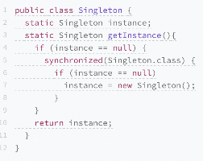

## 并发理论基础

### 并发编程bug源头
可见性、有序性、原子性问题
- 缓存导致的可见性问题：一个线程对共享变量的修改，另外一个线程能够立刻看到，称为可见性
- 线程切换带来的原子性问题：一个或者多个操作在CPU执行的过程中不被中断的特性称为原子性
- 编译优化带来的有序性问题
  - 如：双端检索机制实例化单例bean的时候，在getInstance()方法中，先判断instance是否为空，再加锁，再判断一次是否为空，再去实例化 
  - 有序性问题描述：当有A,B两个线程同时访问，同时判断实例为空，其中一个线程获得锁，进入方法内实例化；另一个线程等待A线程执行完，执行完后获得锁对象，再次判断不为空，不会再去实例化
    - 我们以为的流程：
      1. 分配一块内存M
      2. 在内存M上初始化instance
      3. 然后把M的地址赋值给instance
    - 然而JMM内存优化后的是：
      1. 分配一块内存M
      2. 把M的地址赋值给instance
      3. 在内存M上初始化instance
    - 解决：增加volatile禁止指令重排序
### Java内存模型，如何解决可见性、有序性
- 导致可见性原因是缓存优化，导致有序性是编译器优化，那最直接的解决方案就是禁用缓存优化，禁用编译器优化；但是，会有性能问题
- 按需禁用缓存优化编译器优化
- Java内存模型规范了JVM如何提供按需禁用缓存以及编译优化的方法
  - volatile
  - synchronized
  - final
  - 六项Happens-before规则：前面一个操作的结果对后续是可见的
    1. 对一个volatile变量的写操作相对于后续对这个volatile变量的读操作可见
    2. 传递性：如果A happens-before B，B happens-before C,那么A happens-before C
    3. 管程中锁的规则：对一个锁的解锁Happens-before于后续对这个锁的加锁（管程：通用的同步原语，Java中synchronized是对管程的实现）

### 原子性问题解决，互斥锁
互斥：同一个时刻只有一个线程在执行
- synchronized关键字：修饰静态方法，锁住的是当前Class对象；修饰非静态方法，锁定的是当前实例对象this
- 可以使用一把锁保护多个资源，但是不可以使用多把锁保护同一个资源
- 保护没有关联关系的多个资源
  - 如电影票和球场门票
  - 用同一把锁保护多个资源会编程多个资源串行化
  - 优化：细粒度锁，用不同的锁保护资源进行精细化管理，以优化性能
- 保护有关联关系的多个资源：选择粒度更大的锁，这个锁能覆盖所有相关的资源
- 原子性本质：多个资源间有一致性的要求，操作的中间状态对外不可见

### 死锁，怎么办
细粒度锁虽然可以优化性能，但是代价就是可能会导致死锁。一组互相竞争资源的线程因互相等待，导致"永久"阻塞的现象
#### 死锁发生条件
1. 互斥，共享资源x和y只能被一个线程占用
2. 占有且等待，线程T1已经取得共享资源x，在等待共享资源y的时候，不释放共享资源x。
   - 破坏：一次性申请所有资源，就不存在等待了，如增加管理员
3. 不可抢占：其他线程不能强行抢占线程T1占有的资源。
   - 破坏：能够主动释放它占有的资源，synchronized做不到，因为如果申请不到会阻塞，可以使用juc下的Lock
4. 循环等待：线程T1等待线程T2占有的资源，线程T2在等待线程T1占有的资源，就是循环等待
   - 破坏：需要对资源进行排序，然后按顺序申请资源

### 用等待-通知机制优化循环等待(线程间协作方式)

