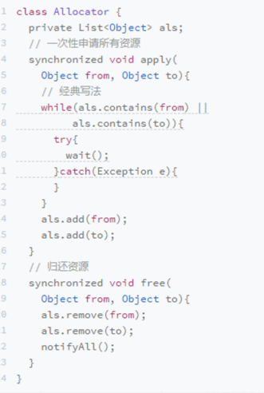
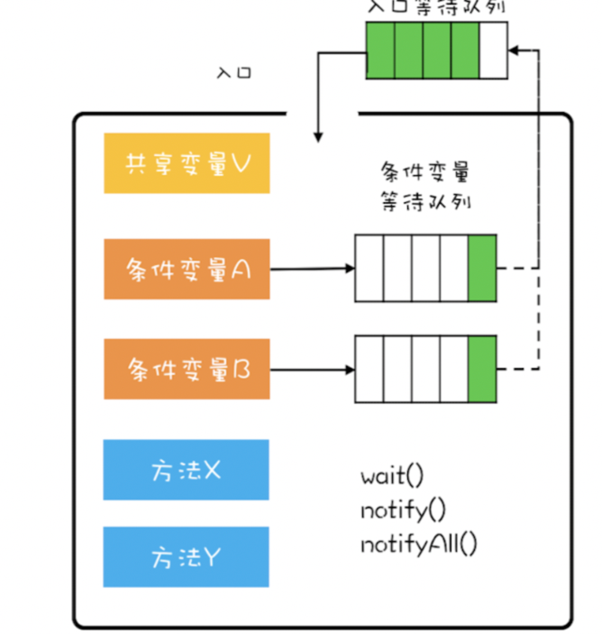
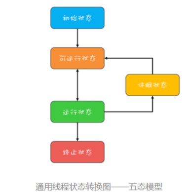
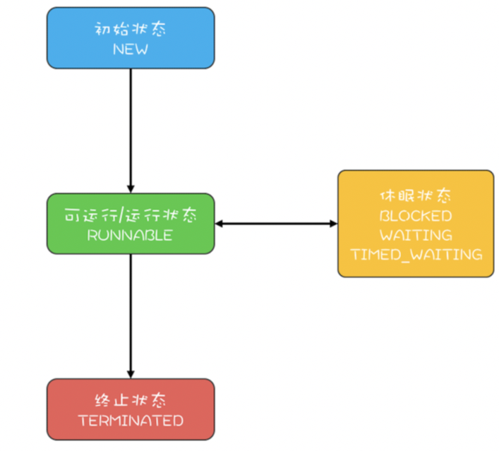

## 并发理论基础

### 并发编程bug源头

可见性、有序性、原子性问题

- 缓存导致的可见性问题：一个线程对共享变量的修改，另外一个线程能够立刻看到，称为可见性
- 线程切换带来的原子性问题：一个或者多个操作在CPU执行的过程中不被中断的特性称为原子性
- 编译优化带来的有序性问题
    - 如：双端检索机制实例化单例bean的时候，在getInstance()
      方法中，先判断instance是否为空，再加锁，再判断一次是否为空，再去实例化
    - 有序性问题描述：当有A,B两个线程同时访问，同时判断实例为空，其中一个线程获得锁，进入方法内实例化；另一个线程等待A线程执行完，执行完后获得锁对象，再次判断不为空，不会再去实例化
        - 我们以为的流程：
            1. 分配一块内存M
            2. 在内存M上初始化instance
            3. 然后把M的地址赋值给instance
        - 然而JMM内存优化后的是：
            1. 分配一块内存M
            2. 把M的地址赋值给instance
            3. 在内存M上初始化instance
        - 解决：增加volatile禁止指令重排序

### Java内存模型，如何解决可见性、有序性

- 导致可见性原因是缓存优化，导致有序性是编译器优化，那最直接的解决方案就是禁用缓存优化，禁用编译器优化；但是，会有性能问题
- 按需禁用缓存优化编译器优化
- Java内存模型规范了JVM如何提供按需禁用缓存以及编译优化的方法
    - volatile
    - synchronized
    - final
    - 六项Happens-before规则：前面一个操作的结果对后续是可见的
        1. 对一个volatile变量的写操作相对于后续对这个volatile变量的读操作可见
        2. 传递性：如果A happens-before B，B happens-before C,那么A happens-before C
        3. 管程中锁的规则：对一个锁的解锁Happens-before于后续对这个锁的加锁（管程：通用的同步原语，Java中synchronized是对管程的实现）

### 原子性问题解决，互斥锁

互斥：同一个时刻只有一个线程在执行

- synchronized关键字：修饰静态方法，锁住的是当前Class对象；修饰非静态方法，锁定的是当前实例对象this
- 可以使用一把锁保护多个资源，但是不可以使用多把锁保护同一个资源
- 保护没有关联关系的多个资源
    - 如电影票和球场门票
    - 用同一把锁保护多个资源会编程多个资源串行化
    - 优化：细粒度锁，用不同的锁保护资源进行精细化管理，以优化性能
- 保护有关联关系的多个资源：选择粒度更大的锁，这个锁能覆盖所有相关的资源
- 原子性本质：多个资源间有一致性的要求，操作的中间状态对外不可见

### 死锁，怎么办

细粒度锁虽然可以优化性能，但是代价就是可能会导致死锁。一组互相竞争资源的线程因互相等待，导致"永久"阻塞的现象

#### 死锁发生条件

1. 互斥，共享资源x和y只能被一个线程占用
2. 占有且等待，线程T1已经取得共享资源x，在等待共享资源y的时候，不释放共享资源x。
    - 破坏：一次性申请所有资源，就不存在等待了，如增加管理员
3. 不可抢占：其他线程不能强行抢占线程T1占有的资源。
    - 破坏：能够主动释放它占有的资源，synchronized做不到，因为如果申请不到会阻塞，可以使用juc下的Lock
4. 循环等待：线程T1等待线程T2占有的资源，线程T2在等待线程T1占有的资源，就是循环等待
    - 破坏：需要对资源进行排序，然后按顺序申请资源

### 用等待-通知机制优化循环等待(线程间协作方式)

等待-通知机制：线程首先获取互斥锁，当线程要求的条件不满足时，就释放互斥锁，进入等待状态；当要求的条件满足时，通知等待的线程，重新获取互斥锁

#### 用synchronized实现等待通知机制：wait()、notify()、notifyAll()

 
尽量使用notifyAll()而不是notify()，因为notify()是随机通知等待队列中的一个线程，而notifyAll()是通知等待队列中的所有线程。(notify()风险在于等待队列中的某个线程可能永远不会被通知到)

#### wait()方法和sleep()区别

- wait()方法会释放"锁标识"，在synchronized代码块内别的线程可以访问到共享资源
- sleep()方法需要指定等待事件，它可以让当前正在执行的线程在指定的时间内暂停执行，进入阻塞状态，不会释放"锁标识"，该方法可以让其他同优先级或者高优先级的线程得到执行的机会

### 安全性、活跃性以及性能问题

#### 安全性问题

1. 本质：正确性，程序按照我们的期望执行，线程安全
2. 如何解决？

- 避免原子性问题，可见性问题，有序性问题
- 互斥

3. 什么情况下才需要考虑？

- 存在共享数据并且数据会发生变化，通俗讲就是多个线程会同时读写同一数据

#### 活跃性问题

操作无法执行下去，如死锁、活锁、饥饿

- 死锁：线程互相等待，一直等下去，就永久阻塞了
- 活锁：两人互相谦让，先走，a以为b不走刚准备走，b也以为a不走刚准备走，就又会相撞
    - 解决：每个人增加一个随机等待时间，相当于每个线程等待时间不同，相撞的概率就会降低。Raft知名的分布式一致性算法
- 饥饿：某线程因无法访问所需资源而无法执行下去，线程优先级不均，则有可能某个线程一直无法获得调度；持有锁的线程，如果执行时间较长，也有可能导致饥饿
    - 解决：唤醒线程采取类似notifyAll()的方式

#### 性能问题

过度使用锁，导致串行化范围过大

- 方案层解决
    - 使用无锁的算法或者数据结构
        - 如线程本地存储ThreadLocal
        - 写时复制copy-on-write
        - 乐观锁
        - Java并发包内的原子类也是无锁的数据结构
    - 减少锁持有的时间
        - 互斥锁本质将并行的程序串行化，所以增加并行的解决方案即是减少持有锁的时间
        - 细粒度锁
        - java并发包内的ConcurrentHashMap，分段锁技术
        - 读写锁，读无锁，写互斥
- 指标
    - 吞吐量：单位时间内能处理的请求数量。吞吐量越高、性能越好
    - 延迟：发出请求收到响应的时间。延迟越小、性能越好
    - 并发量：能同时处理的请求数量，并发量增加，延迟也会增加

### 管程，并发编程的万能钥匙

管程和信号量是等价的，用管程能实现信号量，能用信号量实现管程，管程就是管理共享变量以及对共享变量的操作过程，让他们支持并发

- MESA模型解决互斥问题：将共享变量及对共享变量的操作统一封装起来
- MESA模型解决同步问题 
  
- 管程就是一个对象监视器，任何线程想要访问该资源，都需要先进入监控范围。进入之后，接受检查，不符合条件，继续等待，直到被通知，然后继续进入监视器 

### Java线程的生命周期

五态模型/六种状态

#### 通用的线程生命周期

- 五态模型
    - 初始状态：线程已被创建，但是还不允许分配CPU执行。编程语言特有，在编程预言层面被创建，而在操作系统内还没有创建
    - 可运行状态：线程可以分配CPU执行，操作系统线程已被创建
    - 运行状态：有空闲CPU的时候，操作系统会将其分配给一个可运行状态的线程，此时此线程处于运行状态
    - 休眠状态：如果运行状态的线程调用阻塞API或者某个等待某个事件，那线程状态就会变为休眠状态。休眠状态的线程会释放CPU使用权
    - 终止状态：线程执行完，或者执行异常就会进入终止状态，也意味着线程生命周期的结束

#### Java线程的生命周期

六种状态，简化为三种 

- New初始化
- Runable可运行/运行状态
- Blocked阻塞状态
- Waiting无时限等待状态
- TIMED_WAITING有时限等待状态
- Terminated终止状态

#### Java线程状态转换

- RUNABLE转BLOCKED
    - 一种场景，synchronized隐式锁
- RUNABLE转WAITING
    - 场景一：获得synchronized隐式锁的线程，调用wait()方法
    - 场景二：调用无参方法Thread.join()，如在b线程中A.join()A线程join，则会B线程转到WAITING状态，同步等待A线程执行完毕，再由WAITING转为RUNABLE
    - 场景三：调用LockSupport.park()方法线程进入WAITING状态，再调用LockSupport.unpark()方法可以唤醒线程进入RUNABLE状态
- RUNABLE与TIMED_WAITING状态转换
    - 调用带超时参数的Thread.sleep(long millis)方法
    - 调用带超时参数的Thread.join(long millis)
    - 获得synchronized隐式锁的线程，调用wait(long timeout)方法
    - 调用带超时参数的LockSupport.parkNanos(Object blocker,long deadline)
    - 调用带超时参数的LockSupport.parkUntil(long deadline)
- NEW到RUNABLE
    - 继承Thread对象，重写run()方法：调用线程对象的start()方法
    - 实现Runable接口，重写run()方法：调用线程对象的start()方法
- RUNABLE到TERMINATED
    - run()方法后会自动进入TERMINTED
