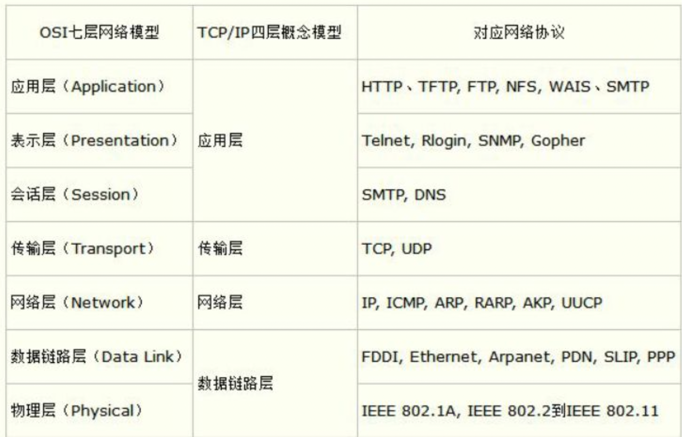

## OSI七层模型

1. 来源 
   OSI（Open System Interconnect），即开放式系统互联。 一般都叫OSI参考模型，是ISO（国际标准化组织）组织在1985年研究的网络互连模型。
2. 七层模型划分 
   ISO开放互联系统参考模型：（下3层主要任务数据通信，上3层主要任务数据处理）

- 物理层：
    - 参考模型的最低层
    - 利用传输介质为数据链路层提供物理连接，实现比特流的传输
    - 物理层常用的传输介质：集线器、中继器、调制解调器、网线、双绞线、同轴电缆
- 数据链路层：
    - 介质访问控制（MAC）和逻辑链路控制（LLC）
    - 通过各种控制协议，将有差错的物理信道变为无差错的、能可靠传输数据帧的数据链路
    - 通过差错控制，流量控制，使有差错的物理线路变为无差错的数据链路，即提供可靠的通过物理介质传输数据的方法
- 网络层
    - 通信子网的最高一层，在下两层的基础上向资源子网提供服务
    - IP选址，路由选择
    - 通过路由选择算法，为报文或分组通过通信子网选择最适当的路径
        - 路由算法：当源节点和目的节点之间存在多条路径时，本层可以根据路由算法，通过网络为数据分组选择最佳路径，并将信息从最合适的路径由发送端传送到接收端
    - 数据链路层是解决同一网络内节点之间的通信，而网络层主要解决不同子网间的通信
    - IP协议层
- 传输层
    - 建立，管理，维护端到端的连接
    - 该层是通信子网和资源子网接口和桥梁，起到承上启下的作用
    - 该层常见的协议有TCP/IP中的TCP协议、Novell网络中的SPX协议和微软的NetBIOS/NetBEUI协议
    - 提供建立、维护和拆除传输连接的功能。传输层在网络层的基础上为高层提供“面向连接”和“面向无连接”的两种服务
    - 用户数据协议 UDP（User Datagram Protocol）--提供无连接的，尽最大努力的数据传输服务（不保证数据传输的可靠性）
- 会话层
    - 组织和协调两个会话进程之间的通信，并对数据交换进行管理和维护。
    - 当建立会话时，用户必须提供他们想要连接的远程地址。而这些地址与MAC（介质访问控制子层）地址或网络层的逻辑地址不同，它们是为用户专门设计的，更便于用户记忆。域名（DN）就是一种网络上使用的远程地址
- 表示层
    - 数据格式转换，数据加密
    - 对来自应用层的命令和数据进行解释，对各种语法赋予相应的含义，并按照一定的格式传送给会话层。
    - 压缩和解压缩：为了减少数据的传输量，这一层还负责数据的压缩与恢复
- 应用层
    - 参考模型的最高层
    - 直接向用户提供服务，完成用户希望在网络上完成的各种工作
    -
    对于不同的网络应用需要不同的应用层协议，（HTTP，HTTPS，FTP，POP3、SMTP）文件服务、目录服务、文件传输服务（FTP）、远程登录服务（Telnet）、电子邮件服务（E-mail）、打印服务、安全服务、网络管理服务、数据库服务

如图，总结 
