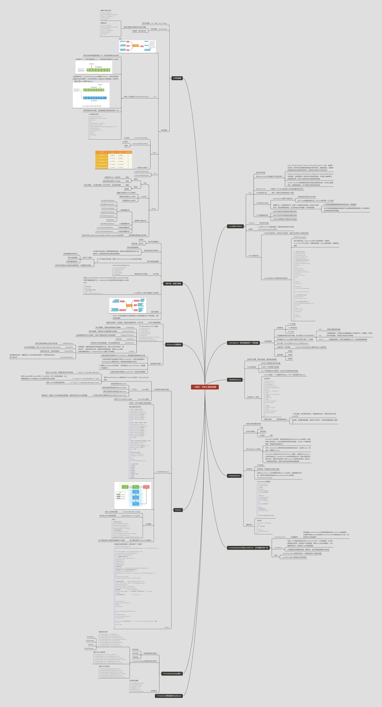

# 并发工具类

## Lock和Condition

condition,解决同步问题

共同点：Lock和Condition实现的管程，线程等待和通知可以调用await(),signal(),signalAll()方法

### Lock

解决互斥问题

#### 弥补synchorinzed不能破坏不可抢占条件

1. void lockInterruptibly()（throws InterruptedException）方法，能够响应中断，即在我们给阻塞的线程发送中断信号时，能够唤醒它，那阻塞的线程就有机会释放持有的锁，这样就可以破坏不可抢占条件
2. boolean tryLock(long time,TimeUnit unit)(throws InterruptedException)
   支持超时，如果线程在一段时间内没有获取到锁，不是进入阻塞状态，而是返回异常，那这个线程也有机会释放持有的锁
3. boolean tryLock()非阻塞的获取锁,如果尝试获取锁失败，并不进入阻塞状态，而是直接返回，这个线程也会释放持有的锁

#### ReentrantLock

可重入锁（线程可以重复获取同一把锁）， 内部有一个volatile修饰的state成员变量保证可见性

ReentrantLock有两个构造方法

- 无参构造方法默认非公平锁
- 有一个fair参数的构造方法，传入true就构造一个公平锁

锁都对应一个线程等待队列，如果一个线程没有获得锁，就会放入等待队列，当有线程释放锁时，会从等待队列中唤醒一个等待的线程

- 公平锁的唤醒策略就是谁等待的时间长，就唤醒谁
- 非公平锁的唤醒策略多线程模式不会按照线程顺序获取锁，有可能等待时间短的线程先被唤醒

### 三个用锁最佳实践

1. 永远只在更新对象的成员变量时加锁
2. 永远只在访问可变的成员变量时加锁
3. 永远不在调用其它对象的方法时加锁

## Semaphore：如何快速实现一个限流器

信号量模型：一个计数器、一个等待队列、三个方法

### 模型

计数器和等待队列对外透明，所以使用三个方法对外访问

1. init()设置计数器的初始值
2. up()计数器的值加1；如果此时计数器的值小于或者等于0，则唤醒一个等待队列中的线程，并将其从等待队列中移除
3. down()计数器的值减1，如果计数器的值小于0，则当前线程被阻塞

信号量的down(),up()操作也被称为P操作V操作，PV原语

在Java里，down()对应acquire(),up()对应release()

**使用场景：**
> 连接池、对象池、线程池

## ReadWriteLock

读多写少场景，缓存元数据，缓存基础数据等

### 三大基本原则

1. 允许多个线程同时读共享变量
2. 只允许一个线程写共享变量
3. 当一个写线程在执行写操作，此时禁止读线程读共享变量

### 快速实现一个缓存

Cache工具类，一个读缓存方法get()，另一个是写缓存方法put()。

```java
class Cache<K, V> {
    final Map<K, V> m =
            new HashMap<>();
    final ReadWriteLock rwl =
            new ReentrantReadWriteLock();
    // 读锁
    final Lock r = rwl.readLock();
    // 写锁
    final Lock w = rwl.writeLock();

    // 读缓存
    V get(K key) {
        r.lock();
        try {
            return m.get(key);
        } finally {
            r.unlock();
        }
    }

    // 写缓存
    V put(K key, V value) {
        w.lock();
        try {
            return m.put(key, v);
        } finally {
            w.unlock();
        }
    }
}
```

缓存数据初始化

1. 一次性加载：如在程序启动时，将数据查询出来，调用示例方法中的put()方法
2. 懒加载：在需要用到数据，缓存内不存在时，再去查询数据库放入缓存中

## StampedLock

性能比读写锁更快的锁。支持三种模式：写锁、悲观读锁、乐观读（无锁）

### 与ReadWriteLock区别

- StampedLock的写锁、悲观读锁的语义和ReadWriteLock的写锁、读锁的语义非常类似，允许多线程同时获取悲观读锁，只允许一个线程获取写锁，写锁和悲观读锁互斥
- 不同：StampedLock里写锁和悲观读锁加锁成功后，会返回stamp；解锁时，需要传入stamp
- StampedLock性能之所以比ReadWriteLock要好，
  关键是StampedLock支持乐观读方式。ReadWriteLock支持多线程同时读，但是与写操作时候互斥的，写操作会被阻塞；而StampedLock提供的乐观读，是允许一个线程获取写锁的，就是不是所有的写操作都被阻塞

### 注意事项

- 不支持重入
- 悲观读锁、写锁都不支持条件变量
- 使用StampedLock一定不要调用中断interrupt()操作，如果需要支持中断，使用可中断的悲观读锁readLockInterruptibly()和写锁writeLockInterruptibly()

### 模板代码

读模板

```java
final StampedLock sl=
        new StampedLock();
// 乐观读
        long stamp=
        sl.tryOptimisticRead();
// 读入方法局部变量
        ......
// 校验stamp
        if(!sl.validate(stamp)){
        // 升级为悲观读锁
        stamp=sl.readLock();
        try{
        // 读入方法局部变量
        .....
        }finally{
        //释放悲观读锁
        sl.unlockRead(stamp);
        }
        }
//使用方法局部变量执行业务操作
        ......
```

写 代码

```java
long stamp=sl.writeLock();
        try{
        // 写共享变量
        ......
        }finally{
        sl.unlockWrite(stamp);
        }
```

## CountDownLatch和CyclicBarrier：让多线程步调一致

CountDownLatch计数器操作

声明创建CountDownLatch,在线程调用时实现countDown()减减操作，主线程中使用await()方法等待CountDownLatch内的初始化大小为0，再继续执行主线城操作

### CyclicBarrier

1. 创建一个计数器初始值为N的CyclicBarieer,传入一个回调函数，当计数器减到0的时候，会调用这个回调函数。调用await()将计数器减1，当计数器变成0时，会调用barrier的回调函数
2. 计数器有自动重置的功能，减到0时，会自动重置设置的N初始值

### 区别

1. CountDownLatch主要用于解决一个线程等待多个线程的场景
2. CyclicBarrier是一组线程之间互相等待

## 并发容器

## 原子类：无锁工具类

## Executor与线程池

## Future

## CompletionStage接口

---

