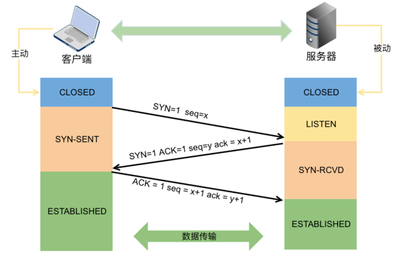
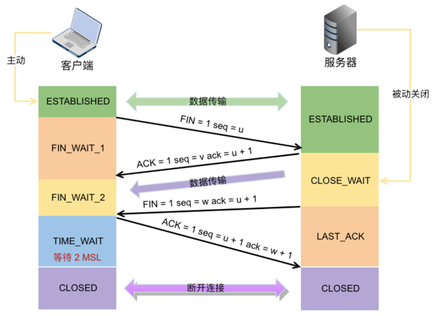

## TCP三次握手、四次挥手

TCP报文格式比较重要的字段有： 

1. 序号（sequence number）：Seq序号，占32位，用来标识从TCP源端向目的端发送的字节流，发起方发送数据时对此进行标记
2. 确认号（acknowledgement number）：Ack序号，占32位，只有ACK标志位为1时，确认序号字段才有效，Ack=Seq+1
3. 标志位（Flags）：共6个，即URG、ACK、PSH、RST、SYN、FIN等。具体含义如下：
    - URG：紧急指针（urgent pointer）有效
    - ACK：确认序号有效
    - PSH：接收方应该尽快将这个报文交给应用层
    - RST：重置连接
    - SYN：发起一个新连接
    - FIN：释放一个连接

### TCP三次握手（Three-Way Handshake）

三次握手==TCP建立连接，这个连接必须是一方主动打开，另一方被动打开，如图（来源于网络） 

1. 客户端向服务器端发送一段TCP报文:SYN=1,seq=x
    - 标记位为SYN，表示“请求建立新连接”;
    - 序号为Seq=X（X一般为1）
    - 随后客户端进入SYN-SENT阶段
2. 服务器端接收到来自客户端的TCP报文之后，结束LISTEN阶段。并返回一段TCP报文，其中：SYN=1,ACK=1,seq=y,ack=x+1
    - 标志位为SYN和ACK，表示“确认客户端的报文Seq序号有效，服务器能正常接收客户端发送的数据，并同意创建新连接”
    - 序号为seq=y
    - 确认号为Ack=x+1，表示收到客户端的序号Seq并将其值加1作为自己确认号Ack的值；随后服务器端进入SYN-RCVD阶段
3. 客户端接收到来自服务器端的确认收到数据的TCP报文之后，明确了从客户端到服务器的数据传输是正常的，结束SYN-SENT阶段。并返回最后一段TCP报文。其中：ACK=1,seq=x+1,ack=y+1
    - 标志位为ACK，表示“确认收到服务器端同意连接的信号”
    - 序号为Seq=x+1，表示收到服务器端的确认号Ack，并将其值作为自己的序号值
    - 确认号为Ack=y+1，表示收到服务器端序号Seq，并将其值加1作为自己的确认号Ack的值
    - 随后客户端进入ESTABLISHED阶段
4. 服务器收到来自客户端的“确认收到服务器数据”的TCP报文之后，明确了从服务器到客户端的数据传输是正常的。结束SYN-SENT阶段，进入ESTABLISHED阶段

#### 为什么要三次握手

目的：双方确认自己与对方的发送与接收是正常的，建立可靠的通信信道

- 第一次握手：Client什么都不能确认;Server端接收正常，对方发送正常
- 第二次握手：Client确定自己发送正常，接收正常，对方发送正常，接收正常;Server确认对方发送正常，自己接收正常
- 第三次握手：Client确定自己发送正常，接收正常，对方发送正常，接收正常;Server确认对方发送正常，自己接收正常，自己发送正常，对方接收正常

#### 三次握手可以携带数据吗

- 第三次可以，前两次不可以，如果有人要恶意攻击服务器，那他每次都在第一次握手中的 SYN 报文中放入大量的数据，疯狂着重复发 SYN 报文，这会让服务器花费大量的内存空间来缓存这些报文，这样服务器就更容易被攻击

### TCP四次挥手（Four-Way Wavehand）

四次挥手即TCP连接的释放(解除)。连接的释放必须是一方主动释放，另一方被动释放 

1. 首先客户端想要释放连接，向服务器端发送一段TCP报文，其中：FIN=1,seq=u
    - 标记位为FIN，表示“请求释放连接“
    - 序号为Seq=U
    - 随后客户端进入FIN-WAIT-1阶段，即半关闭阶段。并且停止在客户端到服务器端方向上发送数据，但是客户端仍然能接收从服务器端传输过来的数据。
2. 服务器端接收到从客户端发出的TCP报文之后，确认了客户端想要释放连接，随后服务器端结束ESTABLISHED阶段，进入CLOSE-WAIT阶段（半关闭状态）并返回一段TCP报文,其中：ACK=1,seq=v,ack=u+1
    - 标记位为ACK，表示“接收到客户端发送的释放连接的请求”
    - 序号为Seq=v
    - 确认号为Ack=U+1，表示是在收到客户端报文的基础上，将其序号Seq值加1作为本段报文确认号Ack的值
    - 随后服务器端开始准备释放服务器端到客户端方向上的连接
    - 客户端收到从服务器端发出的TCP报文之后，确认了服务器收到了客户端发出的释放连接请求，随后客户端结束FIN-WAIT-1阶段，进入FIN-WAIT-2阶段
3. 服务器端自从发出ACK确认报文之后，经过CLOSED-WAIT阶段，做好了释放服务器端到客户端方向上的连接准备，再次向客户端发出一段TCP报文，其中：FIN=1,ACK=1,seq=w,ack=u+1
    - 标记位为FIN，ACK，表示“已经准备好释放连接了”
    - 序号为Seq=W
    - 确认号为Ack=U+1；表示是在收到客户端报文的基础上，将其序号Seq值加1作为本段报文确认号Ack的值
    - 随后服务器端结束CLOSE-WAIT阶段，进入LAST-ACK阶段。并且停止在服务器端到客户端的方向上发送数据，但是服务器端仍然能够接收从客户端传输过来的数据。
4. 客户端收到从服务器端发出的TCP报文，确认了服务器端已做好释放连接的准备，结束FIN-WAIT-2阶段，进入TIME-WAIT阶段，并向服务器端发送一段报文，其中：ACK=1,seq=u+1,ack=w+1
    - 标记位为ACK，表示“接收到服务器准备好释放连接的信号”
    - 序号为Seq=U+1；表示是在收到了服务器端报文的基础上，将其确认号Ack值作为本段报文序号的值
    - 确认号为Ack=W+1；表示是在收到了服务器端报文的基础上，将其序号Seq值作为本段报文确认号的值
    - 随后客户端开始在TIME-WAIT阶段等待2MSL
    - 服务器端收到从客户端发出的TCP报文之后结束LAST-ACK阶段，进入CLOSED阶段。由此正式确认关闭服务器端到客户端方向上的连接;客户端等待完2MSL之后，结束TIME-WAIT阶段，进入CLOSED阶段，由此完成"
      四次挥手"

#### 为什么要等待2MSL

MSL（Maximum Segment Lifetime），TCP允许不同的实现可以设置不同的MSL值。

- 保证客户端发送的最后一个ACK报文能够到达服务器，因为这个ACK报文可能丢失，站在服务器的角度看来，我已经发送了FIN+ACK报文请求断开了，客户端还没有给我回应，应该是我发送的请求断开报文它没有收到，于是服务器又会重新发送一次，而客户端就能在这个2MSL时间段内收到这个重传的报文，接着给出回应报文，并且会重启2MSL计时器。
- 防止类似与“三次握手”中提到了的“已经失效的连接请求报文段”出现在本连接中

#### 如果已建立了连接，客户端故障了如何处理

TCP还设有一个保活计时器，显然，客户端如果出现故障，服务器不能一直等下去，白白浪费资源。服务器每收到一次客户端的请求后都会重新复位这个计时器，时间通常是设置为2小时，若两小时还没有收到客户端的任何数据，服务器就会发送一个探测报文段，以后每隔75秒发送一次。若一连发送10个探测报文仍然没反应，服务器就认为客户端出了故障，接着就关闭连接

## TCP,UDP协议的区别

- TCP
    - 优点： 可靠，稳定 TCP的可靠体现在TCP在传递数据之前，会有三次握手来建立连接，而且在数据传递时，有确认、窗口、重传、拥塞控制机制，在数据传完后，还会断开连接用来节约系统资源。
    - 缺点：慢，效率低，占用系统资源高，易被攻击，因为TCP有确认机制、三次握手机制，这些也导致TCP容易被人利用，实现DOS、DDOS、CC等攻击
    - 应用：浏览器，用的HTTP FlashFXP，用的FTP Outlook，用的POP、SMTP Putty，用的Telnet、SSH QQ文件传输
- UDP:
    - 优点： UDP是一个无状态的传输协议，所以它在传递数据时非常快
    - 缺点：网络质量不好，就会很容易丢包，不可靠，不稳定
    - 应用：QQ语音 QQ视频 TFTP 直播
- 总结：
    1. TCP面向连接（如打电话要先拨号建立连接）;UDP是无连接的，即发送数据之前不需要建立连接
    2. 每一条TCP连接只能是点到点的;UDP支持一对一，一对多，多对一和多对多的交互通信
    3. TCP首部开销20字节;UDP的首部开销小，只有8个字节
    4. TCP的逻辑通信信道是全双工的可靠信道，UDP则是不可靠信道

    