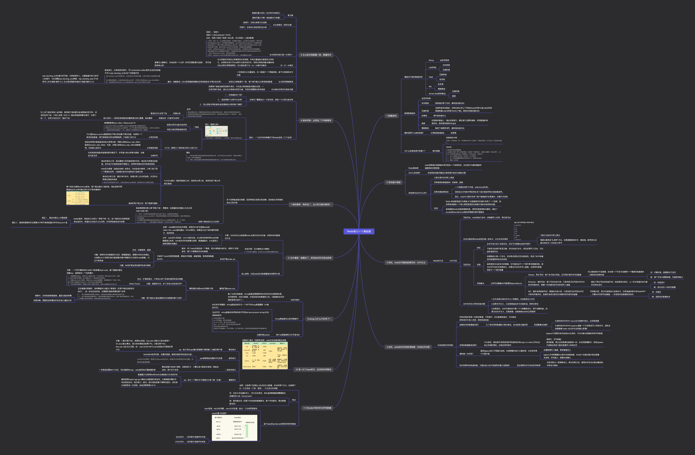

## 简介
设计一个单机千万级吞吐量的键值数据库。在这个过程中，可以深入、透彻地研究了 Redis，包括它的源代码、架构设计以及核心控制点
## 设计使用当中的坑
总的来说分四个方面：
- CPU 使用上的“坑”，例如数据结构的复杂度、跨 CPU 核的访问；
- 内存使用上的“坑”，例如主从同步和 AOF 的内存竞争；
- 存储持久化上的“坑”，例如在 SSD 上做快照的性能抖动；
- 网络通信上的“坑”，例如多实例时的异常网络丢包。
## Redis全景图包括哪些
两大维度、三大主线

## redis核心基础篇1-11压缩图片

推荐前往幕布查看原文档：https://www.mubucm.com/doc/1bMEbiZTaGl