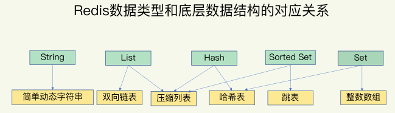
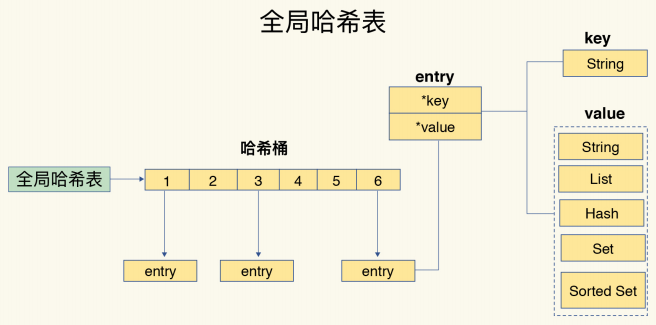

## redis有哪些数据结构（https://www.kancloud.cn/kancloud/redisbook/63832）
基础的数据结构有String、Hash、List、Set、ZSet五种，还有HyperLogLog、GEO、Pub\Sub
### redis对使用者暴露了五种value type,其底层实现的数据结构有8种，分别是：
1. SDS   -   simple synamic string -支持自动动态扩容的字节数组（简单动态字符串--String类型）
2. list  -   链表（双向链表）
3. dict  -   使用双哈希表实现，支持平滑扩容的字典（哈希表）
4. zskiplist -   附加了后向指针的跳表
5. intset    -  用于存储整数数值集合的自有结构（整数数组）
6. ziplist  -   实现类似于TLV,但比TLV复杂，用于存储任意数据的有序序列的数据结构（压缩列表）
7. quicklist    -   以ziplist作为结点的双链表结构
8. zipmap   -   小规模场合使用的轻量级字典结构


### 键值采用什么结构组织
使用哈希表来保存所有键值对，其实就是一个数组，数组的每个元素称为一个哈希桶。哈希桶中的元素保存的并不是值本身，而是指向具体值的指针。

如图，在哈希桶内，一个entry内存放了*key,*value的键值指针，分别指向了不同数据结构的值。<br/>
哈希表最大好处是可以使用O(1)的时间复杂度来快速查找到键值对==我们只需要计算键的哈希值，即可找到哈希桶的位置，然后可以访问到entry元素。
#### 当写入大量数据时，操作可能会变慢，什么原因？
哈希表冲突和rehash可能带来操作阻塞。
redis解决哈希冲突的方式，就是链式哈希。指同一个哈希桶中的多个元素用一个链表来保存，它们之间依次用指针连接。
### string字符串
字符串类型可以存放--简单的字符串、复杂的字符串（xml、json）、数字（整数、浮点数）、二进制（图片、音频、视频），最大不能超过512M
- 使用场景
    - 缓存功能，大部分请求数据从redis获取，而不是持久层，支撑高并发访问对持久层造成的压力，缓存可以起到加速读写和降低后端压力的作用
    - 计数器，快速计数，查询缓存，比如登录输入五次密码错误就锁定，可以统计输入密码次数。
    - 共享token，redis引入解决最大的问题就是天然的分布式，一处写入token，写入用户信息，多处访问获取token内json数据
    - 限速:用户获取手机短信验证码，为了短信接口不被频繁调用，限制用户每分钟获取验证码的频率
### hash哈希
hash类型是指键本身又是一种键值对结构，如：

上面的例子是使用hash结构存储的Map
```java
	/**
	 * HashSet
	 * 
	 * @param key 键
	 * @param map 对应多个键值
	 * @return true 成功 false 失败
	 */
	public boolean hmset(String key, Map<String, Object> map) {
		try {
			redisTemplate.opsForHash().putAll(key, map);
			return true;
		} catch (Exception e) {
			e.printStackTrace();
			return false;
		}
	}
```
### list列表
列表类型用来储存多个有序的字符串，一个列表最多可以储存2的32次方-1个元素，可以通过索引下标获取某个或某个范围内的元素列表

