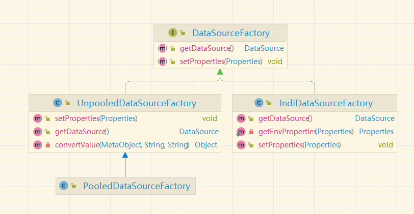

# Mybatis详解

## 初始化过程

创建 Configuration 对象的过程

- 基于XML配置文件：MyBatis 加载 XML 配置文件，将配置文信息组装成内部的 Configuration 对象
- 基于 Java API：在java代码中，手动创建 Configuration 对象，然后将配置参数 set 进入 Configuration 对象中。

### SQLSessionFactory

mybatis 初始化 -->创建 SqlSession -->执行 SQL 语句

SqlSessionFactoryBuilder 根据传入的数据流生成 Configuration 对象，然后根据 Configuration 对象创建默认的 SqlSessionFactory 实例

1. 调用 SqlSessionFactoryBuilder 对象的 build(inputStream)方法；
2. SqlSessionFactoryBuilder 会根据输入流 inputStream 等信息创建 XMLConfigBuilder 对象;
3. SqlSessionFactoryBuilder 调用 XMLConfigBuilder 对象的 parse()方法；
4. XMLConfigBuilder 对象返回 Configuration 对象；
5. SqlSessionFactoryBuilder 根据 Configuration 对象创建一个 DefaultSessionFactory 对象；
6. SqlSessionFactoryBuilder 返回 DefaultSessionFactory 对象给 Client，供 Client 使用。

源码解析

```java
 public SqlSessionFactory build(InputStream inputStream,String environment,Properties properties){
        SqlSessionFactory var5;
        try{
        //根据输入流创建XMLConfigBuilder对象
        XMLConfigBuilder parser=new XMLConfigBuilder(inputStream,environment,properties);
        var5=this.build(parser.parse());
        }catch(Exception var14){
        throw ExceptionFactory.wrapException("Error building SqlSession.",var14);
        }finally{
        ErrorContext.instance().reset();

        try{
        inputStream.close();
        }catch(IOException var13){
        }

        }

        return var5;
        }
//根据 Configuration 对象创建一个 DefaultSessionFactory 对象
public SqlSessionFactory build(Configuration config){return new DefaultSqlSessionFactory(config);}
```

## 数据源与连接池

### DataSource创建

MyBatis 把数据源 DataSource 分为三种： UNPOOLED 不使用连接池的数据源 ; POOLED 使用连接池的数据源 ; JNDI 使用 JNDI 实现的数据源

有源码可以看出使用了工厂模式


MyBatis 是通过工厂模式来创建数据源 DataSource 对象的，MyBatis 定义了抽象的工厂接口,通过其 getDataSource()方法返回数据源 DataSource。

### Connection创建

当需要创建 SqlSession 对象并需要执行 SQL 语句时，这时候 MyBatis 才会去调用 dataSource 对象来创建 java.sql.Connection 对象
