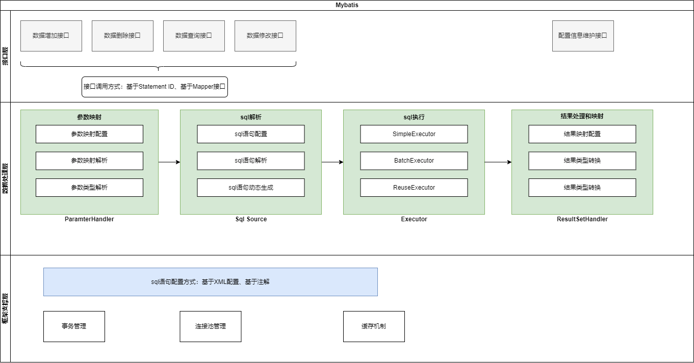

# ORM框架

Mybatis

## 接口层

MyBatis 和数据库的交互有两种方式：

1. 使用传统的 MyBatis 提供的 API
2. 使用 Mapper 接口

## 数据处理层：

1. 通过传入参数构建动态 SQL 语句；（MyBatis 通过传入的参数值，使 用 Ognl 来动态地构造 SQL 语句，使得 MyBatis 有很强的灵活性和扩展性）
2. SQL 语句的执行以及封装查询结果集成 List<E>

## 框架支撑层：

事务管理；连接池管理；缓存等

## mybatis核心部件

- SqlSession 作为 MyBatis 工作的主要顶层 API，表示和数据库交互的会话，完成 必要数据库增删改查功能
- Executor MyBatis 执行器，是 MyBatis 调度的核心，负责 SQL 语句的生成和 查询缓存的维护
- StatementHandler 封装了 JDBC Statement 操作，负责对 JDBC statement 的操作，如设置参数、将 Statement 结果集转换成 List 集合。
- ParameterHandler 负责对用户传递的参数转换成 JDBC Statement 所需要的参数，
- ResultSetHandler 负责将 JDBC 返回的 ResultSet 结果集对象转换成 List 类型的集合；
- TypeHandler 负责 java 数据类型和 jdbc 数据类型之间的映射和转换
- MappedStatement MappedStatement 维护了一条<select|update|delete|insert>节点的封装，
- SqlSource 负责根据用户传递的 parameterObject，动态地生成 SQL 语句，将信 息封装到 BoundSql 对象中，并返回
- BoundSql 表示动态生成的 SQL 语句以及相应的参数信息
- Configuration MyBatis 所有的配置信息都维持在 Configuration 对象之中。
