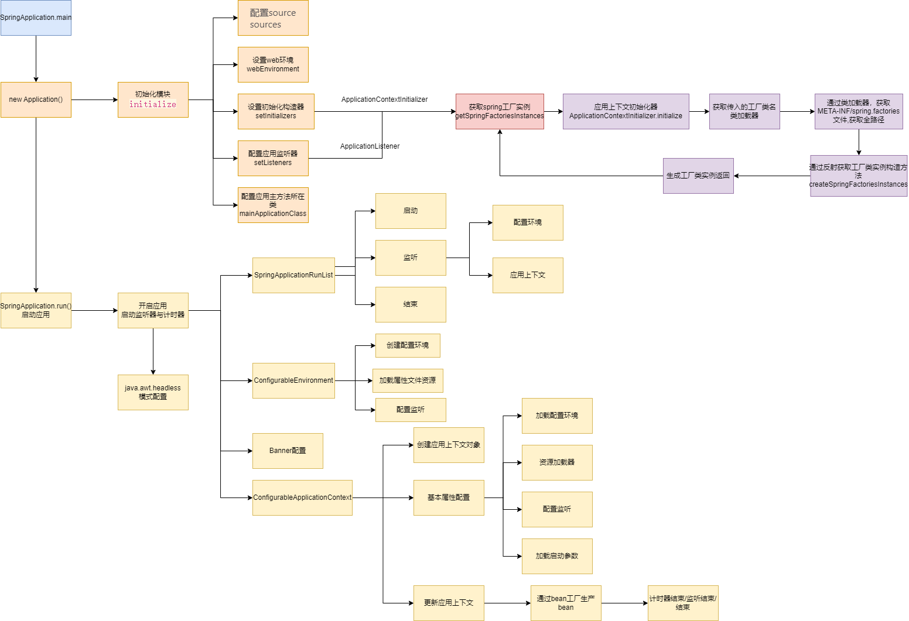

# SpringApplication

SpringBoot启动流程及各组件相互调用关系如图


## 详解

### 无参构造方法调用initialize()方法做初始化动作

```java
/**
 * Create a new SpringApplication instance. The application context will load beans from the specified sources (see class-level documentation for details. The instance can be customized before calling run(String...).
 Params:
 sources – the bean sources
 See Also:
 run(Object, String[]), SpringApplication(ResourceLoader, Object...)
 */
@SuppressWarnings({"unchecked", "rawtypes"})
private void initialize(Object[]sources){
        if(sources!=null&&sources.length>0){
        this.sources.addAll(Arrays.asList(sources));
        }
        //推断当前程序类型
        this.webEnvironment=deduceWebEnvironment();
        //使用SpringFactoriesLoader 实例化所有可用的初始器
        setInitializers((Collection)getSpringFactoriesInstances(ApplicationContextInitializer.class));
        //使用SpringFactoriesLoader 实例化所有可用的监听器
        setListeners((Collection)getSpringFactoriesInstances(ApplicationListener.class));
        //配置应用主方法所在类
        this.mainApplicationClass=deduceMainApplicationClass();
        }
```

### 启动方法run()

run方法完成了spring整个启动过程

```java
	/**
	 * Run the Spring application, creating and refreshing a new
	 * {@link ApplicationContext}.
	 * @param args the application arguments (usually passed from a Java main method)
	 * @return a running {@link ApplicationContext}
	 */
	public ConfigurableApplicationContext run(String... args) {
        //开启时钟计时
		StopWatch stopWatch = new StopWatch();
		stopWatch.start();
		ConfigurableApplicationContext context = null;
		FailureAnalyzers analyzers = null;
        //开启设置，让系统模拟不存在io设备
		configureHeadlessProperty();
        //初始化SpringApplicationRunListener 监听器，并进行封装
		SpringApplicationRunListeners listeners = getRunListeners(args);
		listeners.starting();
		try {
			ApplicationArguments applicationArguments = new DefaultApplicationArguments(
					args);
            //环境准备
			ConfigurableEnvironment environment = prepareEnvironment(listeners,
					applicationArguments);
            //打印banner
			Banner printedBanner = printBanner(environment);
			context = createApplicationContext();
			analyzers = new FailureAnalyzers(context);
            //容器初始化
			prepareContext(context, environment, listeners, applicationArguments,
					printedBanner);
            //刷新上下文容器
			refreshContext(context);
			afterRefresh(context, applicationArguments);
			listeners.finished(context, null);
			stopWatch.stop();
			if (this.logStartupInfo) {
				new StartupInfoLogger(this.mainApplicationClass)
						.logStarted(getApplicationLog(), stopWatch);
			}
			return context;
		}
		catch (Throwable ex) {
			handleRunFailure(context, listeners, analyzers, ex);
			throw new IllegalStateException(ex);
		}
	}
```

### SpringApplicationRunListeners 使用
通过getSpringFactoriesInstances 获取到所有实现SpringApplicationRunListener  接口的实例，默认情况下该接口的实现类只有 EventPublishingRunListener  他的主要作用是作为springboot 的一个广播器

```java
private SpringApplicationRunListeners getRunListeners(String[] args) {
		Class<?>[] types = new Class<?>[] { SpringApplication.class, String[].class };
		return new SpringApplicationRunListeners(logger, getSpringFactoriesInstances(
				SpringApplicationRunListener.class, types, this, args));
	}
```

