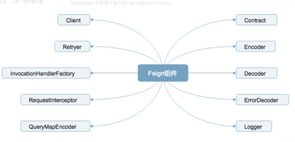
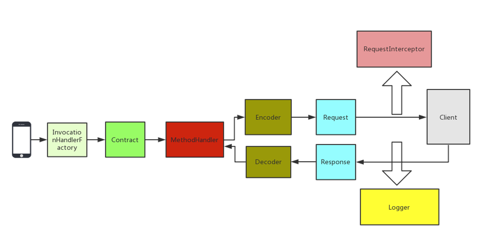

## Feign
FeignClient
### 什么是Feign
一个声明式的Web服务客户端，编写Web服务客户端只需要创建一个接口，然后添加注解即可
### Feign组件详解
如图：
1. contract契约组件
   - feign中通过定义API接口方式调用远程的Http API，调用Client时候增加一些注解描述这个调用API的基本信息，如请求是GET/POST
2. Encoder编码组件
   - 将请求信息采用指定的编码方式进行编码后传输
3. Decoder解码组件
   - 将响应数据解码成对象
4. Logger日志记录
   - feign中记录日志，可以指定Logger级别以及自定义日志输出
5. Client请求执行组件
   - 负责Http请求执行的组件，默认Client是通过JDK的HttpURLConnection发送请求，每次发送请求都会创建新的HttpURLConnection，所以feign的性能会很差。所以可以扩展使用Apache HttpClient基于连接池的高性能HTTP客户端
6. Retryer重试组件
   - 内置重试器，HTTP请求出现IO异常，会限定一个最大重试次数来进行重试操作
7. InvocationHandlerFactory代理
   - 采用JDK的动态代理生成代理对象
8. RequestInterceptor请求拦截器
   - 可以为Feign添加多个拦截器，请求执行前设置一些扩展的参数信息
9. QueryMapEncoder参数查询
   - 针对实体类参数查询的编码器
