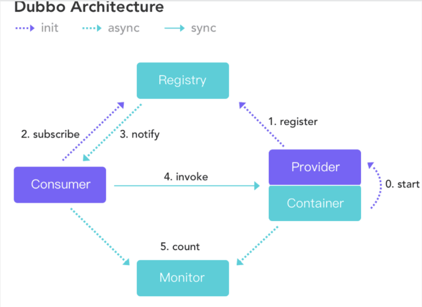

# 分布式服务框架

[dubbo官网](https://dubbo.apache.org/zh/docs/)

## dubbo的原理

1. 工作原理

- service层：接口层，给服务提供者和消费者来实现
- config层：配置层，主要对Dubbo进行各种配置
- proxy层：服务代理层，consumer，provider,dubbo都会生成代理，代理之间进行网络通信
- registry层：注册层，负责服务的注册与发现
- cluster层；集群层，封装多个服务提供者的路由进行负载均衡，多个实例组合成一个服务
- monitor层：监控层，对RPC接口的调用次数和调用时间进行监控
- protocal层：远程调用层，疯转RPC调用
- exchange层：信息交换层，封装请求响应模式，同步转异步
- transport层：网络传输层，封装mina和netty为统一接口
- serialize层：数据序列化层

2. 工作流程

- provider向注册中心去注册
- consumer从注册中心订阅服务，注册中心通知consumer注册好的服务
- consumer调用provider
- consumer和provide都异步通知监控中心

3. 注册中心挂了可以继续通信吗？

可以，初始化时，消费者会将provide提供的地址等信息拉取到本地，所以注册中心挂了仍然可以继续通信

