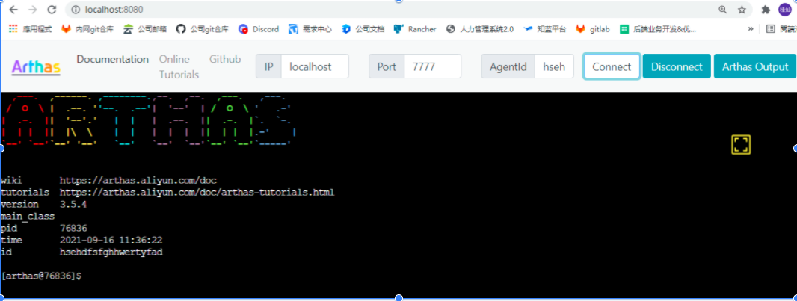

	在项目中通过引入 [arthas-spring-boot-starter](https://search.maven.org/search?q=arthas-spring-boot-starter)  进行Java诊断
**使用步骤**
1. 在项目的pom.xml引入
  
``` 
<dependency>
	<groupId>com.taobao.arthas</groupId>
	<artifactId>arthas-spring-boot-starter</artifactId>
	<version>${arthas.version}</version>
</dependency>
```

2. 配置连接信息
2.1	配置arthas tunnel server实现远程管理
	通过Arthas Tunnel Server/Client 来远程管理/连接多个Agent，因此我们首先要先安装Arthas Tunnel Server/Client。
	a、下载部署[arthas tunnel server](https://github.com/alibaba/arthas/releases) 
	b、启动arthas-tunnel-server
	
``` 
java -jar  arthas-tunnel-server-3.5.4-fatjar.jar
```
		c、在项目的yml做如下配置
	
``` 
arthas:
  agent-id: ${ARTHAS_AGENT_ID:hsehdfsfghhwertyfad}
  app-name: ${spring.application.name}
  tunnel-server: ${ARTHAS_TUNNEL_SERVER:ws://localhost:7777/ws}
```
PS：agentId要保持唯一，否则会在tunnel server上冲突，不能正常工作
d、效果演示



2.2 在spring配置文件进行配置

``` 
arthas:
 # 通过http访问的端口
  http-port: 8563
  # 通过telnet访问的端口
  telnet-port: 3658
  session-timeout: 1800
  # 绑定的ip
  ip: 0.0.0.0
```
PS： 如果配置 arthas.telnetPort为 -1 ，则不监听 telnet端口，如果配置 arthas.telnetPort为 0 ，则随机telnet端口。arthas.httpPort也同理。
效果演示：

3. [命令文档](https://arthas.aliyun.com/doc/commands.html) 

