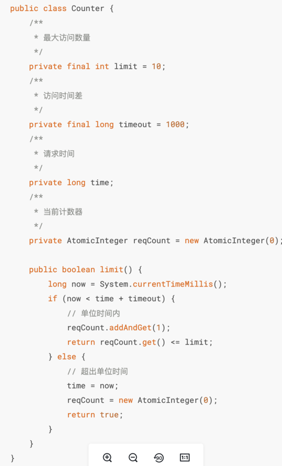
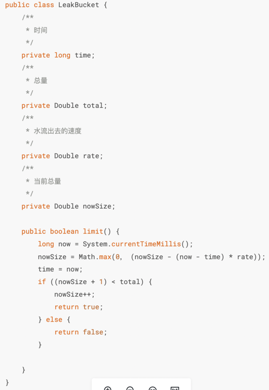
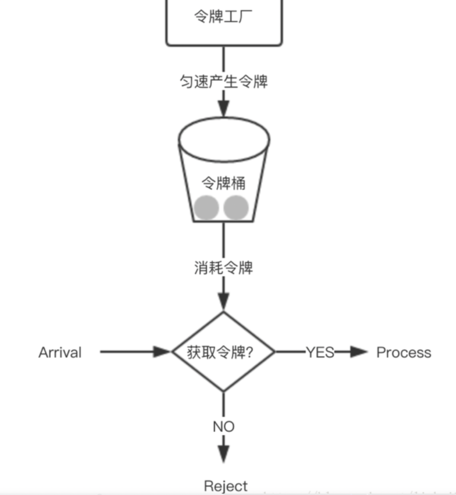

## Hystrix
断路器
### 什么是Hystrix
- 防雪崩利器，具有服务降级、服务熔断、服务隔离、监控等一些防雪崩的技术
- 防雪崩方式
  - 服务降级：接口调用失败就调用本地方法返回一个空
  - 服务熔断：接口调用失败进入调用接口提前定义好的一个熔断方法，返回错误信息
  - 服务隔离：隔离服务之间相互影响
  - 服务监控：服务发生调用时，将每秒请求数、成功请求数等运行指标记录
### 如何限流
- 限流算法：
  - 计数器：控制单位时间内的请求数量
    - 劣势：设每分钟请求数量60个，每秒处理1个请求，用户在 00:59 发送 60 个请求，在 01:00 发送 60 个请求 此时 2 秒钟有 120 个请求(每秒 60 个请求)，远远大于了每秒钟处理数量的阈值。（突刺现象）
  - leaky bucket（漏桶）：规定固定容量的桶，进入的水无法管控数量、速度，但是对于流出的水我们可以控制速度
    - 劣势：无法应对短时间突发流量（桶满了就丢弃）
  - Token bucket令牌桶：可以准备一个队列，用来保存令牌，另外通过一个线程池定期生成令牌放到队列中，每来一个请求，就从队列中获取一个令牌，并继续执行。