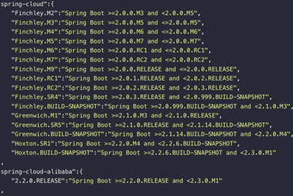

## SpringCloud
微服务架构
### SpringCloud是什么？
- 概念：一系列框架的有序集合，利用SpringBoot脚手架简化了分布式系统基础设施的开发，如：服务发现注册中心、配置中心、消息总线、负载均衡、数据监控等
- 将比较成熟的服务框架组合，通过SpringBoot风格再封装简化配置和实现原理
### SpringCloud优缺点
优点：
```text
1. 耦合度低
2. 并行开发，互不影响
3. 配置简单化，注解支持
4. 跨平台，可以不同模块使用不同开发语言
5. 数据库独立
6. 前后端分离，通过组件进行服务通信
7. 支持单模块横向扩容，针对性提升访问效率与节省没必要的资源浪费
```
缺点：
```text
1. 部署麻烦，模块多
2. 针对数据管理麻烦，因为数据库进行拆分了
3. 性能监控麻烦
```
### SpingCloud与SpringBoot对应关系

### SpringCloud都有哪些组件
- 很多，常用的
    - Eureka:服务注册发现
    - zuul:网关
    - feign：web服务客户端，调用使用http
    - hystrix:断路器，有限流算法（计数器、漏桶、令牌桶）
    - config:分布式统一配置管理

### SpringCloud与一些框架的区别
#### SpringCloud和SpringBoot区别
- SpringBoot相当于个脚手架，SpringCloud是使用SpringBoot脚手架开发的多个组件的服务框架
- SpringCloud关注全局微服务协调整理治理，将SpringBoot开发的一个个单体服务合并管理
- SpringCloud提供了丰富的组件，如服务发现注册、配置中心、路由网关、数据监控等
#### SpringCloud和Dubbo区别
- 服务调用方式：Duubo是RPC调用，SpringCloud是Rest api
- 注册中心：dubbo是zookeeper（保证CP），SpringCloud是[eureka](Eureka.md)（保证AP）,也可以是zk
- 网关：dubbo本身是一个rpc框架，并没有网关，springcloud有zuul
