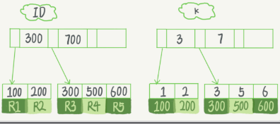

## Mysql实战-基础篇

Mysql核心

### 一条sql语句是怎么执行的

- mysql逻辑架构图如图
    - server层：包含了连接器、查询缓存、分析器、优化器、执行器等，所有的内置函数，所有跨存储引擎的功能都在这实现，如存储过程，触发器，视图等
    - 存储引擎层：负责数据的存储和提取，是插件式的，有InnoDB,MyIsam等
- 执行步骤：
    1. 建立连接
        - 连接器：mysql -h -p
        - 建立连接过程复杂，建议使用长链接，长连接指建立一个连接成功后，如果客户端持续有请求，则一直使用同一个连接
        - 如果全部使用长连接，会导致Mysql占用内存非常多--解决：定期断开长连接；可以在每个执行比较大的操作后，执行mysql_reset_connection重置连接
    2. 查询缓存
        - mysql8.0此功能删除，因为查询缓存功能弊大于利
    3. 分析器
        - 词法分析，检测输入的sql语句格式，如果错误，会收到‘You have an error in your sql syntax’的提示
    4. 优化器
        - 在表里有多个索引时，判断使用哪个索引；在一个语句有多个join连接的时候，判断连接顺序
    5. 执行器
        - 开始执行前，会判断是否有执行此表的权限：无权限责任提示错误；有权限则根据引擎定义，开始执行引擎提供的接口

### 日志：一条sql更新语句是怎么执行的

- 流程：一样走上面的逻辑流程，分析器检测sql语句判断是更新语句，会清空查询缓存内的信息
- redo log重做日志，InnoDB特有的日志，保证了事务的持久性
    - WAL（write-ahead-logging）技术,先写日志，再写磁盘（区别AOF，写后日志，一个为了持久性数据不丢失；一个为了单线程操作不阻塞）
        - 当有记录更新时，InnoDB引擎会把日志先写入redo log里，并更新内存，这时候就算更新完成，InnoDB会在适当时候，将记录更新到磁盘内
        - InnoDB的redo log是固定大小的
        - 如图的write pos当前记录的位置；check point是当前要擦除的点（如果write pos追上check point表示固定大小的redo log满了）
    - 有了redo log，InnoDB就能保证数据库发生异常重启后数据不丢失，这个能力称为crash-safe
- bin log归档日志（server层实现）
    - 和redo log区别：
        1. redolog是InnoDB特有，bin log是mysql的server层实现，所有引擎都可以使用
        2. redo log是物理日志，记录的是在某个数据页上做了什么修改，而binlog是逻辑日志，记录的是这个字段的原始逻辑，如：给ID=2这行的c字段加1
        3. redo log是循环写，空间固定会用完，binlog是追加写入，在写入到一定大小会切换到下一个，并不会覆盖以前的日志
- 两阶段提交
    - 如下sql语句执行流程：`update T set c=c+1 where ID = 2`
        1. 执行器先找引擎渠道ID=2这一行，ID是主键，引擎直接使用主键索引找到这一行，如果ID=2这行所在的数据页本来就在内存中，就直接返回给执行器，否则，需要先从磁盘读入内存，然后再返回
        2. 执行器拿到引擎给的行数据，把这个值加上1，得到新的一行数据，再调用引擎接口写入这行新数据
        3. 引擎将这行新数据更新到内存中，同时将这个更新操作记录到redo log里面，此时redo log处于prepare状态，然后告知执行器执行完成，随时可以提交事务
        4. 执行器生成这个操作的bin log，并把bin log写入磁盘
        5. 执行器调用引擎的提交事务接口，引擎把刚刚写入的redo log改成提交状态，更新完成

### 事务隔离：为什么更改了还看不见？

保证一组数据库操作，要么都成功，要么都失败

#### 隔离性与隔离级别

- 四种事务隔离级别
    - read uncommited读未提交，一个事务未提交时，它的数据就能被别的事务看到（造成脏读）
    - read commited读已提交，一个事务提交成功后，它的数据变更才能被别的事务看到（造成幻读）
    - repeatable read可重复读，一个事务执行过程中看到的数据，总是跟这个事务在启动时看到的数据是一致的。此事务隔离级别下，未提交变更对其他事务也是不可见的（mysql默认的事务隔离级别）
    - serializable串行化，对于同行记录，写加写锁，读加读锁。并且事务执行有顺序
- 事务隔离的实现([详细](MVCC.md))
    - 每条记录在更新时，会同时记录一条回滚操作-undo log
    - 回滚日志删除时机：系统内没有比这个回滚日志更早的read-view的时候
- 事务的启动方式
    - 显示启动：begin或start transaction，提交commit，回滚rollback
    - set autocommit=0,这个命令会将这个线程的自动提交关闭，直至主动执行commit或rollback，或者断开连接

### 深入浅出索引

索引出现的目的是为了提高数据查询效率

#### 索引常见模型

1. 哈希表
    - 以k-v存储数据的结构
    - 值放在数组里，用一个哈希函数把key换算成一个确定的位置，把value放在数组这个位置，出现同一个值的情况：拉出一个链表
    - 缺点：无序，哈希索引做区间查询速度很慢
    - 适用场景：等值查询，如Memcached及其他一些NoSql引擎
2. 有序数组
    - 二分查找，查询速度快，时间复杂度O(log(N))
    - 缺点：如果往中间插入一个记录就必须挪动后面所有记录，成本太高
    - 场景：适用于静态存储引擎
3. 搜索树
    - 二叉，多叉，树高度问题，高度越高，每个数据库寻址速度会累加

#### InnoDB的索引模型

- InnoDB中，表根据主键顺序以索引的形式存放，这种存储方式表称为索引组织表
- 每个索引在InnoDB中对应一棵B+树
- 假设sql` mysql> create table T(
  id int primary key, k int not null, name varchar(16), index (k))engine=InnoDB;`
    - 对应的索引树如图
    - 根据叶子节点内容，索引类型分为：主键索引（聚簇索引），非主键索引
    - 主键索引叶子节点存整行数据，非主键索引的叶子节点内容是主键的值
- 主键索引和普通索引区别：主键索引查询，只需要搜索ID这棵B+树；如果普通索引查询方式，需要先搜索普通索引树，得到ID值，再搜索ID索引树，这个过程称为--*回表*
- 索引维护
    - 页分裂/页合并：B+树为了保证有序性，插入新值时需要挪动位置，如果数据页满了，再插入当前页中一个新值，则需要将部分数据挪动到新申请的一个数据页中，这个过程称为页分裂；当相邻页由于删除数据，利用率很低后会做页合并
    - 自增主键有序，插入时向后插入，不会导致页分裂的产生，所以一般使用自增主键
    - 查询索引树上包含的值无须回表的被称作覆盖索引，比如select ID from。。。可以直接查询到值
    - 最左前缀原则：最左侧第一个数据有序，当第一个数据相等时，判断第二个数据，第二个数据在第一个数据相等时有序，所以联合索引如：（a,b,c）,查询为a=1 and b=3 and c=1，则可以使用到索引，如果是a > 1 and
      b =3 and c = 1则使用不到索引
    - 索引下推：减少回表次数，多个查询条件时，会优先在普通用索引树内做过滤，再去回表过滤

### 全局锁和表级行锁

- 全局锁：全局锁对整个数据库实例加锁，全局读锁方式：Flush tables with read lock.此时整个库处于只读状态，其他线程会被阻塞。（全库逻辑备份使用）
- 表级锁
    - 表锁：lock tables ... read/write会限制别的线程的读写，也限定了本线程接下来的操作对象。除非执行unlock tables
    - 元数据锁：无须显示使用，访问一个表时自动加上。对一个表操作增删改查操作时，加元数据读锁；对表数据结构变更操作时，加元数据写锁
        - 读锁之间不互斥；读写锁之间，写锁之间互斥，保证变更表结构操作的安全性，如果由两个线程同时给一个表加字段，其中一个要等另一个执行完才能开始执行
        - 给一个小表加字段，如
        - 如上图，A,B都可以正常申请到读锁，不互斥；当alter添加表字段时增加写锁，D申请不到读锁。当业务有多个重试，连接可能很快爆满导致挂掉---解决：alter table
          内设定等待时间，拿不到先放弃`ALTER TABLE tbl_name WAIT N add column ...`
    - online DDL：优化解决了写锁的问题
        1. 拿元数据写锁
        2. 降级成元数据读锁
        3. 真正做DDL
        4. 升级成元数据写锁
        5. 实放元数据锁
- 行锁，引擎层自己实现
    - 两阶段锁协议：在InnoDB事务中，行锁是在需要的时候加上的，并不是不需要了就立刻释放，而是要等到事务结束才释放
    - 死锁和死锁检测：并发系统中不同线程出现循环资源依赖，涉及的线程都在等别的线程释放资源时，就会导致这几个线程都进入无限等待的状态，称为死锁
      - 死锁两种策略：一直进入等待，直到超时，innodb_lock_wait_timeout设置，默认50s;发起死锁检测，发现死锁后，主动回滚某一个事务，让其他事务继续执行，innodb_deadlock_detect设置为on(
        死锁检测会耗费大量CPU资源)
      

--- 
详细如图

        