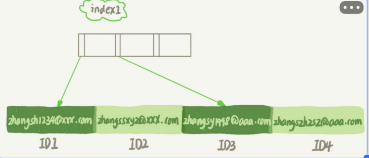
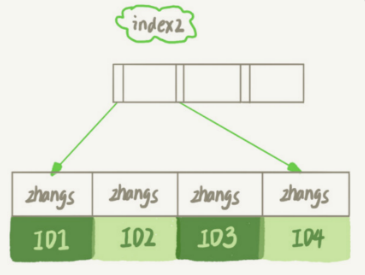
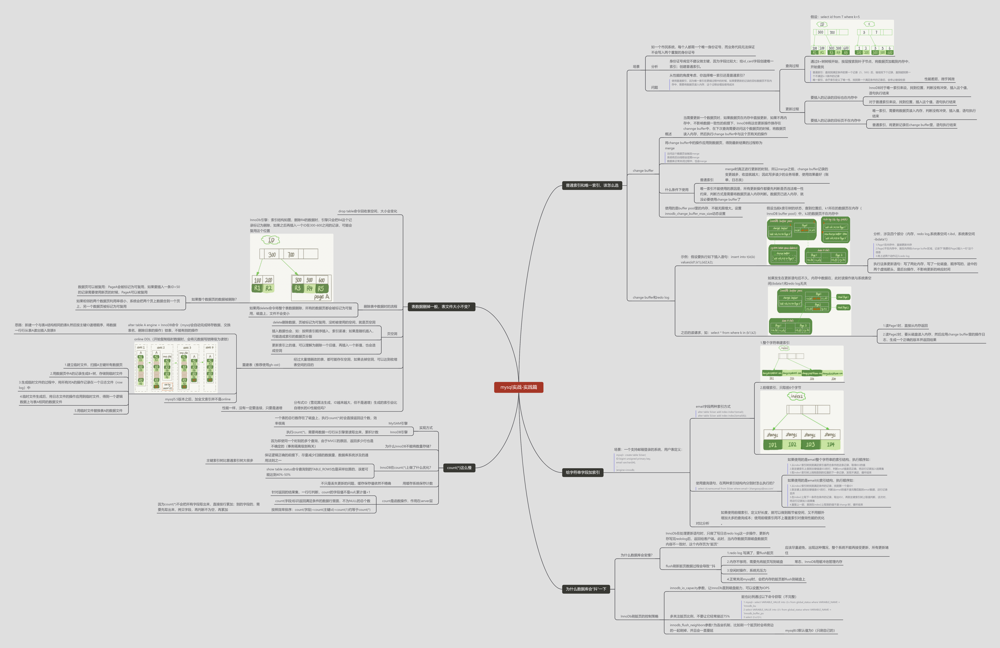

# Mysql实践

实际应用，实际问题

## 普通索引和唯一索引，该怎么选

场景:如一个市民系统，每个人都需一个唯一身份证号，而业务代码无法保证不会写入两个重复的身份证号

分析：身份证号肯定不建议做主键，因为字段比较大；给id_card字段创建唯一索引；创建普通索引。

### 问题：从性能的角度考虑，你选择唯一索引还是普通索引？

使用普通索引，因为唯一索引在更新过程中的时候，如果要更新的记录的目标数据页不在内存中，需要将数据页读入内存，这个过程会增加使用成本

#### 查询过程

假设：select id from T where k=5（k有一棵主键索引树，叶子节点存储的是主键id）

通过B+树树根开始，按层搜索到叶子节点，将数据页加载到内存中，开始查找

- 普通索引：查找到满足条件的第一个记录（5，500）后，继续找下个记录，直到碰到第一个不满足k=5条件的记录
- 唯一索引，由于索引定义了唯一性，找到第一个满足条件的记录后，会停止继续检索

性能差距，微乎其微

#### 更新过程

- 要插入的记录的目标也在内存中
    - InnoDB对于唯一索引来说，找到位置，判断没有冲突，插入这个值，语句执行结束
    - 对于普通索引来说，找到位置，插入这个值，语句执行结束
- 要插入的记录的目标页不在内存中
    - 唯一索引，需要将数据页读入内存，判断没有冲突，插入值，语句执行结束
    - 普通索引，将更新记录在change buffer里，语句执行结束

---

### change buffer

当需要更新一个数据页时，如果数据页在内存中直接更新，如果不再内存中，不影响数据一致性的前提下，InnoDB将这些更新操作缓存在channge buffer中，在下次查询需要访问这个数据页的时候，将数据页读入内存，然后执行change
buffer中与这个页有关的操作

#### 将change buffer中的操作应用到数据页，得到最新结果的过程称为merge

1. 访问这个数据页会触发merge
2. 系统有后台线程会定期merge
3. 数据库正常关闭过程中，也会merge

#### 什么条件下使用

- 普通索引：merge时真正进行更新的时刻，所以merge之前，change buffer记录的变更越多，收益就越大；因此写多读少的业务场景，使用效果最好（账单，日志类）
- 唯一索引不能使用的原因是，所有更新操作都要先判断是否违反唯一性约束，判断方式是需要将数据页读入内存判断。数据页已进入内存，就没必要使用change buffer了

注意
> change buffer使用的是buffer pool里的内存，不能无限增大。设置innodb_change_buffer_max_size动态设置

---

### change buffer和redo log

1. 示例：假设要执行如下插入语句：insert into t(id,k) values(id1,k1),(id2,k2);
    1. 假设当前k索引树的状态，查到位置后，k1所在的数据页在内存（InnoDB buffer pool）中，k2的数据页不在内存中
    2. 分析，涉及四个部分（内存，redo log,系统表空间-t.ibd，系统表空间-ibdata1）
        - Page1在内存中，直接更新内存
        - Page2不在内存中，就在内存的change buffer区域，记录下“我要往Page2插入一行”这个信息
        - 将上述两个动作记入redo log
    3. 执行这条更新语句：写了两处内存，写了一处磁盘，顺序写的
2. 之后的读请求，如：select * from where k in (k1,k2)
    1. 如果发生在更新语句后不久，内存中数据在，此时读操作就与系统表空间(ibdata1)和redo log无关
        1. 读Page1时，直接从内存返回
        2. 读Page2时，要从磁盘读入内存，然后应用change buffer里的操作日志，生成一个正确的版本并返回结果

## 给字符串字段加索引

场景：一个支持邮箱登录的系统，用户表定义：

```sql
mysql
>
create table SUser
(
    ID    bigint unsigned primary key,
    email varchar(64), .
    .
    .
)engine=innodb; 
```

email字段两种索引方式

- alter table SUser add index index1(email); 整个字符串建索引
  
- alter table SUser add index index2(email(6)); 前缀索引，只取前6个字节
- 

### 使用查询语句，在两种索引结构内分别时怎么执行的？

select id,name,email from SUser where email='zhangssxyz@xxx.com'

#### 如果使用的是email整个字符串的索引结构，执行顺序如：

1. 从index1索引树找到满足索引值符合条件的这条记录，取得ID2的值
2. 到主键索引上查到主键值是ID2的行，判断email值是否正确，将这行记录加入结果集
3. 取index1索引树上刚刚查到的位置的下一条记录，发现不满足，循环结束

#### 如果使用的是email(6)索引结构，执行顺序如：

## 为什么数据库会“抖”一下

## 表数据删掉一半，表文件大小不变？

## count(*)这么慢
---
详细如图
