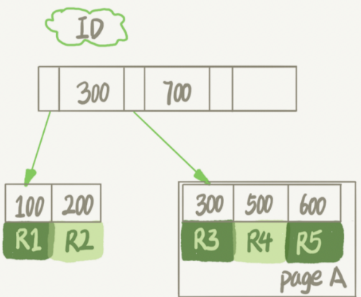

# Mysql实践

实际应用，实际问题

## 普通索引和唯一索引，该怎么选

场景:如一个市民系统，每个人都需一个唯一身份证号，而业务代码无法保证不会写入两个重复的身份证号

分析：身份证号肯定不建议做主键，因为字段比较大；给id_card字段创建唯一索引；创建普通索引。

### 问题：从性能的角度考虑，你选择唯一索引还是普通索引？

使用普通索引，因为唯一索引在更新过程中的时候，如果要更新的记录的目标数据页不在内存中，需要将数据页读入内存，这个过程会增加使用成本

#### 查询过程

假设：select id from T where k=5（k有一棵主键索引树，叶子节点存储的是主键id）

通过B+树树根开始，按层搜索到叶子节点，将数据页加载到内存中，开始查找

- 普通索引：查找到满足条件的第一个记录（5，500）后，继续找下个记录，直到碰到第一个不满足k=5条件的记录
- 唯一索引，由于索引定义了唯一性，找到第一个满足条件的记录后，会停止继续检索

性能差距，微乎其微

#### 更新过程

- 要插入的记录的目标也在内存中
    - InnoDB对于唯一索引来说，找到位置，判断没有冲突，插入这个值，语句执行结束
    - 对于普通索引来说，找到位置，插入这个值，语句执行结束
- 要插入的记录的目标页不在内存中
    - 唯一索引，需要将数据页读入内存，判断没有冲突，插入值，语句执行结束
    - 普通索引，将更新记录在change buffer里，语句执行结束

---

### change buffer

当需要更新一个数据页时，如果数据页在内存中直接更新，如果不再内存中，不影响数据一致性的前提下，InnoDB将这些更新操作缓存在channge buffer中，在下次查询需要访问这个数据页的时候，将数据页读入内存，然后执行change
buffer中与这个页有关的操作

#### 将change buffer中的操作应用到数据页，得到最新结果的过程称为merge

1. 访问这个数据页会触发merge
2. 系统有后台线程会定期merge
3. 数据库正常关闭过程中，也会merge

#### 什么条件下使用

- 普通索引：merge时真正进行更新的时刻，所以merge之前，change buffer记录的变更越多，收益就越大；因此写多读少的业务场景，使用效果最好（账单，日志类）
- 唯一索引不能使用的原因是，所有更新操作都要先判断是否违反唯一性约束，判断方式是需要将数据页读入内存判断。数据页已进入内存，就没必要使用change buffer了

注意
> change buffer使用的是buffer pool里的内存，不能无限增大。设置innodb_change_buffer_max_size动态设置

---

### change buffer和redo log

1. 示例：假设要执行如下插入语句：insert into t(id,k) values(id1,k1),(id2,k2);
    1. 假设当前k索引树的状态，查到位置后，k1所在的数据页在内存（InnoDB buffer pool）中，k2的数据页不在内存中
    2. 分析，涉及四个部分（内存，redo log,系统表空间-t.ibd，系统表空间-ibdata1）
        - Page1在内存中，直接更新内存
        - Page2不在内存中，就在内存的change buffer区域，记录下“我要往Page2插入一行”这个信息
        - 将上述两个动作记入redo log
    3. 执行这条更新语句：写了两处内存，写了一处磁盘，顺序写的
2. 之后的读请求，如：select * from where k in (k1,k2)
    1. 如果发生在更新语句后不久，内存中数据在，此时读操作就与系统表空间(ibdata1)和redo log无关
        1. 读Page1时，直接从内存返回
        2. 读Page2时，要从磁盘读入内存，然后应用change buffer里的操作日志，生成一个正确的版本并返回结果

## 给字符串字段加索引

场景：一个支持邮箱登录的系统，用户表定义：

```sql
mysql
>
create table SUser
(
    ID    bigint unsigned primary key,
    email varchar(64), .
    .
    .
)engine=innodb; 
```

email字段两种索引方式

- alter table SUser add index index1(email); 整个字符串建索引
  
- alter table SUser add index index2(email(6)); 前缀索引，只取前6个字节
- 

### 使用查询语句，在两种索引结构内分别时怎么执行的？

select id,name,email from SUser where email='zhangssxyz@xxx.com'

#### 如果使用的是email整个字符串的索引结构，执行顺序如：

1. 从index1索引树找到满足索引值符合条件的这条记录，取得ID2的值
2. 到主键索引上查到主键值是ID2的行，判断email值是否正确，将这行记录加入结果集
3. 取index1索引树上刚刚查到的位置的下一条记录，发现不满足，循环结束

#### 如果使用的是email(6)索引结构，执行顺序如：

1. 从index2索引树找到满足条件的记录，找到第一个是ID1
2. 到主键上查到主键值是ID1的行，判断出email的值不是完整匹配的email数据，这行记录丢弃
3. 在index2上取下一条符合条件的记录，取出ID2，再到主键索引树上取值判断，这次对，将这行记录加入结果集
4. 重复上一部，直到在index2上取到的值不是‘zhangs’时，循环结束

> 对比：如果使用前缀索引，定义好长度，就可以做到既节省空间，又不用额外增加太多的查询成本；使用前缀索引用不上覆盖索引对查询性能的优化。

## 为什么数据库会“抖”一下

flush刷新脏页数据过程会导致“”抖

### 脏页

InnoDb在处理更新语句时，只做了写日志redo log这一步操作，更新内存写完redolog后，返回给客户端。此时，当内存数据页跟磁盘数据页内容不一致时，这个内存页为“脏页”

- redo log 写满了，要flush脏页（应该尽量避免，出现这种情况，整个系统不能再接受更新，所有更新堵住）
- 内存不够用，需要先将脏页写到磁盘（常态，InnoDB用缓冲池管理内存）
- 空闲时操作，系统无压力
- 正常关闭mysql时，会把内存的脏页都flush到磁盘上

### InnoDb刷脏页的控制策略

1. innodb_io_capacity参数，让InnoDb直到磁盘能力，可以设置为IOPS

2. 多关注脏页比例，不要让它经常接近75%

3. innodb_flush_neighbors参数1为连坐机制，比如刷一个脏页时会将旁边的一起刷掉，并且会一直蔓延（mysql8.0默认值为0--只刷自己的）

---

## 表数据删掉一半，表文件大小不变？

drop table命令回收表空间，大小会变化

### 删除表中数据时的流程

InnoDb引擎：索引结构如图，删除R4的数据时，引擎只会把R4这个记录标记为删除，如果之后再插入一个ID在300-600之间的记录，可能会复用这个位置



如果整个数据页的数据被删除呢？

- 数据页可以被复用：PageA会被标记为可复用，如果要插入一条ID=50的记录需要使用新页的时候，PageA可以被复用
- 如果相邻的两个数据页利用率很小，系统会把两个页上数据合到一个页上，另一个数据页被标记为可复用

> 解答问题：如果用delete命令将整个表数据删除，所有的数据页都会被标记为可复用，磁盘上，文件不会变小

### 页空洞

1. delete删除数据，页被标记为可复用，没有被使用的空间，就是页空洞
2. 插入数据也会，如：按照索引顺序插入，索引紧凑；如果是随机插入，可能造成索引的数据页分裂
3. 更新索引上的值，可以理解为删除一个旧值，再插入一个新值，也会造成空洞

### 经过大量增删改的表，都可能存在空洞，如果去掉空洞，可以达到收缩表空间的目的

重建表（推荐使用gh-ost）

1. alter table A engine = InnoDB命令（mysql会自动完成转存数据、交换表名、删除旧表的操作）锁表，不能有别的操作
    - 思路：新建一个与表A结构相同的表B,然后按主键ID递增顺序，将数据一行行从表A读出插入到表B
2. online DDL（开始复制临时数据时，会将元数据写锁降级为读锁）
    1. 建立临时文件，扫描A主键所有数据页
    2. 用数据页中A的记录生成B+树，存储到临时文件
    3. 生成临时文件的过程中，将所有对A的操作记录在一个日志文件（row log）中
    4. 临时文件生成后，将日志文件的操作应用到临时文件，得到一个逻辑数据上与表A相同的数据文件
    5. 用临时文件替换表A的数据文件
3. mysql5.5版本之后，加全文索引并不是online

### 分布式ID（雪花算法生成，ID越来越大，但不是递增）生成的索引会比自增长的ID性能低吗？

性能一样，没有一定要连续，只要是递增

## count(*)这么慢

### 实现

- MyISAM引擎：一个表的总行数存在了磁盘上，执行count(*)时会直接返回这个数，效率很高
- InnoDB引擎：执行count(*)，需要将数据一行行从引擎里读取出来，累积计数

### 为什么InnoDB不能将数量存储？

因为即使同一个时刻的多个查询，由于MVCC的原因，返回多少行也是不确定的（事务隔离级别有关）

### InnoDB在count(*)上做了什么优化？

- 保证逻辑正确的前提下，尽量减少扫描的数据量，数据库系统涉及的通用法则之一 （主键索引树比普通索引树大很多）
- show table status命令查询到的TABLE_ROWS也是采样估算的，误差可能达到40%-50%

### count是函数操作，作用在server层

1. 针对返回的结果集，一行行判断，count的字段值不是null,累计值+1
2. count(字段)标识返回满足条件的数据行里面，不为NULL的总个数
3. 按照效率排序：count(字段)<count(主键id)<count(1)约等于count(*)
    1. 因为count(*)不会把所有字段取出来，直接按行累加；别的字段的，需要先取出来，拷贝字段，再判断不为空，再累加

---
详细如图
