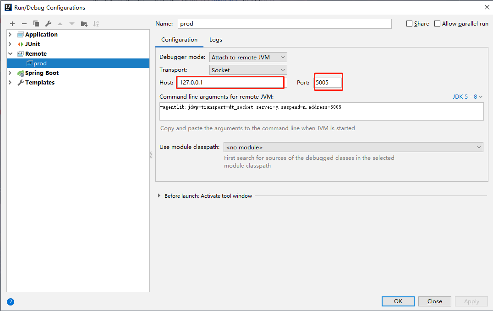

# IDEA远程调试

大家知道，线上环境定位问题不是那么简单的，如果有非常完善的日志以及监控系统是不必担心的，但是应对这些并不完善的场景下，IDEA提供了一种远程调试的功能，remote集成了可以远程调试的功能，只需要在你的生产环境开放某个端口供外部远程访问即可，下面讲解一下教程：

首先是IDEA配置Remote,


1. 如上图，只需要添加要监控的服务器，以及开启监控的端口即可。

2. IDEA配置好监控之后，需要在服务器上开放对应的端口供外部监控，我的启用方式是在启动jar包的时候指定，如下命令：

```shell
nohup java -Xdebug -Xnoagent -Djava.compiler=NONE -Xrunjdwp:transport=dt_socket,address=5005,server=y,suspend=n -jar jardemo.jar --spring.profiles.active=prod &
```

3. 启动之后启动IDEA配置的remote，看到如下图，即已经开启监控，这时候打断点debug就可以远程调试了