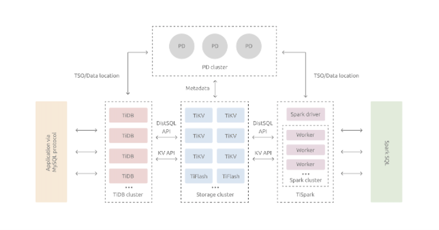
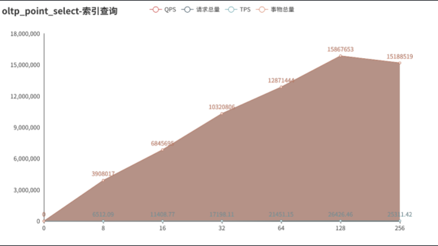
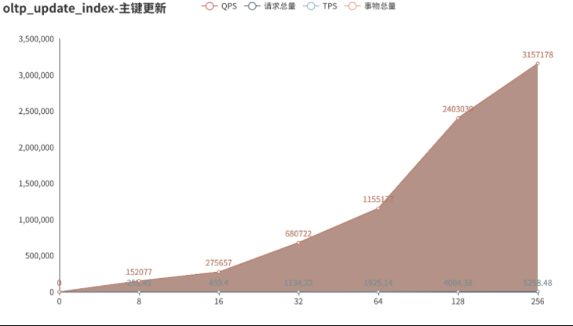
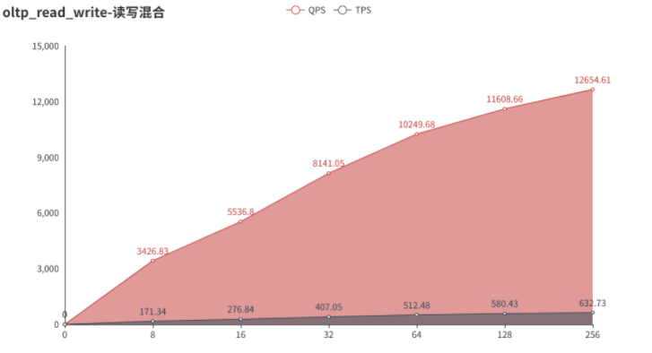
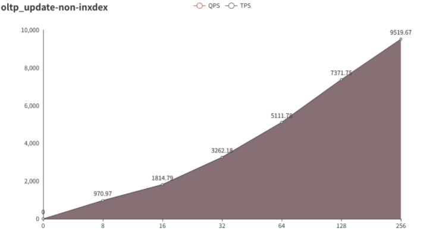
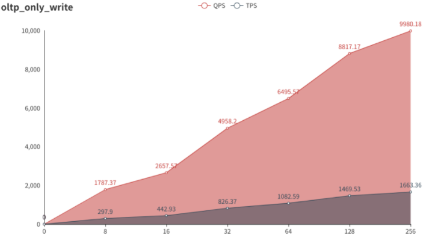
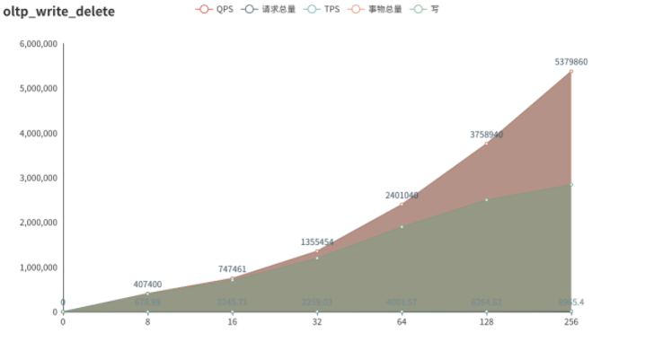
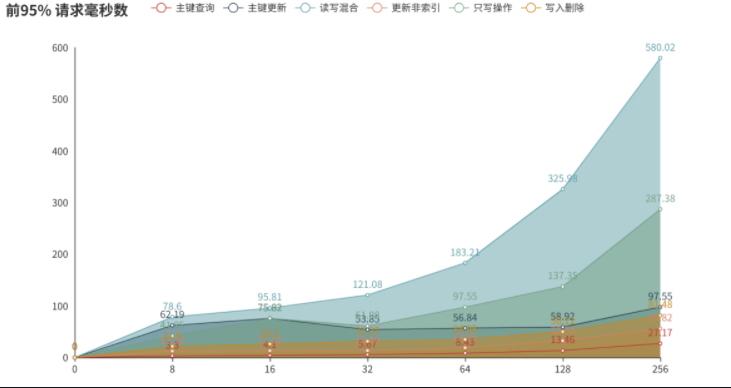

## TIDB 性能测试
感谢大佬
### TIDB整体架构

与传统的单机数据库相比，TiDB 具有以下优势：

- 纯分布式架构，拥有良好的扩展性，支持弹性的扩缩容
- 支持 SQL，对外暴露 MySQL 的网络协议，并兼容大多数 MySQL 的语法，在大多数场景下可以直接替换 MySQL
- 默认支持高可用，在少数副本失效的情况下，数据库本身能够自动进行数据修复和故障转移，对业务透明
- 支持 ACID 事务，对于一些有强一致需求的场景友好，例如：银行转账
- 具有丰富的工具链生态，覆盖数据迁移、同步、备份等多种场景

在内核设计上，TiDB 分布式数据库将整体架构拆分成了多个模块，各模块之间互相通信，组成完整的 TiDB 系统。对应的架构图如下：



- TiDB Server：SQL 层，对外暴露 MySQL 协议的连接 endpoint，负责接受客户端的连接，执行 SQL 解析和优化，最终生成分布式执行计划。TiDB 层本身是无状态的，实践中可以启动多个 TiDB 实例，通过负载均衡组件（如 LVS、HAProxy 或 F5）对外提供统一的接入地址，客户端的连接可以均匀地分摊在多个 TiDB 实例上以达到负载均衡的效果。TiDB Server 本身并不存储数据，只是解析 SQL，将实际的数据读取请求转发给底层的存储节点 TiKV（或 TiFlash）。
- PD Server：整个 TiDB 集群的元信息管理模块，负责存储每个 TiKV 节点实时的数据分布情况和集群的整体拓扑结构，提供 TiDB Dashboard 管控界面，并为分布式事务分配事务 ID。PD 不仅存储元信息，同时还会根据 TiKV 节点实时上报的数据分布状态，下发数据调度命令给具体的 TiKV 节点，可以说是整个集群的“大脑”。此外，PD 本身也是由至少 3 个节点构成，拥有高可用的能力。建议部署奇数个 PD 节点。
- 存储节点
  - TiKV Server：负责存储数据，从外部看 TiKV 是一个分布式的提供事务的 Key-Value 存储引擎。存储数据的基本单位是 Region，每个 Region 负责存储一个 Key Range（从 StartKey 到 EndKey 的左闭右开区间）的数据，每个 TiKV 节点会负责多个 Region。TiKV 的 API 在 KV 键值对层面提供对分布式事务的原生支持，默认提供了 SI (Snapshot Isolation) 的隔离级别，这也是 TiDB 在 SQL 层面支持分布式事务的核心。TiDB 的 SQL 层做完 SQL 解析后，会将 SQL 的执行计划转换为对 TiKV API 的实际调用。所以，数据都存储在 TiKV 中。另外，TiKV 中的数据都会自动维护多副本（默认为三副本），天然支持高可用和自动故障转移。
  - TiFlash：TiFlash 是一类特殊的存储节点。和普通 TiKV 节点不一样的是，在 TiFlash 内部，数据是以列式的形式进行存储，主要的功能是为分析型的场景加速。


### 使用TiUP集群在一台机器上设置测试环境

- 场景：体验具有完整拓扑的最小TiDB集群，并在单个Linux服务器上模拟生产部署步骤

#### 准备

官方推荐最小TIDB集群拓扑

| 实例    | 副本数   | IP地址        | 端口                                |
| ------- | -------- | ------------- | ----------------------------------- |
| TIKV    | 3        | 10.101.16.245 | 20160/20180,20161/20181,20162/20182 |
| TIDB    | 1        | 10.101.16.245 | 4000/10080                          |
| PD      | 1        | 10.101.16.245 | 2379/2380                           |
| TiFlash | 1        | 10.101.16.245 | 9000/8123/3930/20170/20292/8234     |
| Monitor | prometheus<br>grafana | 10.101.16.245 | 9090,3000                           |

#### 部署

- 下载并安装TiUP

```bash
curl --proto '=https' --tlsv1.2 -sSf https://tiup-mirrors.pingcap.com/install.sh | sh
```

- 安装TiUP集群组件

```bash
tiup cluster
# 更新
tiup update --self && tiup update cluster
```

- 创建并启动集群

  创建配置文件

  ```bash
  cat > topo.yaml <<- 'EOF' 
  # # Global variables are applied to all deployments and used as the default value of
  # # the deployments if a specific deployment value is missing.
  global:
   user: "tidb"
   ssh_port: 22
   deploy_dir: "/tidb-deploy"
   data_dir: "/tidb-data"
  
  # # Monitored variables are applied to all the machines.
  monitored:
   node_exporter_port: 9100
   blackbox_exporter_port: 9115
  
  server_configs:
   tidb:
     log.slow-threshold: 300
   tikv:
     readpool.storage.use-unified-pool: false
     readpool.coprocessor.use-unified-pool: true
   pd:
     replication.enable-placement-rules: true
     replication.location-labels: ["host"]
   tiflash:
     logger.level: "info"
  
  pd_servers:
   - host: 10.101.16.245
  
  tidb_servers:
   - host: 10.101.16.245
  
  tikv_servers:
   - host: 10.101.16.245
     port: 20160
     status_port: 20180
     config:
       server.labels: { host: "logic-host-1" }
  
   - host: 10.101.16.245
     port: 20161
     status_port: 20181
     config:
       server.labels: { host: "logic-host-2" }
  
   - host: 10.101.16.245
     port: 20162
     status_port: 20182
     config:
       server.labels: { host: "logic-host-3" }
  
  tiflash_servers:
   - host: 10.101.16.245
  
  monitoring_servers:
   - host: 10.101.16.245
  
  grafana_servers:
   - host: 10.101.16.245
  EOF
  ```

- 执行集群部署命令

```bash
tiup cluster deploy tidb-ddyw  v4.0.8 ./topo.yaml --user root
Starting component `cluster`: /root/.tiup/components/cluster/v1.2.5/tiup-cluster deploy tidb-ddyw v4.0.8 ./topo.yaml --user root
Please confirm your topology:
Cluster type:    tidb
Cluster name:    tidb-ddyw
Cluster version: v4.0.8
Type        Host           Ports                            OS/Arch       Directories
----        ----           -----                            -------       -----------
pd          10.101.16.245  2379/2380                        linux/x86_64  /tidb-deploy/pd-2379,/tidb-data/pd-2379
tikv        10.101.16.245  20160/20180                      linux/x86_64  /tidb-deploy/tikv-20160,/tidb-data/tikv-20160
tikv        10.101.16.245  20161/20181                      linux/x86_64  /tidb-deploy/tikv-20161,/tidb-data/tikv-20161
tikv        10.101.16.245  20162/20182                      linux/x86_64  /tidb-deploy/tikv-20162,/tidb-data/tikv-20162
tidb        10.101.16.245  4000/10080                       linux/x86_64  /tidb-deploy/tidb-4000
tiflash     10.101.16.245  9000/8123/3930/20170/20292/8234  linux/x86_64  /tidb-deploy/tiflash-9000,/tidb-data/tiflash-9000
prometheus  10.101.16.245  9090                             linux/x86_64  /tidb-deploy/prometheus-9090,/tidb-data/prometheus-9090
grafana     10.101.16.245  3000                             linux/x86_64  /tidb-deploy/grafana-3000
Attention:
    1. If the topology is not what you expected, check your yaml file.
    2. Please confirm there is no port/directory conflicts in same host.
Do you want to continue? [y/N]:  y
+ Generate SSH keys ... Done
+ Download TiDB components
  - Download pd:v4.0.8 (linux/amd64) ... Done
  - Download tikv:v4.0.8 (linux/amd64) ... Done
  - Download tidb:v4.0.8 (linux/amd64) ... Done
  - Download tiflash:v4.0.8 (linux/amd64) ... Done
  - Download prometheus:v4.0.8 (linux/amd64) ... Done
  - Download grafana:v4.0.8 (linux/amd64) ... Done
  - Download node_exporter:v0.17.0 (linux/amd64) ... Done
  - Download blackbox_exporter:v0.12.0 (linux/amd64) ... Done
+ Initialize target host environments
  - Prepare 10.101.16.245:22 ... Done
+ Copy files
  - Copy pd -> 10.101.16.245 ... Done
  - Copy tikv -> 10.101.16.245 ... Done
  - Copy tikv -> 10.101.16.245 ... Done
  - Copy tikv -> 10.101.16.245 ... Done
  - Copy tidb -> 10.101.16.245 ... Done
  - Copy tiflash -> 10.101.16.245 ... Done
  - Copy prometheus -> 10.101.16.245 ... Done
  - Copy grafana -> 10.101.16.245 ... Done
  - Copy node_exporter -> 10.101.16.245 ... Done
  - Copy blackbox_exporter -> 10.101.16.245 ... Done
+ Check status

Enabling component pd
+ Enable cluster
        Enable pd 10.101.16.245:2379 success
+ Enable cluster
+ Enable cluster
Enabling component tikv
	Enabling instance tikv 10.101.16.245:20162
	Enabling instance tikv 10.101.16.245:20160
+ Enable cluster
+ Enable cluster
+ Enable cluster
        Enable tikv 10.101.16.245:20162 success
Enabling component tidb
+ Enable cluster
        Enable tidb 10.101.16.245:4000 success
Enabling component tiflash
+ Enable cluster
        Enable tiflash 10.101.16.245:9000 success
Enabling component prometheus
+ Enable cluster
        Enable prometheus 10.101.16.245:9090 success
Enabling component grafana
+ Enable cluster
+ Enable cluster
Deployed cluster `tidb-ddyw` successfully, you can start the cluster via `tiup cluster start tidb-ddyw`
```

- 启动集群

```bash
tiup cluster start tidb-ddyw
Starting component `cluster`: /root/.tiup/components/cluster/v1.2.5/tiup-cluster start tidb-ddyw
Starting cluster tidb-ddyw...
+ [ Serial ] - SSHKeySet: privateKey=/root/.tiup/storage/cluster/clusters/tidb-ddyw/ssh/id_rsa, publicKey=/root/.tiup/storage/cluster/clusters/tidb-ddyw/ssh/id_rsa.pub
+ [Parallel] - UserSSH: user=tidb, host=10.101.16.245
+ [Parallel] - UserSSH: user=tidb, host=10.101.16.245
+ [Parallel] - UserSSH: user=tidb, host=10.101.16.245
+ [Parallel] - UserSSH: user=tidb, host=10.101.16.245
+ [Parallel] - UserSSH: user=tidb, host=10.101.16.245
+ [Parallel] - UserSSH: user=tidb, host=10.101.16.245
+ [Parallel] - UserSSH: user=tidb, host=10.101.16.245
+ [Parallel] - UserSSH: user=tidb, host=10.101.16.245
+ [ Serial ] - StartCluster
Starting component pd
	Starting instance pd 10.101.16.245:2379
	Start pd 10.101.16.245:2379 success
Starting component node_exporter
	Starting instance 10.101.16.245
	Start 10.101.16.245 success
Starting component blackbox_exporter
	Starting instance 10.101.16.245
	Start 10.101.16.245 success
Starting component tikv
	Starting instance tikv 10.101.16.245:20162
	Starting instance tikv 10.101.16.245:20160
	Starting instance tikv 10.101.16.245:20161
	Start tikv 10.101.16.245:20160 success
	Start tikv 10.101.16.245:20161 success
	Start tikv 10.101.16.245:20162 success
Starting component tidb
	Starting instance tidb 10.101.16.245:4000
	Start tidb 10.101.16.245:4000 success
Starting component tiflash
	Starting instance tiflash 10.101.16.245:9000
	Start tiflash 10.101.16.245:9000 success
Starting component prometheus
	Starting instance prometheus 10.101.16.245:9090
	Start prometheus 10.101.16.245:9090 success
Starting component grafana
	Starting instance grafana 10.101.16.245:3000
	Start grafana 10.101.16.245:3000 success
+ [ Serial ] - UpdateTopology: cluster=tidb-ddyw
Started cluster `tidb-ddyw` successfully
```

- 访问集群

```bash
# 安装mysql client客户端
yum install -y mysql
# 访问TIDB,默认为空密码
mysql -h 10.101.16.245 -P 4000 -u root
MySQL [(none)]> show databases;
+--------------------+
| Database           |
+--------------------+
| INFORMATION_SCHEMA |
| METRICS_SCHEMA     |
| PERFORMANCE_SCHEMA |
| mysql              |
| test               |
+--------------------+
5 rows in set (0.00 sec)

# 查看集群列表
tiup cluster list
Starting component `cluster`: /root/.tiup/components/cluster/v1.2.5/tiup-cluster list
Name       User  Version  Path                                            PrivateKey
----       ----  -------  ----                                            ----------
tidb-ddyw  tidb  v4.0.8   /root/.tiup/storage/cluster/clusters/tidb-ddyw  /root/.tiup/storage/cluster/clusters/tidb-ddyw/ssh/id_rsa
# 查看集群拓扑
tiup cluster display tidb-ddyw
Starting component `cluster`: /root/.tiup/components/cluster/v1.2.5/tiup-cluster display tidb-ddyw
Cluster type:    tidb
Cluster name:    tidb-ddyw
Cluster version: v4.0.8
SSH type:        builtin
ID                   Role        Host           Ports                            OS/Arch       Status   Data Dir                    Deploy Dir
--                   ----        ----           -----                            -------       ------   --------                    ----------
10.101.16.245:3000   grafana     10.101.16.245  3000                             linux/x86_64  Up       -                           /tidb-deploy/grafana-3000
10.101.16.245:2379   pd          10.101.16.245  2379/2380                        linux/x86_64  Up|L|UI  /tidb-data/pd-2379          /tidb-deploy/pd-2379
10.101.16.245:9090   prometheus  10.101.16.245  9090                             linux/x86_64  Up       /tidb-data/prometheus-9090  /tidb-deploy/prometheus-9090
10.101.16.245:4000   tidb        10.101.16.245  4000/10080                       linux/x86_64  Up       -                           /tidb-deploy/tidb-4000
10.101.16.245:9000   tiflash     10.101.16.245  9000/8123/3930/20170/20292/8234  linux/x86_64  Up       /tidb-data/tiflash-9000     /tidb-deploy/tiflash-9000
10.101.16.245:20160  tikv        10.101.16.245  20160/20180                      linux/x86_64  Up       /tidb-data/tikv-20160       /tidb-deploy/tikv-20160
10.101.16.245:20161  tikv        10.101.16.245  20161/20181                      linux/x86_64  Up       /tidb-data/tikv-20161       /tidb-deploy/tikv-20161
10.101.16.245:20162  tikv        10.101.16.245  20162/20182                      linux/x86_64  Up       /tidb-data/tikv-20162       /tidb-deploy/tikv-20162
Total nodes: 8
# TIDB访问
To connect TiDB: mysql --host 10.101.16.245 --port 4000 -u root
To view the dashboard: http://10.101.16.245:2379/dashboard
To view the monitor: http://10.101.16.245:9090
```

### 分布式部署

#### 准备

本次测试环境TIDB集群拓扑

| 实例    | 配置       | 副本数                | IP地址        | 端口                                |
| ------- | ---------- | --------------------- | ------------- | ----------------------------------- |
| TiDB    | 8核32G500G | 1                     | 10.101.16.246 | 4000/10080                          |
| PD      | 8核32G500G | 1                     | 10.101.16.247 | 2379/2380                           |
| TIKV    | 8核32G500G | 3                     | 10.101.16.246<br>10.101.16.247<br>10.101.16.248| 20160/20180,20161/20181,20162/20182 |
| TiFlash | 8核32G500G | 1                     | 10.101.16.248 | 9000/8123/3930/20170/20292/8234     |
| Monitor | 8核32G500G | prometheus<br>grafana | 10.101.16.246 | 9090,3000                           |

#### 部署

>  磁盘格式化(三台机器执行)

```bash
# 数据盘分区
fdisk /dev/vdb
欢迎使用 fdisk (util-linux 2.23.2)。

更改将停留在内存中，直到您决定将更改写入磁盘。
使用写入命令前请三思。

Device does not contain a recognized partition table
使用磁盘标识符 0xa1b68466 创建新的 DOS 磁盘标签。

命令(输入 m 获取帮助)：n
Partition type:
   p   primary (0 primary, 0 extended, 4 free)
   e   extended
Select (default p): p
分区号 (1-4，默认 1)：1
起始 扇区 (2048-943718399，默认为 2048)：
将使用默认值 2048
Last 扇区, +扇区 or +size{K,M,G} (2048-943718399，默认为 943718399)：
将使用默认值 943718399
分区 1 已设置为 Linux 类型，大小设为 450 GiB

命令(输入 m 获取帮助)：p

磁盘 /dev/vdb：483.2 GB, 483183820800 字节，943718400 个扇区
Units = 扇区 of 1 * 512 = 512 bytes
扇区大小(逻辑/物理)：512 字节 / 512 字节
I/O 大小(最小/最佳)：512 字节 / 512 字节
磁盘标签类型：dos
磁盘标识符：0xa1b68466

   设备 Boot      Start         End      Blocks   Id  System
/dev/vdb1            2048   943718399   471858176   83  Linux

命令(输入 m 获取帮助)：w
The partition table has been altered!

Calling ioctl() to re-read partition table.
正在同步磁盘。
# 创建文件系统
mkfs -t xfs /dev/vdb1
# 挂载使用
mkdir /tidbdata
mount /dev/vdb1 /tidbdata
# 挂载开机启动
blkid
/dev/vda1: UUID="9f2d3e15-a78a-4f3d-8385-0165b4b67864" TYPE="ext4" 
/dev/vdb1: UUID="b2c45077-0f11-42ff-90d1-864a6d9c7490" TYPE="xfs" 
cat >> /etc/fstab <<- 'EOF'
> UUID=b2c45077-0f11-42ff-90d1-864a6d9c7490 /tidbdata xfs default 0 0
> EOF
```

> 10.101.16.246 上安装tiup并初始化tidb集群

- 下载并安装TiUP

```bash
curl --proto '=https' --tlsv1.2 -sSf https://tiup-mirrors.pingcap.com/install.sh | sh
```

- 安装TiUP集群组件

```bash
# source bash_profile
source ~/.bash_profile
# 安装tiup
tiup cluster
# 更新
tiup update --self && tiup update cluster
```

- 创建并启动集群

  创建配置文件

  ```bash
  cat > topo.yaml <<- 'EOF' 
  # # Global variables are applied to all deployments and used as the default value of
  # # the deployments if a specific deployment value is missing.
  global:
   user: "tidb"
   ssh_port: 22
   deploy_dir: "/tidbdata/tidb-deploy"
   data_dir: "/tidbdata/tidb-data"
  
  # # Monitored variables are applied to all the machines.
  monitored:
   node_exporter_port: 9100
   blackbox_exporter_port: 9115
  
  server_configs:
   tidb:
     log.slow-threshold: 300
   tikv:
     readpool.storage.use-unified-pool: false
     readpool.coprocessor.use-unified-pool: true
   pd:
     replication.enable-placement-rules: true
     replication.location-labels: ["host"]
   tiflash:
     logger.level: "info"
  
  pd_servers:
   - host: 10.101.16.247
  
  tidb_servers:
   - host: 10.101.16.246
  
  tikv_servers:
   - host: 10.101.16.246
     port: 20160
     status_port: 20180
     config:
       server.labels: { host: "tidb-node01" }
  
   - host: 10.101.16.247
     port: 20161
     status_port: 20181
     config:
       server.labels: { host: "tidb-node02" }
  
   - host: 10.101.16.248
     port: 20162
     status_port: 20182
     config:
       server.labels: { host: "tidb-node03" }
  
  tiflash_servers:
   - host: 10.101.16.248
  
  monitoring_servers:
   - host: 10.101.16.246
  
  grafana_servers:
   - host: 10.101.16.246
  EOF
  ```

- 执行集群部署命令

```bash
tiup cluster deploy tidb-ddyw  v4.0.8 ./topo.yaml --user root
Deployed cluster `tidb-ddyw` successfully, you can start the cluster via `tiup cluster start tidb-ddyw`
```

- 启动集群

```bash
tiup cluster start tidb-ddyw
Started cluster `tidb-ddyw` successfully
```

- 访问集群

```bash
# 安装mysql client客户端
yum install -y mysql
# 访问TIDB,默认为空密码
mysql -h 10.101.16.246 -P 4000 -u root
MySQL [(none)]> show databases;
+--------------------+
| Database           |
+--------------------+
| INFORMATION_SCHEMA |
| METRICS_SCHEMA     |
| PERFORMANCE_SCHEMA |
| mysql              |
| test               |
+--------------------+
5 rows in set (0.00 sec)

# 查看集群列表
tiup cluster display tidb-ddyw
Starting component `cluster`: /root/.tiup/components/cluster/v1.2.5/tiup-cluster display tidb-ddyw
Cluster type:    tidb
Cluster name:    tidb-ddyw
Cluster version: v4.0.8
SSH type:        builtin
ID                   Role        Host           Ports                            OS/Arch       Status   Data Dir                             Deploy Dir
--                   ----        ----           -----                            -------       ------   --------                             ----------
10.101.16.246:3000   grafana     10.101.16.246  3000                             linux/x86_64  Up       -                                    /tidbdata/tidb-deploy/grafana-3000
10.101.16.247:2379   pd          10.101.16.247  2379/2380                        linux/x86_64  Up|L|UI  /tidbdata/tidb-data/pd-2379          /tidbdata/tidb-deploy/pd-2379
10.101.16.246:9090   prometheus  10.101.16.246  9090                             linux/x86_64  Up       /tidbdata/tidb-data/prometheus-9090  /tidbdata/tidb-deploy/prometheus-9090
10.101.16.246:4000   tidb        10.101.16.246  4000/10080                       linux/x86_64  Up       -                                    /tidbdata/tidb-deploy/tidb-4000
10.101.16.248:9000   tiflash     10.101.16.248  9000/8123/3930/20170/20292/8234  linux/x86_64  Up       /tidbdata/tidb-data/tiflash-9000     /tidbdata/tidb-deploy/tiflash-9000
10.101.16.246:20160  tikv        10.101.16.246  20160/20180                      linux/x86_64  Up       /tidbdata/tidb-data/tikv-20160       /tidbdata/tidb-deploy/tikv-20160
10.101.16.247:20161  tikv        10.101.16.247  20161/20181                      linux/x86_64  Up       /tidbdata/tidb-data/tikv-20161       /tidbdata/tidb-deploy/tikv-20161
10.101.16.248:20162  tikv        10.101.16.248  20162/20182                      linux/x86_64  Up       /tidbdata/tidb-data/tikv-20162       /tidbdata/tidb-deploy/tikv-20162
Total nodes: 8
# TIDB访问
## 内网访问
To connect TiDB: mysql --host 10.101.16.246 --port 4000 -u root
To view the dashboard: http://10.101.16.246:2379/dashboard
To view the monitor: http://10.101.16.246:9090
## 外网访问
To connect TiDB: mysql --host 47.93.55.89 --port 32002 -u root
To view the dashboard: http://47.93.55.89:32003/dashboard
To view the monitor prometheus: http://47.93.55.89:32004
To view the monitor grafana: http://47.93.55.89:32001 admin admin
```

### TIDB集群管理

#### 集群重启

在停止node_exporter时,出现超时现象报错,导致集群直接故障,需要手动启动集群,才可回复正常,查看官方提供的tiup部署工具为二进制包,所以需要修改源码才可以解决此问题.

```bash
# 集群重启
## 出现超时报错
tiup cluster restart tidb-ddyw
Starting component `cluster`: /root/.tiup/components/cluster/v1.2.5/tiup-cluster restart tidb-ddyw
+ [ Serial ] - SSHKeySet: privateKey=/root/.tiup/storage/cluster/clusters/tidb-ddyw/ssh/id_rsa, publicKey=/root/.tiup/storage/cluster/clusters/tidb-ddyw/ssh/id_rsa.pub
+ [Parallel] - UserSSH: user=tidb, host=10.101.16.245
+ [Parallel] - UserSSH: user=tidb, host=10.101.16.245
+ [Parallel] - UserSSH: user=tidb, host=10.101.16.245
+ [Parallel] - UserSSH: user=tidb, host=10.101.16.245
+ [Parallel] - UserSSH: user=tidb, host=10.101.16.245
+ [Parallel] - UserSSH: user=tidb, host=10.101.16.245
+ [Parallel] - UserSSH: user=tidb, host=10.101.16.245
+ [Parallel] - UserSSH: user=tidb, host=10.101.16.245
+ [ Serial ] - RestartCluster
Stopping component grafana
	Stopping instance 10.101.16.245
	Stop grafana 10.101.16.245:3000 success
Stopping component prometheus
	Stopping instance 10.101.16.245
	Stop prometheus 10.101.16.245:9090 success
Stopping component tiflash
	Stopping instance 10.101.16.245
	Stop tiflash 10.101.16.245:9000 success
Stopping component tidb
	Stopping instance 10.101.16.245
	Stop tidb 10.101.16.245:4000 success
Stopping component tikv
	Stopping instance 10.101.16.245
	Stopping instance 10.101.16.245
	Stopping instance 10.101.16.245
	Stop tikv 10.101.16.245:20162 success
	Stop tikv 10.101.16.245:20160 success
	Stop tikv 10.101.16.245:20161 success
Stopping component pd
	Stopping instance 10.101.16.245
	Stop pd 10.101.16.245:2379 success
Stopping component node_exporter
retry error: operation timed out after 2m0s
	pd 10.101.16.245:2379 failed to stop: timed out waiting for port 9100 to be stopped after 2m0s

Error: failed to stop: 	pd 10.101.16.245:2379 failed to stop: timed out waiting for port 9100 to be stopped after 2m0s: timed out waiting for port 9100 to be stopped after 2m0s

Verbose debug logs has been written to /tidb-data/tikv-20160/logs/tiup-cluster-debug-2020-12-02-10-50-06.log.
Error: run `/root/.tiup/components/cluster/v1.2.5/tiup-cluster` (wd:/root/.tiup/data/SHyfGAX) failed: exit status 1
## 再次查看集群拓扑,出现异常
Starting component `cluster`: /root/.tiup/components/cluster/v1.2.5/tiup-cluster display tidb-ddyw
Cluster type:    tidb
Cluster name:    tidb-ddyw
Cluster version: v4.0.8
SSH type:        builtin
ID                   Role        Host           Ports                            OS/Arch       Status    Data Dir                    Deploy Dir
--                   ----        ----           -----                            -------       ------    --------                    ----------
10.101.16.245:3000   grafana     10.101.16.245  3000                             linux/x86_64  inactive  -                           /tidb-deploy/grafana-3000
10.101.16.245:2379   pd          10.101.16.245  2379/2380                        linux/x86_64  Down      /tidb-data/pd-2379          /tidb-deploy/pd-2379
10.101.16.245:9090   prometheus  10.101.16.245  9090                             linux/x86_64  inactive  /tidb-data/prometheus-9090  /tidb-deploy/prometheus-9090
10.101.16.245:4000   tidb        10.101.16.245  4000/10080                       linux/x86_64  Down      -                           /tidb-deploy/tidb-4000
10.101.16.245:9000   tiflash     10.101.16.245  9000/8123/3930/20170/20292/8234  linux/x86_64  Down      /tidb-data/tiflash-9000     /tidb-deploy/tiflash-9000
10.101.16.245:20160  tikv        10.101.16.245  20160/20180                      linux/x86_64  Down      /tidb-data/tikv-20160       /tidb-deploy/tikv-20160
10.101.16.245:20161  tikv        10.101.16.245  20161/20181                      linux/x86_64  Down      /tidb-data/tikv-20161       /tidb-deploy/tikv-20161
10.101.16.245:20162  tikv        10.101.16.245  20162/20182                      linux/x86_64  Down      /tidb-data/tikv-20162       /tidb-deploy/tikv-20162
Total nodes: 8

WARN: get location labels from pd failed: Get http://10.101.16.245:2379/pd/api/v1/config/replicate: dial tcp 10.101.16.245:2379: connect: connection refused
## 再启动TIDB,恢复正常
tiup cluster start tidb-ddyw
tiup cluster display tidb-ddyw
Starting component `cluster`: /root/.tiup/components/cluster/v1.2.5/tiup-cluster display tidb-ddyw
Cluster type:    tidb
Cluster name:    tidb-ddyw
Cluster version: v4.0.8
SSH type:        builtin
ID                   Role        Host           Ports                            OS/Arch       Status        Data Dir                    Deploy Dir
--                   ----        ----           -----                            -------       ------        --------                    ----------
10.101.16.245:3000   grafana     10.101.16.245  3000                             linux/x86_64  Up            -                           /tidb-deploy/grafana-3000
10.101.16.245:2379   pd          10.101.16.245  2379/2380                        linux/x86_64  Up|L|UI       /tidb-data/pd-2379          /tidb-deploy/pd-2379
10.101.16.245:9090   prometheus  10.101.16.245  9090                             linux/x86_64  Up            /tidb-data/prometheus-9090  /tidb-deploy/prometheus-9090
10.101.16.245:4000   tidb        10.101.16.245  4000/10080                       linux/x86_64  Up            -                           /tidb-deploy/tidb-4000
10.101.16.245:9000   tiflash     10.101.16.245  9000/8123/3930/20170/20292/8234  linux/x86_64  Disconnected  /tidb-data/tiflash-9000     /tidb-deploy/tiflash-9000
10.101.16.245:20160  tikv        10.101.16.245  20160/20180                      linux/x86_64  Up            /tidb-data/tikv-20160       /tidb-deploy/tikv-20160
10.101.16.245:20161  tikv        10.101.16.245  20161/20181                      linux/x86_64  Up            /tidb-data/tikv-20161       /tidb-deploy/tikv-20161
10.101.16.245:20162  tikv        10.101.16.245  20162/20182                      linux/x86_64  Up            /tidb-data/tikv-20162       /tidb-deploy/tikv-20162
Total nodes: 8
```

#### 更新配置

官方提供示例配置参考如下

```bash
curl -sL https://raw.githubusercontent.com/pingcap/tidb/master/config/config.toml.example -o config.toml.example
```

集群更新配置并重启组件

```bash
# 查看role和node
tiup cluster display tidb-ddyw 
Starting component `cluster`: /root/.tiup/components/cluster/v1.2.5/tiup-cluster display tidb-ddyw
Cluster type:    tidb
Cluster name:    tidb-ddyw
Cluster version: v4.0.8
SSH type:        builtin
ID                   Role        Host           Ports                            OS/Arch       Status   Data Dir                    Deploy Dir
--                   ----        ----           -----                            -------       ------   --------                    ----------
10.101.16.245:3000   grafana     10.101.16.245  3000                             linux/x86_64  Up       -                           /tidb-deploy/grafana-3000
10.101.16.245:2379   pd          10.101.16.245  2379/2380                        linux/x86_64  Up|L|UI  /tidb-data/pd-2379          /tidb-deploy/pd-2379
10.101.16.245:9090   prometheus  10.101.16.245  9090                             linux/x86_64  Up       /tidb-data/prometheus-9090  /tidb-deploy/prometheus-9090
10.101.16.245:4000   tidb        10.101.16.245  4000/10080                       linux/x86_64  Up       -                           /tidb-deploy/tidb-4000
10.101.16.245:9000   tiflash     10.101.16.245  9000/8123/3930/20170/20292/8234  linux/x86_64  Up       /tidb-data/tiflash-9000     /tidb-deploy/tiflash-9000
10.101.16.245:20160  tikv        10.101.16.245  20160/20180                      linux/x86_64  Up       /tidb-data/tikv-20160       /tidb-deploy/tikv-20160
10.101.16.245:20161  tikv        10.101.16.245  20161/20181                      linux/x86_64  Up       /tidb-data/tikv-20161       /tidb-deploy/tikv-20161
10.101.16.245:20162  tikv        10.101.16.245  20162/20182                      linux/x86_64  Up       /tidb-data/tikv-20162       /tidb-deploy/tikv-20162
Total nodes: 8
# 重启整个集群
tiup cluster reload tidb-ddyw
Starting component `cluster`: /root/.tiup/components/cluster/v1.2.5/tiup-cluster reload tidb-ddyw
+ [ Serial ] - SSHKeySet: privateKey=/root/.tiup/storage/cluster/clusters/tidb-ddyw/ssh/id_rsa, publicKey=/root/.tiup/storage/cluster/clusters/tidb-ddyw/ssh/id_rsa.pub
+ [Parallel] - UserSSH: user=tidb, host=10.101.16.245
+ [Parallel] - UserSSH: user=tidb, host=10.101.16.245
+ [Parallel] - UserSSH: user=tidb, host=10.101.16.245
+ [Parallel] - UserSSH: user=tidb, host=10.101.16.245
+ [Parallel] - UserSSH: user=tidb, host=10.101.16.245
+ [Parallel] - UserSSH: user=tidb, host=10.101.16.245
+ [Parallel] - UserSSH: user=tidb, host=10.101.16.245
+ [Parallel] - UserSSH: user=tidb, host=10.101.16.245
+ Refresh instance configs
  - Refresh config pd -> 10.101.16.245:2379 ... Done
  - Refresh config tikv -> 10.101.16.245:20160 ... Done
  - Refresh config tikv -> 10.101.16.245:20161 ... Done
  - Refresh config tikv -> 10.101.16.245:20162 ... Done
  - Refresh config tidb -> 10.101.16.245:4000 ... Done
  - Refresh config tiflash -> 10.101.16.245:9000 ... Done
  - Refresh config prometheus -> 10.101.16.245:9090 ... Done
  - Refresh config grafana -> 10.101.16.245:3000 ... Done
+ Refresh monitor configs
  - Refresh config node_exporter -> 10.101.16.245 ... Done
  - Refresh config blackbox_exporter -> 10.101.16.245 ... Done
+ [ Serial ] - UpgradeCluster
Restarting component tiflash
	Restarting instance 10.101.16.245
	Restart 10.101.16.245 success
Restarting component pd
	Restarting instance 10.101.16.245
	Restart 10.101.16.245 success
Restarting component tikv
Still waitting for the PD leader to be elected
Evicting 9 leaders from store 10.101.16.245:20160...
Still waitting for 9 store leaders to transfer...
Still waitting for 9 store leaders to transfer...
Still waitting for 9 store leaders to transfer...
Still waitting for 9 store leaders to transfer...
Still waitting for 9 store leaders to transfer...
Still waitting for 9 store leaders to transfer...
Still waitting for 8 store leaders to transfer...
Still waitting for 8 store leaders to transfer...
Still waitting for 8 store leaders to transfer...
Still waitting for 8 store leaders to transfer...
Still waitting for 8 store leaders to transfer...
Still waitting for 8 store leaders to transfer...
Still waitting for 8 store leaders to transfer...
Still waitting for 8 store leaders to transfer...
Still waitting for 8 store leaders to transfer...
Still waitting for 8 store leaders to transfer...
Still waitting for 8 store leaders to transfer...
Still waitting for 8 store leaders to transfer...
Still waitting for 8 store leaders to transfer...
Still waitting for 8 store leaders to transfer...
Still waitting for 8 store leaders to transfer...
Still waitting for 8 store leaders to transfer...
Still waitting for 8 store leaders to transfer...
Still waitting for 8 store leaders to transfer...
Still waitting for 8 store leaders to transfer...
Still waitting for 8 store leaders to transfer...
	Restarting instance 10.101.16.245
	Restart 10.101.16.245 success
Delete leader evicting scheduler of store 4 success
Removed store leader evicting scheduler from 10.101.16.245:20160.
Evicting 12 leaders from store 10.101.16.245:20161...
Still waitting for 12 store leaders to transfer...
Still waitting for 12 store leaders to transfer...
Still waitting for 12 store leaders to transfer...
	Restarting instance 10.101.16.245
	Restart 10.101.16.245 success
Delete leader evicting scheduler of store 5 success
Removed store leader evicting scheduler from 10.101.16.245:20161.
Evicting 14 leaders from store 10.101.16.245:20162...
Still waitting for 14 store leaders to transfer...
Still waitting for 14 store leaders to transfer...
Still waitting for 14 store leaders to transfer...
	Restarting instance 10.101.16.245
	Restart 10.101.16.245 success
Delete leader evicting scheduler of store 1 success
Removed store leader evicting scheduler from 10.101.16.245:20162.
Restarting component tidb
	Restarting instance 10.101.16.245
	Restart 10.101.16.245 success
Restarting component prometheus
	Restarting instance 10.101.16.245
	Restart 10.101.16.245 success
Restarting component grafana
	Restarting instance 10.101.16.245
	Restart 10.101.16.245 success
Reloaded cluster `tidb-ddyw` successfully
# 根据node重启组件
tiup cluster reload tidb-ddyw -N 10.101.16.245:9090
Starting component `cluster`: /root/.tiup/components/cluster/v1.2.5/tiup-cluster reload tidb-ddyw -N 10.101.16.245:9090
+ [ Serial ] - SSHKeySet: privateKey=/root/.tiup/storage/cluster/clusters/tidb-ddyw/ssh/id_rsa, publicKey=/root/.tiup/storage/cluster/clusters/tidb-ddyw/ssh/id_rsa.pub
+ [Parallel] - UserSSH: user=tidb, host=10.101.16.245
+ [Parallel] - UserSSH: user=tidb, host=10.101.16.245
+ [Parallel] - UserSSH: user=tidb, host=10.101.16.245
+ [Parallel] - UserSSH: user=tidb, host=10.101.16.245
+ [Parallel] - UserSSH: user=tidb, host=10.101.16.245
+ [Parallel] - UserSSH: user=tidb, host=10.101.16.245
+ [Parallel] - UserSSH: user=tidb, host=10.101.16.245
+ [Parallel] - UserSSH: user=tidb, host=10.101.16.245
+ Refresh instance configs
  - Refresh config pd -> 10.101.16.245:2379 ... Done
  - Refresh config tikv -> 10.101.16.245:20160 ... Done
  - Refresh config tikv -> 10.101.16.245:20161 ... Done
  - Refresh config tikv -> 10.101.16.245:20162 ... Done
  - Refresh config tidb -> 10.101.16.245:4000 ... Done
  - Refresh config tiflash -> 10.101.16.245:9000 ... Done
  - Refresh config prometheus -> 10.101.16.245:9090 ... Done
  - Refresh config grafana -> 10.101.16.245:3000 ... Done
+ Refresh monitor configs
  - Refresh config node_exporter -> 10.101.16.245 ... Done
  - Refresh config blackbox_exporter -> 10.101.16.245 ... Done
+ [ Serial ] - UpgradeCluster
Restarting component prometheus
	Restarting instance 10.101.16.245
	Restart 10.101.16.245 success
Reloaded cluster `tidb-ddyw` successfully
# 根据role重启组件
tiup cluster reload tidb-ddyw -R prometheus
Starting component `cluster`: /root/.tiup/components/cluster/v1.2.5/tiup-cluster reload tidb-ddyw -R prometheus
+ [ Serial ] - SSHKeySet: privateKey=/root/.tiup/storage/cluster/clusters/tidb-ddyw/ssh/id_rsa, publicKey=/root/.tiup/storage/cluster/clusters/tidb-ddyw/ssh/id_rsa.pub
+ [Parallel] - UserSSH: user=tidb, host=10.101.16.245
+ [Parallel] - UserSSH: user=tidb, host=10.101.16.245
+ [Parallel] - UserSSH: user=tidb, host=10.101.16.245
+ [Parallel] - UserSSH: user=tidb, host=10.101.16.245
+ [Parallel] - UserSSH: user=tidb, host=10.101.16.245
+ [Parallel] - UserSSH: user=tidb, host=10.101.16.245
+ [Parallel] - UserSSH: user=tidb, host=10.101.16.245
+ [Parallel] - UserSSH: user=tidb, host=10.101.16.245
+ Refresh instance configs
  - Refresh config pd -> 10.101.16.245:2379 ... Done
  - Refresh config tikv -> 10.101.16.245:20160 ... Done
  - Refresh config tikv -> 10.101.16.245:20161 ... Done
  - Refresh config tikv -> 10.101.16.245:20162 ... Done
  - Refresh config tidb -> 10.101.16.245:4000 ... Done
  - Refresh config tiflash -> 10.101.16.245:9000 ... Done
  - Refresh config prometheus -> 10.101.16.245:9090 ... Done
  - Refresh config grafana -> 10.101.16.245:3000 ... Done
+ Refresh monitor configs
  - Refresh config node_exporter -> 10.101.16.245 ... Done
  - Refresh config blackbox_exporter -> 10.101.16.245 ... Done
+ [ Serial ] - UpgradeCluster
Restarting component prometheus
	Restarting instance 10.101.16.245
	Restart 10.101.16.245 success
Reloaded cluster `tidb-ddyw` successfully
```

#### 查看配置

```bash
# 查看配置文件
pwd;tree tidb-* pd-* tikv-* tiflash-*/conf;
/tidb-deploy
tidb-4000
├── bin
│   └── tidb-server
├── conf
│   └── tidb.toml
├── log
│   ├── tidb.log
│   ├── tidb_slow_query.log
│   └── tidb_stderr.log
└── scripts
    └── run_tidb.sh
pd-2379
├── bin
│   └── pd-server
├── conf
│   └── pd.toml
├── log
│   ├── pd.log
│   └── pd_stderr.log
└── scripts
    └── run_pd.sh
tikv-20160
├── bin
│   └── tikv-server
├── conf
│   └── tikv.toml
├── log
│   ├── tikv.log
│   └── tikv_stderr.log
└── scripts
    └── run_tikv.sh
tikv-20161
├── bin
│   └── tikv-server
├── conf
│   └── tikv.toml
├── log
│   ├── tikv.log
│   └── tikv_stderr.log
└── scripts
    └── run_tikv.sh
tikv-20162
├── bin
│   └── tikv-server
├── conf
│   └── tikv.toml
├── log
│   ├── tikv.log
│   └── tikv_stderr.log
└── scripts
    └── run_tikv.sh
tiflash-9000/conf
├── tiflash-learner.toml
├── tiflash-preprocessed.toml
└── tiflash.toml

20 directories, 29 files
# 查看配置文件内容
tree tidb-*/conf/*.toml && cat tidb-*/conf/*.toml && echo -e "\n+++++++++++++++++++++++++++++++++++++++++++++++\n";tree pd-*/conf/*.toml && cat pd-*/conf/*.toml && echo -e "\n+++++++++++++++++++++++++++++++++++++++++++++++\n";tree tikv-*/conf/*.toml && cat tikv-*/conf/*.toml && echo -e "\n+++++++++++++++++++++++++++++++++++++++++++++++\n";tree tiflash-*/conf/*.toml && cat tiflash-*/conf/*.toml;

tidb-4000/conf/tidb.toml [error opening dir]

0 directories, 0 files
# WARNING: This file is auto-generated. Do not edit! All your modification will be overwritten!
# You can use 'tiup cluster edit-config' and 'tiup cluster reload' to update the configuration
# All configuration items you want to change can be added to:
# server_configs:
#   tidb:
#     aa.b1.c3: value
#     aa.b2.c4: value
[log]
slow-threshold = 300

+++++++++++++++++++++++++++++++++++++++++++++++

pd-2379/conf/pd.toml [error opening dir]

0 directories, 0 files
# WARNING: This file is auto-generated. Do not edit! All your modification will be overwritten!
# You can use 'tiup cluster edit-config' and 'tiup cluster reload' to update the configuration
# All configuration items you want to change can be added to:
# server_configs:
#   pd:
#     aa.b1.c3: value
#     aa.b2.c4: value
[pd-server]
metric-storage = "http://10.101.16.245:9090"

[replication]
enable-placement-rules = true
location-labels = ["host"]

+++++++++++++++++++++++++++++++++++++++++++++++

tikv-20160/conf/tikv.toml [error opening dir]
tikv-20161/conf/tikv.toml [error opening dir]
tikv-20162/conf/tikv.toml [error opening dir]

0 directories, 0 files
# WARNING: This file is auto-generated. Do not edit! All your modification will be overwritten!
# You can use 'tiup cluster edit-config' and 'tiup cluster reload' to update the configuration
# All configuration items you want to change can be added to:
# server_configs:
#   tikv:
#     aa.b1.c3: value
#     aa.b2.c4: value
[readpool]
[readpool.coprocessor]
use-unified-pool = true
[readpool.storage]
use-unified-pool = false

[server]
[server.labels]
host = "logic-host-1"
# WARNING: This file is auto-generated. Do not edit! All your modification will be overwritten!
# You can use 'tiup cluster edit-config' and 'tiup cluster reload' to update the configuration
# All configuration items you want to change can be added to:
# server_configs:
#   tikv:
#     aa.b1.c3: value
#     aa.b2.c4: value
[readpool]
[readpool.coprocessor]
use-unified-pool = true
[readpool.storage]
use-unified-pool = false

[server]
[server.labels]
host = "logic-host-2"
# WARNING: This file is auto-generated. Do not edit! All your modification will be overwritten!
# You can use 'tiup cluster edit-config' and 'tiup cluster reload' to update the configuration
# All configuration items you want to change can be added to:
# server_configs:
#   tikv:
#     aa.b1.c3: value
#     aa.b2.c4: value
[readpool]
[readpool.coprocessor]
use-unified-pool = true
[readpool.storage]
use-unified-pool = false

[server]
[server.labels]
host = "logic-host-3"

+++++++++++++++++++++++++++++++++++++++++++++++

tiflash-9000/conf/tiflash-learner.toml [error opening dir]
tiflash-9000/conf/tiflash-preprocessed.toml [error opening dir]
tiflash-9000/conf/tiflash.toml [error opening dir]

0 directories, 0 files
# WARNING: This file is auto-generated. Do not edit! All your modification will be overwritten!
# You can use 'tiup cluster edit-config' and 'tiup cluster reload' to update the configuration
# All configuration items you want to change can be added to:
# server_configs:
#   tiflash-learner:
#     aa.b1.c3: value
#     aa.b2.c4: value
log-file = "/tidb-deploy/tiflash-9000/log/tiflash_tikv.log"

[raftstore]
apply-pool-size = 4
store-pool-size = 4

[rocksdb]
wal-dir = ""

[security]
ca-path = ""
cert-path = ""
key-path = ""

[server]
addr = "0.0.0.0:20170"
advertise-addr = "10.101.16.245:20170"
advertise-status-addr = "10.101.16.245:20292"
engine-addr = "10.101.16.245:3930"
status-addr = "0.0.0.0:20292"

[storage]
data-dir = "/tidb-data/tiflash-9000/flash"
tmp_path = "/tidb-data/tiflash-9000/tmp"
tcp_port = 9000
display_name = "TiFlash"
default_profile = "default"
mark_cache_size = 5368709120
http_port = 8123
listen_host = "0.0.0.0"
path = "/tidb-data/tiflash-9000"
[users]
	[users.readonly]
		quota = "default"
		password = ""
		profile = "readonly"
		[users.readonly.networks]
			ip = "::/0"
	[users.default]
		quota = "default"
		password = ""
		profile = "default"
		[users.default.networks]
			ip = "::/0"
[status]
	metrics_port = 8234
[profiles]
	[profiles.readonly]
		readonly = 1
	[profiles.default]
		use_uncompressed_cache = 0
		load_balancing = "random"
		max_memory_usage = 10000000000
[quotas]
	[quotas.default]
		[quotas.default.interval]
			result_rows = 0
			read_rows = 0
			queries = 0
			execution_time = 0
			duration = 3600
			errors = 0
[raft]
	pd_addr = "10.101.16.245:2379"
[flash]
	service_addr = "10.101.16.245:3930"
	tidb_status_addr = "10.101.16.245:10080"
	[flash.proxy]
		config = "/tidb-deploy/tiflash-9000/conf/tiflash-learner.toml"
	[flash.flash_cluster]
		update_rule_interval = 5
		master_ttl = 60
		refresh_interval = 20
		cluster_manager_path = "/tidb-deploy/tiflash-9000/bin/tiflash/flash_cluster_manager"
		log = "/tidb-deploy/tiflash-9000/log/tiflash_cluster_manager.log"
[application]
	runAsDaemon = true
[logger]
	log = "/tidb-deploy/tiflash-9000/log/tiflash.log"
	level = "info"
	size = "1000M"
	count = 20
	errorlog = "/tidb-deploy/tiflash-9000/log/tiflash_error.log"
# WARNING: This file is auto-generated. Do not edit! All your modification will be overwritten!
# You can use 'tiup cluster edit-config' and 'tiup cluster reload' to update the configuration
# All configuration items you want to change can be added to:
# server_configs:
#   tiflash:
#     aa.b1.c3: value
#     aa.b2.c4: value
default_profile = "default"
display_name = "TiFlash"
http_port = 8123
listen_host = "0.0.0.0"
mark_cache_size = 5368709120
path = "/tidb-data/tiflash-9000"
tcp_port = 9000
tmp_path = "/tidb-data/tiflash-9000/tmp"

[application]
runAsDaemon = true

[flash]
service_addr = "10.101.16.245:3930"
tidb_status_addr = "10.101.16.245:10080"
[flash.flash_cluster]
cluster_manager_path = "/tidb-deploy/tiflash-9000/bin/tiflash/flash_cluster_manager"
log = "/tidb-deploy/tiflash-9000/log/tiflash_cluster_manager.log"
master_ttl = 60
refresh_interval = 20
update_rule_interval = 5
[flash.proxy]
config = "/tidb-deploy/tiflash-9000/conf/tiflash-learner.toml"

[logger]
count = 20
errorlog = "/tidb-deploy/tiflash-9000/log/tiflash_error.log"
level = "info"
log = "/tidb-deploy/tiflash-9000/log/tiflash.log"
size = "1000M"

[profiles]
[profiles.default]
load_balancing = "random"
max_memory_usage = 10000000000
use_uncompressed_cache = 0
[profiles.readonly]
readonly = 1

[quotas]
[quotas.default]
[quotas.default.interval]
duration = 3600
errors = 0
execution_time = 0
queries = 0
read_rows = 0
result_rows = 0

[raft]
pd_addr = "10.101.16.245:2379"

[status]
metrics_port = 8234

[users]
[users.default]
password = ""
profile = "default"
quota = "default"
[users.default.networks]
ip = "::/0"
[users.readonly]
password = ""
profile = "readonly"
quota = "default"
[users.readonly.networks]
ip = "::/0"
```

### 数据迁移

#### 数据导入

```bash
# 下载示例数据
mkdir -p bikeshare-data && cd bikeshare-data
curl -L --remote-name-all https://s3.amazonaws.com/capitalbikeshare-data/{2010..2017}-capitalbikeshare-tripdata.zip
unzip \*-tripdata.zip
# 加载数据到TIDB中
## 创建表
CREATE DATABASE bikeshare;
USE bikeshare;

CREATE TABLE trips (
 trip_id bigint NOT NULL PRIMARY KEY AUTO_INCREMENT,
 duration integer not null,
 start_date datetime,
 end_date datetime,
 start_station_number integer,
 start_station varchar(255),
 end_station_number integer,
 end_station varchar(255),
 bike_number varchar(255),
 member_type varchar(255)
);
## 导入单个文件数据
LOAD DATA LOCAL INFILE '2017Q1-capitalbikeshare-tripdata.csv' INTO TABLE trips
  FIELDS TERMINATED BY ',' ENCLOSED BY '"'
  LINES TERMINATED BY '\r\n'
  IGNORE 1 LINES
(duration, start_date, end_date, start_station_number, start_station,
end_station_number, end_station, bike_number, member_type);
## 批量导入
for FILE in `ls *.csv`; do
 echo "== $FILE =="
 mysql bikeshare --local-infile=1 -e "LOAD DATA LOCAL INFILE '${FILE}' INTO TABLE trips FIELDS TERMINATED BY ',' ENCLOSED BY '\"' LINES TERMINATED BY '\r\n' IGNORE 1 LINES (duration, start_date, end_date, start_station_number, start_station, end_station_number, end_station, bike_number, member_type);"
done;
```

### Sysbench测试TIDB

IDC机器：

| 类型       | 名称 |
| ---------- | ---- |
| 操作系统   |      |
| 中央处理器 |      |
| 内存       |      |
| 磁盘       |      |
| 网卡       |      |

#### 集群拓扑

| 机器IP        | 部署实例     |
| ------------- | ------------ |
| 10.101.16.246 | sysbench     |
| 10.101.16.246 | tidb tikv    |
| 10.101.16.247 | tikv pd      |
| 10.101.16.248 | tikv tiflash |

#### TIDB配置

```bash
[log]
level = "error"
[prepared-plan-cache]
enabled = true
```

#### TIKV配置

默认CF：写入CF = 4：1

```bash
log-level = "error"
[rocksdb.defaultcf]
block-cache-size = "8GB"
[rocksdb.writecf]
block-cache-size = "2GB"
```

#### Reload 配置

```bash
tiup cluster reload tidb-ddyw
```

#### 测试

##### 安装Sysbench

```bash
curl -s https://packagecloud.io/install/repositories/akopytov/sysbench/script.rpm.sh | bash
yum -y install sysbench
```

##### Sysbench配置

```bash
# 配置8个线程
cat > config <<- 'EOF'
mysql-host=10.101.16.246
mysql-port=4000
mysql-user=root
#mysql-password=password
mysql-password=''
mysql-db=sbtest
time=600
#threads={8, 16, 32, 64, 128, 256}
threads=8
report-interval=10
db-driver=mysql
EOF
```

##### 配置TIDB

```bash
# 登录数据库,配置参数
set global tidb_disable_txn_auto_retry = off;
# 创建数据库
create database sbtest;
```

##### 导入数据

```bash
# 导入数据(32张表,5000万数据)
sysbench --config-file=config oltp_point_select --tables=24 --table-size=50000000 prepare
# 查看创建数据表
MySQL [sbtest]> show tables;
+------------------+
| Tables_in_sbtest |
+------------------+
| sbtest1          |
| sbtest2          |
| sbtest3          |
| sbtest4          |
| sbtest5          |
| sbtest6          |
| sbtest7          |
| sbtest8          |
+------------------+
8 rows in set (0.01 sec)

# 查看表结构
MySQL [sbtest]> desc sbtest1;
+-------+-----------+------+------+---------+----------------+
| Field | Type      | Null | Key  | Default | Extra          |
+-------+-----------+------+------+---------+----------------+
| id    | int(11)   | NO   | PRI  | NULL    | auto_increment |
| k     | int(11)   | NO   |      | 0       |                |
| c     | char(120) | NO   |      |         |                |
| pad   | char(60)  | NO   |      |         |                |
+-------+-----------+------+------+---------+----------------+
4 rows in set (0.00 sec)

# 查看数据记录,由于分布式查询时间不固定
MySQL [sbtest]> select count(*) from sbtest1;
+----------+
| count(*) |
+----------+
|   588081 |
+----------+
1 row in set (2.07 sec)

MySQL [sbtest]> select count(*) from sbtest1;
+----------+
| count(*) |
+----------+
|   588081 |
+----------+
1 row in set (1.22 sec)

# 单表查询测试
MySQL [sbtest]> select count(id) from sbtest4;
```

sysbench mysql 的测试类型：

```bash
#1. bulk_insert.lua  批量写入操作
#2. oltp_delete.lua 写入和删除并行操作
#3. oltp_insert.lua  纯写入操作
#4. oltp_point_select.lua  只读操作，条件为唯一索引列
#5. oltp_read_only.lua  只读操作，包含聚合，去重等操作 大多数情况用于统计的压测
#6. oltp_read_write.lua 读写混合操作，最常用的脚本  用于oltp系统的压测。
#7. oltp_update_index.lua 更新操作，通过主键进行更新
#8. oltp_update_non_index.lua 更新操作，不通过索引列
#9. oltp_write_only.lua 纯写操作，常用脚本，包括insert update delete
#10. select_random_points.lua 随机集合只读操作，常用脚本，聚集索引列的selete in操作
#11. select_random_ranges.lua 随机范围只读操作，常用脚本，聚集索引列的selete between操作
```

##### SELECT 测试

```bash
# selct测试 8线程,测试时间10分钟
sed -i 's/^threads=.*/threads=8/g' config
sysbench --config-file=config oltp_point_select --tables=24 --table-size=50000000 run
# 测试结果如下
[ 10s ] thds: 8 tps: 3911.12 qps: 3911.12 (r/w/o: 3911.12/0.00/0.00) lat (ms,95%): 6.09 err/s: 0.00 reconn/s: 0.00
[ 20s ] thds: 8 tps: 6136.49 qps: 6136.49 (r/w/o: 6136.49/0.00/0.00) lat (ms,95%): 3.62 err/s: 0.00 reconn/s: 0.00
[ 30s ] thds: 8 tps: 6236.03 qps: 6236.03 (r/w/o: 6236.03/0.00/0.00) lat (ms,95%): 3.68 
SQL statistics:
    queries performed:
        read:                            3908017
        write:                           0
        other:                           0
        total:                           3908017
    transactions:                        3908017 (6512.09 per sec.)
    queries:                             3908017 (6512.09 per sec.)
    ignored errors:                      0      (0.00 per sec.)
    reconnects:                          0      (0.00 per sec.)

General statistics:
    total time:                          600.1155s
    total number of events:              3908017

Latency (ms):
         min:                                    0.16
         avg:                                    1.23
         max:                                  630.21
         95th percentile:                        3.30
         sum:                              4796344.69

Threads fairness:
    events (avg/stddev):           488502.1250/1422.83
    execution time (avg/stddev):   599.5431/0.05
# selct测试 16线程,测试时间10分钟
sed -i 's/^threads=.*/threads=16/g' config
sysbench --config-file=config oltp_point_select --tables=24 --table-size=50000000 run
[ 10s ] thds: 16 tps: 11403.36 qps: 11403.36 (r/w/o: 11403.36/0.00/0.00) lat (ms,95%): 4.49 err/s: 0.00 reconn/s: 0.00
[ 20s ] thds: 16 tps: 12498.39 qps: 12498.39 (r/w/o: 12498.39/0.00/0.00) lat (ms,95%): 3.68 err/s: 0.00 reconn/s: 0.00
[ 30s ] thds: 16 tps: 11772.82 qps: 11772.82 (r/w/o: 11772.82/0.00/0.00) lat (ms,95%): 4.25 err/s: 0.00 reconn/s: 0.00
[ 40s ] thds: 16 tps: 10885.84 qps: 10885.84 (r/w/o: 10885.84/0.00/0.00) lat (ms,95%): 5.00 err/s: 0.00 reconn/s: 0.00
[ 50s ] thds: 16 tps: 9687.64 qps: 9687.64 (r/w/o: 9687.64/0.00/0.00) lat (ms,95%): 5.57 err/s: 0.00 reconn/s: 0.00
SQL statistics:
    queries performed:
        read:                            6845695
        write:                           0
        other:                           0
        total:                           6845695
    transactions:                        6845695 (11408.77 per sec.)
    queries:                             6845695 (11408.77 per sec.)
    ignored errors:                      0      (0.00 per sec.)
    reconnects:                          0      (0.00 per sec.)

General statistics:
    total time:                          600.0364s
    total number of events:              6845695

Latency (ms):
         min:                                    0.18
         avg:                                    1.40
         max:                                 1114.67
         95th percentile:                        4.10
         sum:                              9593800.55

Threads fairness:
    events (avg/stddev):           427855.9375/1035.31
    execution time (avg/stddev):   599.6125/0.01
# selct测试 32线程,测试时间10分钟
sed -i 's/^threads=.*/threads=32/g' config
sysbench --config-file=config oltp_point_select --tables=24 --table-size=50000000 run
[ 10s ] thds: 32 tps: 10895.10 qps: 10895.10 (r/w/o: 10895.10/0.00/0.00) lat (ms,95%): 8.28 err/s: 0.00 reconn/s: 0.00
[ 20s ] thds: 32 tps: 15195.12 qps: 15195.12 (r/w/o: 15195.12/0.00/0.00) lat (ms,95%): 6.32 err/s: 0.00 reconn/s: 0.00
[ 30s ] thds: 32 tps: 20718.77 qps: 20718.77 (r/w/o: 20718.77/0.00/0.00) lat (ms,95%): 4.49 err/s: 0.00 reconn/s: 0.00
[ 40s ] thds: 32 tps: 20349.07 qps: 20349.07 (r/w/o: 20349.07/0.00/0.00) lat (ms,95%): 4.18 err/s: 0.00 reconn/s: 0.00
[ 50s ] thds: 32 tps: 20807.25 qps: 20807.25 (r/w/o: 20807.25/0.00/0.00) lat (ms,95%): 4.57 err/s: 0.00 reconn/s: 0.00
[ 60s ] thds: 32 tps: 22122.78 qps: 22122.78 (r/w/o: 22122.78/0.00/0.00) lat (ms,95%): 4.49 err/s: 0.00 reconn/s: 0.00
SQL statistics:
    queries performed:
        read:                            10320806
        write:                           0
        other:                           0
        total:                           10320806
    transactions:                        10320806 (17198.11 per sec.)
    queries:                             10320806 (17198.11 per sec.)
    ignored errors:                      0      (0.00 per sec.)
    reconnects:                          0      (0.00 per sec.)

General statistics:
    total time:                          600.1112s
    total number of events:              10320806

Latency (ms):
         min:                                    0.16
         avg:                                    1.86
         max:                                 1632.43
         95th percentile:                        5.67
         sum:                             19192033.79

Threads fairness:
    events (avg/stddev):           322525.1875/1060.65
    execution time (avg/stddev):   599.7511/0.00
# selct测试 64线程,测试时间10分钟
sed -i 's/^threads=.*/threads=64/g' config
sysbench --config-file=config oltp_point_select --tables=24 --table-size=50000000 run
[ 10s ] thds: 64 tps: 6306.33 qps: 6306.33 (r/w/o: 6306.33/0.00/0.00) lat (ms,95%): 30.26 err/s: 0.00 reconn/s: 0.00
[ 20s ] thds: 64 tps: 18739.97 qps: 18739.97 (r/w/o: 18739.97/0.00/0.00) lat (ms,95%): 9.06 err/s: 0.00 reconn/s: 0.00
[ 30s ] thds: 64 tps: 20780.49 qps: 20780.49 (r/w/o: 20780.49/0.00/0.00) lat (ms,95%): 8.28 err/s: 0.00 reconn/s: 0.00
[ 40s ] thds: 64 tps: 19896.00 qps: 19896.00 (r/w/o: 19896.00/0.00/0.00) lat (ms,95%): 9.91 err/s: 0.00 reconn/s: 0.00
[ 50s ] thds: 64 tps: 17163.66 qps: 17163.66 (r/w/o: 17163.66/0.00/0.00) lat (ms,95%): 11.04 err/s: 0.00 reconn/s: 0.00
[ 60s ] thds: 64 tps: 22208.62 qps: 22208.62 (r/w/o: 22208.62/0.00/0.00) lat (ms,95%): 8.43 err/s: 0.00 reconn/s: 0.00
SQL statistics:
    queries performed:
        read:                            12871444
        write:                           0
        other:                           0
        total:                           12871444
    transactions:                        12871444 (21451.15 per sec.)
    queries:                             12871444 (21451.15 per sec.)
    ignored errors:                      0      (0.00 per sec.)
    reconnects:                          0      (0.00 per sec.)

General statistics:
    total time:                          600.0336s
    total number of events:              12871444

Latency (ms):
         min:                                    0.16
         avg:                                    2.98
         max:                                 1493.53
         95th percentile:                        8.43
         sum:                             38391016.53

Threads fairness:
    events (avg/stddev):           201116.3125/503.93
    execution time (avg/stddev):   599.8596/0.00
# selct测试 128线程,测试时间10分钟
sed -i 's/^threads=.*/threads=128/g' config
sysbench --config-file=config oltp_point_select --tables=24 --table-size=50000000 run
[ 10s ] thds: 128 tps: 23254.21 qps: 23254.21 (r/w/o: 23254.21/0.00/0.00) lat (ms,95%): 16.12 err/s: 0.00 reconn/s: 0.00
[ 20s ] thds: 128 tps: 24602.03 qps: 24602.03 (r/w/o: 24602.03/0.00/0.00) lat (ms,95%): 13.22 err/s: 0.00 reconn/s: 0.00
[ 30s ] thds: 128 tps: 27695.07 qps: 27695.07 (r/w/o: 27695.07/0.00/0.00) lat (ms,95%): 13.46 err/s: 0.00 reconn/s: 0.00
[ 40s ] thds: 128 tps: 26395.86 qps: 26395.86 (r/w/o: 26395.86/0.00/0.00) lat (ms,95%): 12.98 err/s: 0.00 reconn/s: 0.00
[ 50s ] thds: 128 tps: 28633.02 qps: 28633.02 (r/w/o: 28633.02/0.00/0.00) lat (ms,95%): 12.75 err/s: 0.00 reconn/s: 0.00
[ 60s ] thds: 128 tps: 28279.46 qps: 28279.46 (r/w/o: 28279.46/0.00/0.00) lat (ms,95%): 12.98 err/s: 0.00 reconn/s: 0.00
SQL statistics:
    queries performed:
        read:                            15867653
        write:                           0
        other:                           0
        total:                           15867653
    transactions:                        15867653 (26426.46 per sec.)
    queries:                             15867653 (26426.46 per sec.)
    ignored errors:                      0      (0.00 per sec.)
    reconnects:                          0      (0.00 per sec.)

General statistics:
    total time:                          600.4442s
    total number of events:              15867653

Latency (ms):
         min:                                    0.16
         avg:                                    4.84
         max:                                 1295.69
         95th percentile:                       13.46
         sum:                             76797738.06

Threads fairness:
    events (avg/stddev):           123966.0391/421.67
    execution time (avg/stddev):   599.9823/0.08
# selct测试 256线程,测试时间10分钟
sed -i 's/^threads=.*/threads=256/g' config
sysbench --config-file=config oltp_point_select --tables=24 --table-size=50000000 run
[ 10s ] thds: 256 tps: 3956.05 qps: 3956.05 (r/w/o: 3956.05/0.00/0.00) lat (ms,95%): 244.38 err/s: 0.00 reconn/s: 0.00
[ 20s ] thds: 256 tps: 10995.73 qps: 10995.73 (r/w/o: 10995.73/0.00/0.00) lat (ms,95%): 75.82 err/s: 0.00 reconn/s: 0.00
[ 30s ] thds: 256 tps: 15475.90 qps: 15475.90 (r/w/o: 15475.90/0.00/0.00) lat (ms,95%): 55.82 err/s: 0.00 reconn/s: 0.00
[ 40s ] thds: 256 tps: 14701.82 qps: 14701.82 (r/w/o: 14701.82/0.00/0.00) lat (ms,95%): 59.99 err/s: 0.00 reconn/s: 0.00
[ 50s ] thds: 256 tps: 12388.89 qps: 12388.89 (r/w/o: 12388.89/0.00/0.00) lat (ms,95%): 89.16 err/s: 0.00 reconn/s: 0.00
[ 60s ] thds: 256 tps: 25637.06 qps: 25637.06 (r/w/o: 25637.06/0.00/0.00) lat (ms,95%): 25.28 err/s: 0.00 reconn/s: 0.00
SQL statistics:
    queries performed:
        read:                            15188519
        write:                           0
        other:                           0
        total:                           15188519
    transactions:                        15188519 (25311.42 per sec.)
    queries:                             15188519 (25311.42 per sec.)
    ignored errors:                      0      (0.00 per sec.)
    reconnects:                          0      (0.00 per sec.)

General statistics:
    total time:                          600.0643s
    total number of events:              15188519

Latency (ms):
         min:                                    0.16
         avg:                                   10.11
         max:                                 2198.00
         95th percentile:                       27.17
         sum:                            153591443.49

Threads fairness:
    events (avg/stddev):           59330.1523/254.59
    execution time (avg/stddev):   599.9666/0.02

# 只读测试
sysbench --config-file=config oltp_read_only --tables=24 --table-size=50000000 run
```

##### UPDATE 主键更新测试

```bash
# update index 8线程　10分钟
sed -i 's/^threads=.*/threads=8/g' config
sysbench --config-file=config oltp_update_index --tables=24 --table-size=50000000 run
[ 10s ] thds: 8 tps: 105.97 qps: 105.97 (r/w/o: 0.00/104.87/1.10) lat (ms,95%): 257.95 err/s: 0.00 reconn/s: 0.00
[ 20s ] thds: 8 tps: 185.20 qps: 185.20 (r/w/o: 0.00/183.00/2.20) lat (ms,95%): 80.03 err/s: 0.00 reconn/s: 0.00
[ 30s ] thds: 8 tps: 171.99 qps: 171.99 (r/w/o: 0.00/170.69/1.30) lat (ms,95%): 92.42 err/s: 0.00 reconn/s: 0.00
[ 40s ] thds: 8 tps: 219.92 qps: 219.92 (r/w/o: 0.00/217.82/2.10) lat (ms,95%): 80.03 err/s: 0.00 reconn/s: 0.00
[ 50s ] thds: 8 tps: 293.50 qps: 293.50 (r/w/o: 0.00/289.90/3.60) lat (ms,95%): 42.61 err/s: 0.00 reconn/s: 0.00
[ 60s ] thds: 8 tps: 358.60 qps: 358.60 (r/w/o: 0.00/355.40/3.20) lat (ms,95%): 36.24 err/s: 0.00 reconn/s: 0.00
SQL statistics:
    queries performed:
        read:                            0
        write:                           150714
        other:                           1363
        total:                           152077
    transactions:                        152077 (253.45 per sec.)
    queries:                             152077 (253.45 per sec.)
    ignored errors:                      0      (0.00 per sec.)
    reconnects:                          0      (0.00 per sec.)

General statistics:
    total time:                          600.0337s
    total number of events:              152077

Latency (ms):
         min:                                    0.45
         avg:                                   31.56
         max:                                 2484.02
         95th percentile:                       62.19
         sum:                              4799864.38

Threads fairness:
    events (avg/stddev):           19009.6250/71.48
    execution time (avg/stddev):   599.9830/0.01
    
# update index 16线程　10分钟
sed -i 's/^threads=.*/threads=16/g' config
sysbench --config-file=config oltp_update_index --tables=24 --table-size=50000000 run
[ 10s ] thds: 16 tps: 286.55 qps: 286.55 (r/w/o: 0.00/284.45/2.10) lat (ms,95%): 144.97 err/s: 0.00 reconn/s: 0.00
[ 20s ] thds: 16 tps: 374.59 qps: 374.59 (r/w/o: 0.00/371.19/3.40) lat (ms,95%): 78.60 err/s: 0.00 reconn/s: 0.00
[ 30s ] thds: 16 tps: 325.80 qps: 325.80 (r/w/o: 0.00/321.50/4.30) lat (ms,95%): 101.13 err/s: 0.00 reconn/s: 0.00
[ 40s ] thds: 16 tps: 223.41 qps: 223.41 (r/w/o: 0.00/221.51/1.90) lat (ms,95%): 287.38 err/s: 0.00 reconn/s: 0.00
[ 50s ] thds: 16 tps: 372.00 qps: 372.00 (r/w/o: 0.00/368.10/3.90) lat (ms,95%): 65.65 err/s: 0.00 reconn/s: 0.00
[ 60s ] thds: 16 tps: 435.20 qps: 435.20 (r/w/o: 0.00/432.20/3.00) lat (ms,95%): 65.65 err/s: 0.00 reconn/s: 0.00
SQL statistics:
    queries performed:
        read:                            0
        write:                           273213
        other:                           2444
        total:                           275657
    transactions:                        275657 (459.40 per sec.)
    queries:                             275657 (459.40 per sec.)
    ignored errors:                      0      (0.00 per sec.)
    reconnects:                          0      (0.00 per sec.)

General statistics:
    total time:                          600.0415s
    total number of events:              275657

Latency (ms):
         min:                                    0.42
         avg:                                   34.83
         max:                                 2363.14
         95th percentile:                       75.82
         sum:                              9599848.16

Threads fairness:
    events (avg/stddev):           17228.5625/61.31
    execution time (avg/stddev):   599.9905/0.01
    
# update index 16线程　10分钟
sed -i 's/^threads=.*/threads=32/g' config
sysbench --config-file=config oltp_update_index --tables=24 --table-size=50000000 run
[ 10s ] thds: 32 tps: 640.93 qps: 640.93 (r/w/o: 0.00/635.83/5.10) lat (ms,95%): 80.03 err/s: 0.00 reconn/s: 0.00
[ 20s ] thds: 32 tps: 637.31 qps: 637.31 (r/w/o: 0.00/631.81/5.50) lat (ms,95%): 94.10 err/s: 0.00 reconn/s: 0.00
[ 30s ] thds: 32 tps: 825.59 qps: 825.59 (r/w/o: 0.00/818.39/7.20) lat (ms,95%): 66.84 err/s: 0.00 reconn/s: 0.00
[ 40s ] thds: 32 tps: 677.69 qps: 677.69 (r/w/o: 0.00/671.79/5.90) lat (ms,95%): 95.81 err/s: 0.00 reconn/s: 0.00
[ 50s ] thds: 32 tps: 986.00 qps: 986.00 (r/w/o: 0.00/976.30/9.70) lat (ms,95%): 64.47 err/s: 0.00 reconn/s: 0.00
[ 60s ] thds: 32 tps: 1095.82 qps: 1095.82 (r/w/o: 0.00/1085.52/10.30) lat (ms,95%): 52.89 err/s: 0.00 reconn/s: 0.00
SQL statistics:
    queries performed:
        read:                            0
        write:                           674705
        other:                           6017
        total:                           680722
    transactions:                        680722 (1134.22 per sec.)
    queries:                             680722 (1134.22 per sec.)
    ignored errors:                      0      (0.00 per sec.)
    reconnects:                          0      (0.00 per sec.)

General statistics:
    total time:                          600.1651s
    total number of events:              680722

Latency (ms):
         min:                                    0.38
         avg:                                   28.21
         max:                                 1179.24
         95th percentile:                       53.85
         sum:                             19201507.50

Threads fairness:
    events (avg/stddev):           21272.5625/57.52
    execution time (avg/stddev):   600.0471/0.04
# update index 64线程　10分钟
sed -i 's/^threads=.*/threads=64/g' config
sysbench --config-file=config oltp_update_index --tables=24 --table-size=50000000 run
[ 10s ] thds: 64 tps: 2180.69 qps: 2180.69 (r/w/o: 0.00/2158.20/22.49) lat (ms,95%): 47.47 err/s: 0.00 reconn/s: 0.00
[ 20s ] thds: 64 tps: 1979.82 qps: 1979.82 (r/w/o: 0.00/1960.52/19.30) lat (ms,95%): 52.89 err/s: 0.00 reconn/s: 0.00
[ 30s ] thds: 64 tps: 1898.09 qps: 1898.09 (r/w/o: 0.00/1882.09/16.00) lat (ms,95%): 65.65 err/s: 0.00 reconn/s: 0.00
[ 40s ] thds: 64 tps: 1968.12 qps: 1968.12 (r/w/o: 0.00/1951.42/16.70) lat (ms,95%): 50.11 err/s: 0.00 reconn/s: 0.00
[ 50s ] thds: 64 tps: 2244.30 qps: 2244.30 (r/w/o: 0.00/2224.10/20.20) lat (ms,95%): 44.17 err/s: 0.00 reconn/s: 0.00
[ 60s ] thds: 64 tps: 1448.81 qps: 1448.81 (r/w/o: 0.00/1436.21/12.60) lat (ms,95%): 118.92 err/s: 0.00 reconn/s: 0.00
SQL statistics:
    queries performed:
        read:                            0
        write:                           1145001
        other:                           10176
        total:                           1155177
    transactions:                        1155177 (1925.14 per sec.)
    queries:                             1155177 (1925.14 per sec.)
    ignored errors:                      0      (0.00 per sec.)
    reconnects:                          0      (0.00 per sec.)

General statistics:
    total time:                          600.0474s
    total number of events:              1155177

Latency (ms):
         min:                                    0.45
         avg:                                   33.24
         max:                                 2247.91
         95th percentile:                       56.84
         sum:                             38399975.13

Threads fairness:
    events (avg/stddev):           18049.6406/49.49
    execution time (avg/stddev):   599.9996/0.01
# update index 128线程　10分钟
sed -i 's/^threads=.*/threads=128/g' config
sysbench --config-file=config oltp_update_index --tables=24 --table-size=50000000 run
[ 10s ] thds: 128 tps: 2940.58 qps: 2940.58 (r/w/o: 0.00/2915.20/25.38) lat (ms,95%): 87.56 err/s: 0.00 reconn/s: 0.00
[ 20s ] thds: 128 tps: 2761.92 qps: 2761.92 (r/w/o: 0.00/2737.02/24.90) lat (ms,95%): 80.03 err/s: 0.00 reconn/s: 0.00
[ 30s ] thds: 128 tps: 2847.77 qps: 2847.77 (r/w/o: 0.00/2823.67/24.10) lat (ms,95%): 84.47 err/s: 0.00 reconn/s: 0.00
[ 40s ] thds: 128 tps: 2562.89 qps: 2562.89 (r/w/o: 0.00/2539.79/23.10) lat (ms,95%): 74.46 err/s: 0.00 reconn/s: 0.00
[ 50s ] thds: 128 tps: 2779.34 qps: 2779.34 (r/w/o: 0.00/2754.14/25.20) lat (ms,95%): 101.13 err/s: 0.00 reconn/s: 0.00
[ 60s ] thds: 128 tps: 3990.12 qps: 3990.12 (r/w/o: 0.00/3952.02/38.10) lat (ms,95%): 59.99 err/s: 0.00 reconn/s: 0.00
SQL statistics:
    queries performed:
        read:                            0
        write:                           2381625
        other:                           21414
        total:                           2403039
    transactions:                        2403039 (4004.38 per sec.)
    queries:                             2403039 (4004.38 per sec.)
    ignored errors:                      0      (0.00 per sec.)
    reconnects:                          0      (0.00 per sec.)

General statistics:
    total time:                          600.1009s
    total number of events:              2403039

Latency (ms):
         min:                                    0.44
         avg:                                   31.96
         max:                                 2111.37
         95th percentile:                       58.92
         sum:                             76804828.46

Threads fairness:
    events (avg/stddev):           18773.7422/47.75
    execution time (avg/stddev):   600.0377/0.02
# update index 256线程　10分钟
sed -i 's/^threads=.*/threads=256/g' config
sysbench --config-file=config oltp_update_index --tables=24 --table-size=50000000 run
[ 10s ] thds: 256 tps: 3950.63 qps: 3950.63 (r/w/o: 0.00/3916.67/33.95) lat (ms,95%): 142.39 err/s: 0.00 reconn/s: 0.00
[ 20s ] thds: 256 tps: 3807.87 qps: 3807.87 (r/w/o: 0.00/3775.37/32.50) lat (ms,95%): 134.90 err/s: 0.00 reconn/s: 0.00
[ 30s ] thds: 256 tps: 4390.40 qps: 4390.40 (r/w/o: 0.00/4348.90/41.50) lat (ms,95%): 112.67 err/s: 0.00 reconn/s: 0.00
[ 40s ] thds: 256 tps: 4877.34 qps: 4877.34 (r/w/o: 0.00/4833.34/44.00) lat (ms,95%): 106.75 err/s: 0.00 reconn/s: 0.00
[ 50s ] thds: 256 tps: 5416.16 qps: 5416.16 (r/w/o: 0.00/5371.16/45.00) lat (ms,95%): 94.10 err/s: 0.00 reconn/s: 0.00
[ 60s ] thds: 256 tps: 5808.93 qps: 5808.93 (r/w/o: 0.00/5759.15/49.77) lat (ms,95%): 81.48 err/s: 0.00 reconn/s: 0.00
SQL statistics:
    queries performed:
        read:                            0
        write:                           3129355
        other:                           27823
        total:                           3157178
    transactions:                        3157178 (5258.48 per sec.)
    queries:                             3157178 (5258.48 per sec.)
    ignored errors:                      0      (0.00 per sec.)
    reconnects:                          0      (0.00 per sec.)

General statistics:
    total time:                          600.3958s
    total number of events:              3157178

Latency (ms):
         min:                                    0.44
         avg:                                   48.67
         max:                                 2368.23
         95th percentile:                       97.55
         sum:                            153649411.42

Threads fairness:
    events (avg/stddev):           12332.7266/50.73
    execution time (avg/stddev):   600.1930/0.11
```

##### 读写混合测试

```bash
# select insert 8线程　10分钟
sed -i 's/^threads=.*/threads=8/g' config
sysbench --config-file=config oltp_read_write --tables=24 --table-size=50000000 run
[ 10s ] thds: 8 tps: 172.47 qps: 3460.48 (r/w/o: 2423.67/685.78/351.04) lat (ms,95%): 65.65 err/s: 0.00 reconn/s: 0.00
[ 20s ] thds: 8 tps: 207.91 qps: 4156.23 (r/w/o: 2908.69/825.93/421.61) lat (ms,95%): 49.21 err/s: 0.00 reconn/s: 0.00
[ 30s ] thds: 8 tps: 206.40 qps: 4132.20 (r/w/o: 2893.50/819.30/419.40) lat (ms,95%): 50.11 err/s: 0.00 reconn/s: 0.00
[ 40s ] thds: 8 tps: 216.10 qps: 4320.19 (r/w/o: 3024.00/858.60/437.60) lat (ms,95%): 47.47 err/s: 0.00 reconn/s: 0.00
[ 50s ] thds: 8 tps: 215.40 qps: 4310.49 (r/w/o: 3017.10/856.80/436.60) lat (ms,95%): 47.47 err/s: 0.00 reconn/s: 0.00
[ 60s ] thds: 8 tps: 213.40 qps: 4264.18 (r/w/o: 2985.18/845.50/433.50) lat (ms,95%): 48.34 err/s: 0.00 reconn/s: 0.00
SQL statistics:
    queries performed:
        read:                            1439326
        write:                           408522
        other:                           208332
        total:                           2056180
    transactions:                        102809 (171.34 per sec.)
    queries:                             2056180 (3426.83 per sec.)
    ignored errors:                      0      (0.00 per sec.)
    reconnects:                          0      (0.00 per sec.)

General statistics:
    total time:                          600.0231s
    total number of events:              102809

Latency (ms):
         min:                                   20.55
         avg:                                   46.69
         max:                                 1381.74
         95th percentile:                       78.60
         sum:                              4799764.06

Threads fairness:
    events (avg/stddev):           12851.1250/18.58
    execution time (avg/stddev):   599.9705/0.01

# select insert 16线程　10分钟
sed -i 's/^threads=.*/threads=16/g' config
sysbench --config-file=config oltp_read_write --tables=24 --table-size=50000000 run
[ 10s ] thds: 16 tps: 169.97 qps: 3421.92 (r/w/o: 2398.22/676.66/347.03) lat (ms,95%): 144.97 err/s: 0.00 reconn/s: 0.00
[ 20s ] thds: 16 tps: 231.90 qps: 4637.37 (r/w/o: 3246.15/921.22/470.00) lat (ms,95%): 104.84 err/s: 0.00 reconn/s: 0.00
[ 30s ] thds: 16 tps: 311.78 qps: 6237.09 (r/w/o: 4366.92/1237.01/633.17) lat (ms,95%): 65.65 err/s: 0.00 reconn/s: 0.00
[ 40s ] thds: 16 tps: 287.50 qps: 5753.82 (r/w/o: 4026.51/1145.20/582.10) lat (ms,95%): 69.29 err/s: 0.00 reconn/s: 0.00
[ 50s ] thds: 16 tps: 284.10 qps: 5680.37 (r/w/o: 3977.48/1127.59/575.30) lat (ms,95%): 69.29 err/s: 0.00 reconn/s: 0.00
[ 60s ] thds: 16 tps: 303.70 qps: 6073.10 (r/w/o: 4250.10/1206.90/616.10) lat (ms,95%): 68.05 err/s: 0.00 reconn/s: 0.00
SQL statistics:
    queries performed:
        read:                            2325722
        write:                           660088
        other:                           336650
        total:                           3322460
    transactions:                        166123 (276.84 per sec.)
    queries:                             3322460 (5536.80 per sec.)
    ignored errors:                      0      (0.00 per sec.)
    reconnects:                          0      (0.00 per sec.)

General statistics:
    total time:                          600.0672s
    total number of events:              166123

Latency (ms):
         min:                                   24.50
         avg:                                   57.79
         max:                                 1233.54
         95th percentile:                       95.81
         sum:                              9599917.16

Threads fairness:
    events (avg/stddev):           10382.6875/22.65
    execution time (avg/stddev):   599.9948/0.01

# select insert 32线程　10分钟
sed -i 's/^threads=.*/threads=32/g' config
sysbench --config-file=config oltp_read_write --tables=24 --table-size=50000000 run
[ 10s ] thds: 32 tps: 444.80 qps: 8941.18 (r/w/o: 6264.55/1774.02/902.60) lat (ms,95%): 95.81 err/s: 0.00 reconn/s: 0.00
[ 20s ] thds: 32 tps: 447.59 qps: 8959.13 (r/w/o: 6272.58/1779.86/906.69) lat (ms,95%): 86.00 err/s: 0.00 reconn/s: 0.00
[ 30s ] thds: 32 tps: 440.89 qps: 8805.90 (r/w/o: 6161.66/1752.06/892.18) lat (ms,95%): 87.56 err/s: 0.00 reconn/s: 0.00
[ 40s ] thds: 32 tps: 505.40 qps: 10106.91 (r/w/o: 7073.90/2008.90/1024.10) lat (ms,95%): 82.96 err/s: 0.00 reconn/s: 0.00
[ 50s ] thds: 32 tps: 486.40 qps: 9739.97 (r/w/o: 6820.75/1934.91/984.31) lat (ms,95%): 84.47 err/s: 0.00 reconn/s: 0.00
[ 60s ] thds: 32 tps: 477.10 qps: 9532.05 (r/w/o: 6671.67/1894.19/966.20) lat (ms,95%): 87.56 err/s: 0.00 reconn/s: 0.00
SQL statistics:
    queries performed:
        read:                            3419850
        write:                           970844
        other:                           494806
        total:                           4885500
    transactions:                        244275 (407.05 per sec.)
    queries:                             4885500 (8141.05 per sec.)
    ignored errors:                      0      (0.00 per sec.)
    reconnects:                          0      (0.00 per sec.)

General statistics:
    total time:                          600.1055s
    total number of events:              244275

Latency (ms):
         min:                                   23.04
         avg:                                   78.60
         max:                                 1441.26
         95th percentile:                      121.08
         sum:                             19200207.50

Threads fairness:
    events (avg/stddev):           7633.5938/16.54
    execution time (avg/stddev):   600.0065/0.02
# select insert 64线程　10分钟
sed -i 's/^threads=.*/threads=64/g' config
sysbench --config-file=config oltp_read_write --tables=24 --table-size=50000000 run
[ 10s ] thds: 64 tps: 424.39 qps: 8593.20 (r/w/o: 6026.48/1700.35/866.37) lat (ms,95%): 253.35 err/s: 0.00 reconn/s: 0.00
[ 20s ] thds: 64 tps: 451.41 qps: 9010.57 (r/w/o: 6308.92/1786.73/914.92) lat (ms,95%): 193.38 err/s: 0.00 reconn/s: 0.00
[ 30s ] thds: 64 tps: 417.90 qps: 8363.85 (r/w/o: 5852.16/1664.29/847.39) lat (ms,95%): 272.27 err/s: 0.00 reconn/s: 0.00
[ 40s ] thds: 64 tps: 539.30 qps: 10782.19 (r/w/o: 7547.89/2141.50/1092.80) lat (ms,95%): 161.51 err/s: 0.00 reconn/s: 0.00
[ 50s ] thds: 64 tps: 515.10 qps: 10305.70 (r/w/o: 7214.40/2047.30/1044.00) lat (ms,95%): 164.45 err/s: 0.00 reconn/s: 0.00
[ 60s ] thds: 64 tps: 546.27 qps: 10927.74 (r/w/o: 7649.00/2174.09/1104.64) lat (ms,95%): 158.63 err/s: 0.00 reconn/s: 0.00
SQL statistics:
    queries performed:
        read:                            4306274
        write:                           1222527
        other:                           623019
        total:                           6151820
    transactions:                        307591 (512.48 per sec.)
    queries:                             6151820 (10249.68 per sec.)
    ignored errors:                      0      (0.00 per sec.)
    reconnects:                          0      (0.00 per sec.)

General statistics:
    total time:                          600.1948s
    total number of events:              307591

Latency (ms):
         min:                                   26.25
         avg:                                  124.86
         max:                                 1593.38
         95th percentile:                      183.21
         sum:                             38406426.60

Threads fairness:
    events (avg/stddev):           4806.1094/14.48
    execution time (avg/stddev):   600.1004/0.05

# select insert 128线程　10分钟
sed -i 's/^threads=.*/threads=128/g' config
sysbench --config-file=config oltp_read_write --tables=24 --table-size=50000000 run
[ 10s ] thds: 128 tps: 590.39 qps: 12021.37 (r/w/o: 8442.39/2367.34/1211.63) lat (ms,95%): 292.60 err/s: 0.00 reconn/s: 0.00
[ 20s ] thds: 128 tps: 534.41 qps: 10671.02 (r/w/o: 7462.98/2124.82/1083.21) lat (ms,95%): 511.33 err/s: 0.00 reconn/s: 0.00
[ 30s ] thds: 128 tps: 589.19 qps: 11736.22 (r/w/o: 8211.87/2329.76/1194.58) lat (ms,95%): 320.17 err/s: 0.00 reconn/s: 0.00
[ 40s ] thds: 128 tps: 610.91 qps: 12240.69 (r/w/o: 8574.63/2428.44/1237.62) lat (ms,95%): 282.25 err/s: 0.00 reconn/s: 0.00
[ 50s ] thds: 128 tps: 570.00 qps: 11418.01 (r/w/o: 7991.91/2271.00/1155.10) lat (ms,95%): 308.84 err/s: 0.00 reconn/s: 0.00
[ 60s ] thds: 128 tps: 543.47 qps: 10845.10 (r/w/o: 7586.78/2158.68/1099.64) lat (ms,95%): 404.61 err/s: 0.00 reconn/s: 0.00
SQL statistics:
    queries performed:
        read:                            4876886
        write:                           1384663
        other:                           705431
        total:                           6966980
    transactions:                        348349 (580.43 per sec.)
    queries:                             6966980 (11608.66 per sec.)
    ignored errors:                      0      (0.00 per sec.)
    reconnects:                          0      (0.00 per sec.)

General statistics:
    total time:                          600.1523s
    total number of events:              348349

Latency (ms):
         min:                                   21.36
         avg:                                  220.50
         max:                                 1633.75
         95th percentile:                      325.98
         sum:                             76810380.95

Threads fairness:
    events (avg/stddev):           2721.4766/12.10
    execution time (avg/stddev):   600.0811/0.03

# select insert 256线程　10分钟
sed -i 's/^threads=.*/threads=256/g' config
sysbench --config-file=config oltp_read_write --tables=24 --table-size=50000000 run
[ 10s ] thds: 256 tps: 481.34 qps: 9985.82 (r/w/o: 7030.71/1956.00/999.11) lat (ms,95%): 1327.91 err/s: 0.00 reconn/s: 0.00
[ 20s ] thds: 256 tps: 601.64 qps: 11971.39 (r/w/o: 8379.42/2375.18/1216.79) lat (ms,95%): 590.56 err/s: 0.00 reconn/s: 0.00
[ 30s ] thds: 256 tps: 626.57 qps: 12537.25 (r/w/o: 8779.05/2488.98/1269.23) lat (ms,95%): 601.29 err/s: 0.00 reconn/s: 0.00
[ 40s ] thds: 256 tps: 605.78 qps: 12177.38 (r/w/o: 8511.77/2438.34/1227.27) lat (ms,95%): 634.66 err/s: 0.00 reconn/s: 0.00
[ 50s ] thds: 256 tps: 575.83 qps: 11480.88 (r/w/o: 8046.78/2268.63/1165.47) lat (ms,95%): 707.07 err/s: 0.00 reconn/s: 0.00
[ 60s ] thds: 256 tps: 603.38 qps: 12011.43 (r/w/o: 8397.97/2393.81/1219.65) lat (ms,95%): 612.21 err/s: 0.00 reconn/s: 0.00
SQL statistics:
    queries performed:
        read:                            5317970
        write:                           1510266
        other:                           768864
        total:                           7597100
    transactions:                        379855 (632.73 per sec.)
    queries:                             7597100 (12654.61 per sec.)
    ignored errors:                      0      (0.00 per sec.)
    reconnects:                          0      (0.00 per sec.)

General statistics:
    total time:                          600.3413s
    total number of events:              379855

Latency (ms):
         min:                                   22.27
         avg:                                  404.48
         max:                                 2959.56
         95th percentile:                      580.02
         sum:                            153642558.00

Threads fairness:
    events (avg/stddev):           1483.8086/7.28
    execution time (avg/stddev):   600.1662/0.09


```

##### 更新操作不通过索引列

```bash
# select insert 8线程　10分钟
sed -i 's/^threads=.*/threads=8/g' config
sysbench --config-file=config oltp_update_non_index --tables=24 --table-size=50000000 run
[ 10s ] thds: 8 tps: 1022.25 qps: 1022.25 (r/w/o: 0.00/1013.55/8.70) lat (ms,95%): 11.04 err/s: 0.00 reconn/s: 0.00
[ 20s ] thds: 8 tps: 1022.90 qps: 1022.90 (r/w/o: 0.00/1015.90/7.00) lat (ms,95%): 10.84 err/s: 0.00 reconn/s: 0.00
[ 30s ] thds: 8 tps: 1051.90 qps: 1051.90 (r/w/o: 0.00/1044.10/7.80) lat (ms,95%): 10.27 err/s: 0.00 reconn/s: 0.00
[ 40s ] thds: 8 tps: 1059.20 qps: 1059.20 (r/w/o: 0.00/1050.70/8.50) lat (ms,95%): 10.46 err/s: 0.00 reconn/s: 0.00
[ 50s ] thds: 8 tps: 994.00 qps: 994.00 (r/w/o: 0.00/985.90/8.10) lat (ms,95%): 10.27 err/s: 0.00 reconn/s: 0.00
[ 60s ] thds: 8 tps: 1067.00 qps: 1067.00 (r/w/o: 0.00/1058.10/8.90) lat (ms,95%): 10.46 err/s: 0.00 reconn/s: 0.00
SQL statistics:
    queries performed:
        read:                            0
        write:                           577971
        other:                           4621
        total:                           582592
    transactions:                        582592 (970.97 per sec.)
    queries:                             582592 (970.97 per sec.)
    ignored errors:                      0      (0.00 per sec.)
    reconnects:                          0      (0.00 per sec.)

General statistics:
    total time:                          600.0085s
    total number of events:              582592

Latency (ms):
         min:                                    0.38
         avg:                                    8.24
         max:                                  588.56
         95th percentile:                       12.52
         sum:                              4799235.71

Threads fairness:
    events (avg/stddev):           72824.0000/62.01
    execution time (avg/stddev):   599.9045/0.00

# select insert 16线程　10分钟
sed -i 's/^threads=.*/threads=16/g' config
sysbench --config-file=config oltp_update_non_index --tables=24 --table-size=50000000 run
[ 10s ] thds: 16 tps: 1894.52 qps: 1894.52 (r/w/o: 0.00/1878.92/15.60) lat (ms,95%): 12.30 err/s: 0.00 reconn/s: 0.00
[ 20s ] thds: 16 tps: 1848.30 qps: 1848.30 (r/w/o: 0.00/1833.90/14.40) lat (ms,95%): 11.45 err/s: 0.00 reconn/s: 0.00
[ 30s ] thds: 16 tps: 1949.59 qps: 1949.59 (r/w/o: 0.00/1933.69/15.90) lat (ms,95%): 10.84 err/s: 0.00 reconn/s: 0.00
[ 40s ] thds: 16 tps: 1944.80 qps: 1944.80 (r/w/o: 0.00/1929.80/15.00) lat (ms,95%): 10.84 err/s: 0.00 reconn/s: 0.00
[ 50s ] thds: 16 tps: 1871.71 qps: 1871.71 (r/w/o: 0.00/1857.21/14.50) lat (ms,95%): 11.45 err/s: 0.00 reconn/s: 0.00
[ 60s ] thds: 16 tps: 1762.30 qps: 1762.30 (r/w/o: 0.00/1748.40/13.90) lat (ms,95%): 11.45 err/s: 0.00 reconn/s: 0.00
SQL statistics:
    queries performed:
        read:                            0
        write:                           1080035
        other:                           8856
        total:                           1088891
    transactions:                        1088891 (1814.79 per sec.)
    queries:                             1088891 (1814.79 per sec.)
    ignored errors:                      0      (0.00 per sec.)
    reconnects:                          0      (0.00 per sec.)

General statistics:
    total time:                          600.0077s
    total number of events:              1088891

Latency (ms):
         min:                                    0.41
         avg:                                    8.82
         max:                                  757.97
         95th percentile:                       13.22
         sum:                              9598670.78

Threads fairness:
    events (avg/stddev):           68055.6875/61.00
    execution time (avg/stddev):   599.9169/0.00
# select insert 32线程　10分钟
sed -i 's/^threads=.*/threads=32/g' config
sysbench --config-file=config oltp_update_non_index --tables=24 --table-size=50000000 run
[ 10s ] thds: 32 tps: 3248.33 qps: 3248.33 (r/w/o: 0.00/3224.63/23.70) lat (ms,95%): 13.95 err/s: 0.00 reconn/s: 0.00
[ 20s ] thds: 32 tps: 3178.02 qps: 3178.02 (r/w/o: 0.00/3153.52/24.50) lat (ms,95%): 12.98 err/s: 0.00 reconn/s: 0.00
[ 30s ] thds: 32 tps: 3405.79 qps: 3405.79 (r/w/o: 0.00/3376.89/28.90) lat (ms,95%): 12.52 err/s: 0.00 reconn/s: 0.00
[ 40s ] thds: 32 tps: 3367.72 qps: 3367.72 (r/w/o: 0.00/3339.32/28.40) lat (ms,95%): 12.52 err/s: 0.00 reconn/s: 0.00
[ 50s ] thds: 32 tps: 3265.01 qps: 3265.01 (r/w/o: 0.00/3238.41/26.60) lat (ms,95%): 13.22 err/s: 0.00 reconn/s: 0.00
[ 60s ] thds: 32 tps: 3237.49 qps: 3237.49 (r/w/o: 0.00/3213.79/23.70) lat (ms,95%): 12.98 err/s: 0.00 reconn/s: 0.00
SQL statistics:
    queries performed:
        read:                            0
        write:                           1957338
        other:                           15562
        total:                           1957338
    transactions:                        1957338 (3262.18 per sec.)
    queries:                             1957338 (3262.18 per sec.)
    ignored errors:                      0      (0.00 per sec.)
    reconnects:                          0      (0.00 per sec.)

General statistics:
    total time:                          600.0078s
    total number of events:              1957338

Latency (ms):
         min:                                    0.41
         avg:                                    9.81
         max:                                  902.52
         95th percentile:                       13.46
         sum:                             19197804.63

Threads fairness:
    events (avg/stddev):           61166.8125/61.01
    execution time (avg/stddev):   599.9314/0.00
# select insert 64线程　10分钟
sed -i 's/^threads=.*/threads=64/g' config
sysbench --config-file=config oltp_update_non_index --tables=24 --table-size=50000000 run
[ 10s ] thds: 64 tps: 5254.99 qps: 5254.99 (r/w/o: 0.00/5212.31/42.68) lat (ms,95%): 17.95 err/s: 0.00 reconn/s: 0.00
[ 20s ] thds: 64 tps: 5625.60 qps: 5625.60 (r/w/o: 0.00/5581.80/43.80) lat (ms,95%): 16.12 err/s: 0.00 reconn/s: 0.00
[ 30s ] thds: 64 tps: 5203.48 qps: 5203.48 (r/w/o: 0.00/5162.28/41.20) lat (ms,95%): 19.29 err/s: 0.00 reconn/s: 0.00
[ 40s ] thds: 64 tps: 3663.77 qps: 3663.77 (r/w/o: 0.00/3633.67/30.10) lat (ms,95%): 33.72 err/s: 0.00 reconn/s: 0.00
[ 50s ] thds: 64 tps: 5478.25 qps: 5478.25 (r/w/o: 0.00/5434.95/43.30) lat (ms,95%): 20.00 err/s: 0.00 reconn/s: 0.00
[ 60s ] thds: 64 tps: 5174.52 qps: 5174.52 (r/w/o: 0.00/5129.92/44.60) lat (ms,95%): 17.63 err/s: 0.00 reconn/s: 0.00
SQL statistics:
    queries performed:
        read:                            0
        write:                           3042486
        other:                           24646
        total:                           3067132
    transactions:                        3067132 (5111.78 per sec.)
    queries:                             3067132 (5111.78 per sec.)
    ignored errors:                      0      (0.00 per sec.)
    reconnects:                          0      (0.00 per sec.)

General statistics:
    total time:                          600.0115s
    total number of events:              3067132

Latency (ms):
         min:                                    0.41
         avg:                                   12.52
         max:                                 1070.55
         95th percentile:                       18.95
         sum:                             38396613.65

Threads fairness:
    events (avg/stddev):           47923.9375/58.56
    execution time (avg/stddev):   599.9471/0.00
# select insert 128线程　10分钟
sed -i 's/^threads=.*/threads=128/g' config
sysbench --config-file=config oltp_update_non_index --tables=24 --table-size=50000000 run
[ 10s ] thds: 128 tps: 7684.84 qps: 7684.84 (r/w/o: 0.00/7622.50/62.35) lat (ms,95%): 27.66 err/s: 0.00 reconn/s: 0.00
[ 20s ] thds: 128 tps: 7721.65 qps: 7721.65 (r/w/o: 0.00/7660.55/61.10) lat (ms,95%): 27.17 err/s: 0.00 reconn/s: 0.00
[ 30s ] thds: 128 tps: 8408.18 qps: 8408.18 (r/w/o: 0.00/8343.68/64.50) lat (ms,95%): 25.74 err/s: 0.00 reconn/s: 0.00
[ 40s ] thds: 128 tps: 7419.08 qps: 7419.08 (r/w/o: 0.00/7358.58/60.50) lat (ms,95%): 31.37 err/s: 0.00 reconn/s: 0.00
[ 50s ] thds: 128 tps: 5580.22 qps: 5580.22 (r/w/o: 0.00/5537.53/42.70) lat (ms,95%): 51.02 err/s: 0.00 reconn/s: 0.00
[ 60s ] thds: 128 tps: 6943.18 qps: 6943.18 (r/w/o: 0.00/6883.98/59.20) lat (ms,95%): 41.10 err/s: 0.00 reconn/s: 0.00
SQL statistics:
    queries performed:
        read:                            0
        write:                           4387663
        other:                           35553
        total:                           4423216
    transactions:                        4423216 (7371.75 per sec.)
    queries:                             4423216 (7371.75 per sec.)
    ignored errors:                      0      (0.00 per sec.)
    reconnects:                          0      (0.00 per sec.)

General statistics:
    total time:                          600.0212s
    total number of events:              4423216

Latency (ms):
         min:                                    0.43
         avg:                                   17.36
         max:                                  809.63
         95th percentile:                       32.53
         sum:                             76796124.53

Threads fairness:
    events (avg/stddev):           34556.3750/76.45
    execution time (avg/stddev):   599.9697/0.01
# select insert 256线程　10分钟
sed -i 's/^threads=.*/threads=256/g' config
sysbench --config-file=config oltp_update_non_index --tables=24 --table-size=50000000 run
[ 10s ] thds: 256 tps: 10767.47 qps: 10767.57 (r/w/o: 0.00/10679.60/87.97) lat (ms,95%): 44.98 err/s: 0.00 reconn/s: 0.00
[ 20s ] thds: 256 tps: 9622.65 qps: 9622.55 (r/w/o: 0.00/9538.56/84.00) lat (ms,95%): 49.21 err/s: 0.00 reconn/s: 0.00
[ 30s ] thds: 256 tps: 9375.97 qps: 9375.97 (r/w/o: 0.00/9301.17/74.80) lat (ms,95%): 52.89 err/s: 0.00 reconn/s: 0.00
[ 40s ] thds: 256 tps: 10087.61 qps: 10087.61 (r/w/o: 0.00/10003.91/83.70) lat (ms,95%): 54.83 err/s: 0.00 reconn/s: 0.00
[ 50s ] thds: 256 tps: 9808.50 qps: 9808.50 (r/w/o: 0.00/9731.70/76.80) lat (ms,95%): 51.02 err/s: 0.00 reconn/s: 0.00
[ 60s ] thds: 256 tps: 10201.78 qps: 10201.78 (r/w/o: 0.00/10119.98/81.80) lat (ms,95%): 53.85 err/s: 0.00 reconn/s: 0.00
SQL statistics:
    queries performed:
        read:                            0
        write:                           5666278
        other:                           45899
        total:                           5712177
    transactions:                        5712177 (9519.67 per sec.)
    queries:                             5712177 (9519.67 per sec.)
    ignored errors:                      0      (0.00 per sec.)
    reconnects:                          0      (0.00 per sec.)

General statistics:
    total time:                          600.0379s
    total number of events:              5712177

Latency (ms):
         min:                                    0.47
         avg:                                   26.89
         max:                                 1339.52
         95th percentile:                       55.82
         sum:                            153596923.52

Threads fairness:
    events (avg/stddev):           22313.1914/73.30
    execution time (avg/stddev):   599.9880/0.01

```

##### 只写入测试

```bash
# select insert 8线程　10分钟
sed -i 's/^threads=.*/threads=8/g' config
sysbench --config-file=config oltp_write_only --tables=24 --table-size=50000000 run
[ 10s ] thds: 8 tps: 383.63 qps: 2303.99 (r/w/o: 0.00/1526.03/777.96) lat (ms,95%): 26.20 err/s: 0.00 reconn/s: 0.00
[ 20s ] thds: 8 tps: 362.21 qps: 2173.16 (r/w/o: 0.00/1441.24/731.92) lat (ms,95%): 27.17 err/s: 0.00 reconn/s: 0.00
[ 30s ] thds: 8 tps: 394.80 qps: 2369.40 (r/w/o: 0.00/1570.70/798.70) lat (ms,95%): 26.20 err/s: 0.00 reconn/s: 0.00
[ 40s ] thds: 8 tps: 397.40 qps: 2384.51 (r/w/o: 0.00/1579.81/804.70) lat (ms,95%): 25.74 err/s: 0.00 reconn/s: 0.00
[ 50s ] thds: 8 tps: 395.30 qps: 2371.51 (r/w/o: 0.00/1570.11/801.40) lat (ms,95%): 25.74 err/s: 0.00 reconn/s: 0.00
[ 60s ] thds: 8 tps: 384.20 qps: 2305.99 (r/w/o: 0.00/1529.09/776.90) lat (ms,95%): 26.20 err/s: 0.00 reconn/s: 0.00
SQL statistics:
    queries performed:
        read:                            0
        write:                           710760
        other:                           361812
        total:                           1072572
    transactions:                        178762 (297.90 per sec.)
    queries:                             1072572 (1787.37 per sec.)
    ignored errors:                      0      (0.00 per sec.)
    reconnects:                          0      (0.00 per sec.)

General statistics:
    total time:                          600.0819s
    total number of events:              178762

Latency (ms):
         min:                                   11.69
         avg:                                   26.85
         max:                                 1572.86
         95th percentile:                       41.85
         sum:                              4799929.32

Threads fairness:
    events (avg/stddev):           22345.2500/21.72
    execution time (avg/stddev):   599.9912/0.02
# select insert 16线程　10分钟
sed -i 's/^threads=.*/threads=16/g' config
sysbench --config-file=config oltp_write_only --tables=24 --table-size=50000000 run
[ 10s ] thds: 16 tps: 576.19 qps: 3462.96 (r/w/o: 0.00/2294.47/1168.48) lat (ms,95%): 33.72 err/s: 0.00 reconn/s: 0.00
[ 20s ] thds: 16 tps: 565.92 qps: 3394.51 (r/w/o: 0.00/2248.58/1145.94) lat (ms,95%): 34.95 err/s: 0.00 reconn/s: 0.00
[ 30s ] thds: 16 tps: 554.40 qps: 3326.81 (r/w/o: 0.00/2204.10/1122.70) lat (ms,95%): 38.25 err/s: 0.00 reconn/s: 0.00
[ 40s ] thds: 16 tps: 517.70 qps: 3105.10 (r/w/o: 0.00/2055.60/1049.50) lat (ms,95%): 40.37 err/s: 0.00 reconn/s: 0.00
[ 50s ] thds: 16 tps: 543.60 qps: 3264.38 (r/w/o: 0.00/2163.99/1100.39) lat (ms,95%): 37.56 err/s: 0.00 reconn/s: 0.00
[ 60s ] thds: 16 tps: 599.00 qps: 3592.12 (r/w/o: 0.00/2382.41/1209.71) lat (ms,95%): 36.24 err/s: 0.00 reconn/s: 0.00
SQL statistics:
    queries performed:
        read:                            0
        write:                           1056694
        other:                           537968
        total:                           1594662
    transactions:                        265777 (442.93 per sec.)
    queries:                             1594662 (2657.57 per sec.)
    ignored errors:                      0      (0.00 per sec.)
    reconnects:                          0      (0.00 per sec.)

General statistics:
    total time:                          600.0444s
    total number of events:              265777

Latency (ms):
         min:                                    9.65
         avg:                                   36.12
         max:                                 1488.15
         95th percentile:                       75.82
         sum:                              9599571.75

Threads fairness:
    events (avg/stddev):           16611.0625/27.35
    execution time (avg/stddev):   599.9732/0.01
# select insert 32线程　10分钟
sed -i 's/^threads=.*/threads=32/g' config
sysbench --config-file=config oltp_write_only --tables=24 --table-size=50000000 run
[ 10s ] thds: 32 tps: 859.62 qps: 5170.24 (r/w/o: 0.00/3428.50/1741.74) lat (ms,95%): 45.79 err/s: 0.00 reconn/s: 0.00
[ 20s ] thds: 32 tps: 885.10 qps: 5307.11 (r/w/o: 0.00/3514.91/1792.20) lat (ms,95%): 45.79 err/s: 0.00 reconn/s: 0.00
[ 30s ] thds: 32 tps: 799.70 qps: 4799.20 (r/w/o: 0.00/3182.60/1616.60) lat (ms,95%): 51.02 err/s: 0.00 reconn/s: 0.00
[ 40s ] thds: 32 tps: 868.30 qps: 5211.60 (r/w/o: 0.00/3455.90/1755.70) lat (ms,95%): 48.34 err/s: 0.00 reconn/s: 0.00
[ 50s ] thds: 32 tps: 818.26 qps: 4908.36 (r/w/o: 0.00/3254.14/1654.22) lat (ms,95%): 53.85 err/s: 0.00 reconn/s: 0.00
[ 60s ] thds: 32 tps: 753.32 qps: 4520.79 (r/w/o: 0.00/2996.16/1524.63) lat (ms,95%): 56.84 err/s: 0.00 reconn/s: 0.00
SQL statistics:
    queries performed:
        read:                            0
        write:                           1971854
        other:                           1003240
        total:                           2975094
    transactions:                        495849 (826.37 per sec.)
    queries:                             2975094 (4958.20 per sec.)
    ignored errors:                      0      (0.00 per sec.)
    reconnects:                          0      (0.00 per sec.)

General statistics:
    total time:                          600.0342s
    total number of events:              495849

Latency (ms):
         min:                                   12.46
         avg:                                   38.72
         max:                                 1465.32
         95th percentile:                       61.08
         sum:                             19199052.08

Threads fairness:
    events (avg/stddev):           15495.2812/20.61
    execution time (avg/stddev):   599.9704/0.01
# select insert 64线程　10分钟
sed -i 's/^threads=.*/threads=64/g' config
sysbench --config-file=config oltp_write_only --tables=24 --table-size=50000000 run
[ 10s ] thds: 64 tps: 1093.67 qps: 6581.09 (r/w/o: 0.00/4362.47/2218.62) lat (ms,95%): 81.48 err/s: 0.00 reconn/s: 0.00
[ 20s ] thds: 64 tps: 1178.65 qps: 7073.00 (r/w/o: 0.00/4689.40/2383.60) lat (ms,95%): 81.48 err/s: 0.00 reconn/s: 0.00
[ 30s ] thds: 64 tps: 1192.91 qps: 7155.27 (r/w/o: 0.00/4743.05/2412.22) lat (ms,95%): 78.60 err/s: 0.00 reconn/s: 0.00
[ 40s ] thds: 64 tps: 1112.55 qps: 6676.09 (r/w/o: 0.00/4427.20/2248.88) lat (ms,95%): 97.55 err/s: 0.00 reconn/s: 0.00
[ 50s ] thds: 64 tps: 1235.21 qps: 7412.53 (r/w/o: 0.00/4919.91/2492.62) lat (ms,95%): 71.83 err/s: 0.00 reconn/s: 0.00
[ 60s ] thds: 64 tps: 1168.49 qps: 7011.36 (r/w/o: 0.00/4650.08/2361.29) lat (ms,95%): 75.82 err/s: 0.00 reconn/s: 0.00
SQL statistics:
    queries performed:
        read:                            0
        write:                           2584664
        other:                           1313014
        total:                           3897678
    transactions:                        649613 (1082.59 per sec.)
    queries:                             3897678 (6495.57 per sec.)
    ignored errors:                      0      (0.00 per sec.)
    reconnects:                          0      (0.00 per sec.)

General statistics:
    total time:                          600.0507s
    total number of events:              649613

Latency (ms):
         min:                                   13.69
         avg:                                   59.11
         max:                                 1652.85
         95th percentile:                       97.55
         sum:                             38399561.18

Threads fairness:
    events (avg/stddev):           10150.2031/19.65
    execution time (avg/stddev):   599.9931/0.01

# select insert 128线程　10分钟
sed -i 's/^threads=.*/threads=128/g' config
sysbench --config-file=config oltp_write_only --tables=24 --table-size=50000000 run
[ 10s ] thds: 128 tps: 1556.63 qps: 9380.96 (r/w/o: 0.00/6225.83/3155.12) lat (ms,95%): 123.28 err/s: 0.00 reconn/s: 0.00
[ 20s ] thds: 128 tps: 1487.15 qps: 8921.02 (r/w/o: 0.00/5918.31/3002.71) lat (ms,95%): 127.81 err/s: 0.00 reconn/s: 0.00
[ 30s ] thds: 128 tps: 1570.02 qps: 9419.09 (r/w/o: 0.00/6244.46/3174.63) lat (ms,95%): 118.92 err/s: 0.00 reconn/s: 0.00
[ 40s ] thds: 128 tps: 1491.44 qps: 8948.62 (r/w/o: 0.00/5938.95/3009.67) lat (ms,95%): 142.39 err/s: 0.00 reconn/s: 0.00
[ 50s ] thds: 128 tps: 1623.63 qps: 9748.36 (r/w/o: 0.00/6465.61/3282.75) lat (ms,95%): 121.08 err/s: 0.00 reconn/s: 0.00
[ 60s ] thds: 128 tps: 1580.54 qps: 9487.24 (r/w/o: 0.00/6290.56/3196.69) lat (ms,95%): 127.81 err/s: 0.00 reconn/s: 0.00
SQL statistics:
    queries performed:
        read:                            0
        write:                           3509747
        other:                           1781467
        total:                           5291214
    transactions:                        881869 (1469.53 per sec.)
    queries:                             5291214 (8817.17 per sec.)
    ignored errors:                      0      (0.00 per sec.)
    reconnects:                          0      (0.00 per sec.)

General statistics:
    total time:                          600.1021s
    total number of events:              881869

Latency (ms):
         min:                                   14.31
         avg:                                   87.09
         max:                                 2300.36
         95th percentile:                      137.35
         sum:                             76803193.61

Threads fairness:
    events (avg/stddev):           6889.6016/17.75
    execution time (avg/stddev):   600.0250/0.03

# select insert 256线程　10分钟
sed -i 's/^threads=.*/threads=256/g' config
sysbench --config-file=config oltp_write_only --tables=24 --table-size=50000000 run
[ 10s ] thds: 256 tps: 1466.07 qps: 8894.63 (r/w/o: 0.00/5909.39/2985.24) lat (ms,95%): 363.18 err/s: 0.00 reconn/s: 0.00
[ 20s ] thds: 256 tps: 1367.40 qps: 8193.03 (r/w/o: 0.00/5432.02/2761.01) lat (ms,95%): 580.02 err/s: 0.00 reconn/s: 0.00
[ 30s ] thds: 256 tps: 1569.85 qps: 9425.41 (r/w/o: 0.00/6254.20/3171.20) lat (ms,95%): 227.40 err/s: 0.00 reconn/s: 0.00
[ 40s ] thds: 256 tps: 938.90 qps: 5636.79 (r/w/o: 0.00/3741.69/1895.10) lat (ms,95%): 877.61 err/s: 0.00 reconn/s: 0.00
[ 50s ] thds: 256 tps: 1494.38 qps: 8950.90 (r/w/o: 0.00/5931.53/3019.37) lat (ms,95%): 277.21 err/s: 0.00 reconn/s: 0.00
[ 60s ] thds: 256 tps: 1281.90 qps: 7691.88 (r/w/o: 0.00/5101.29/2590.59) lat (ms,95%): 493.24 err/s: 0.00 reconn/s: 0.00
SQL statistics:
    queries performed:
        read:                            0
        write:                           3973855
        other:                           2015555
        total:                           5989410
    transactions:                        998235 (1663.36 per sec.)
    queries:                             5989410 (9980.18 per sec.)
    ignored errors:                      0      (0.00 per sec.)
    reconnects:                          0      (0.00 per sec.)

General statistics:
    total time:                          600.1287s
    total number of events:              998235

Latency (ms):
         min:                                   14.18
         avg:                                  153.88
         max:                                 3163.24
         95th percentile:                      287.38
         sum:                            153611743.50

Threads fairness:
    events (avg/stddev):           3899.3555/16.97
    execution time (avg/stddev):   600.0459/0.04

```

##### 写入和删除并行

```bash
# select insert 8线程　10分钟
sed -i 's/^threads=.*/threads=8/g' config
sysbench --config-file=config oltp_delete --tables=24 --table-size=50000000 run
[ 10s ] thds: 8 tps: 348.04 qps: 348.04 (r/w/o: 0.00/345.34/2.70) lat (ms,95%): 38.25 err/s: 0.00 reconn/s: 0.00
[ 20s ] thds: 8 tps: 544.31 qps: 544.31 (r/w/o: 0.00/541.51/2.80) lat (ms,95%): 23.52 err/s: 0.00 reconn/s: 0.00
[ 30s ] thds: 8 tps: 716.41 qps: 716.41 (r/w/o: 0.00/711.31/5.10) lat (ms,95%): 17.95 err/s: 0.00 reconn/s: 0.00
[ 40s ] thds: 8 tps: 831.29 qps: 831.29 (r/w/o: 0.00/825.79/5.50) lat (ms,95%): 13.95 err/s: 0.00 reconn/s: 0.00
[ 50s ] thds: 8 tps: 808.50 qps: 808.50 (r/w/o: 0.00/802.50/6.00) lat (ms,95%): 13.95 err/s: 0.00 reconn/s: 0.00
[ 60s ] thds: 8 tps: 853.80 qps: 853.80 (r/w/o: 0.00/847.00/6.80) lat (ms,95%): 13.70 err/s: 0.00 reconn/s: 0.00
SQL statistics:
    queries performed:
        read:                            0
        write:                           399568
        other:                           7832
        total:                           407400
    transactions:                        407400 (678.99 per sec.)
    queries:                             407400 (678.99 per sec.)
    ignored errors:                      0      (0.00 per sec.)
    reconnects:                          0      (0.00 per sec.)

General statistics:
    total time:                          600.0086s
    total number of events:              407400

Latency (ms):
         min:                                    0.42
         avg:                                   11.78
         max:                                  613.16
         95th percentile:                       21.50
         sum:                              4799469.44

Threads fairness:
    events (avg/stddev):           50925.0000/81.12
    execution time (avg/stddev):   599.9337/0.00

# select insert 16线程　10分钟
sed -i 's/^threads=.*/threads=16/g' config
sysbench --config-file=config oltp_delete --tables=24 --table-size=50000000 run
[ 10s ] thds: 16 tps: 1207.72 qps: 1207.72 (r/w/o: 0.00/1168.83/38.89) lat (ms,95%): 23.52 err/s: 0.00 reconn/s: 0.00
[ 20s ] thds: 16 tps: 1433.40 qps: 1433.40 (r/w/o: 0.00/1380.60/52.80) lat (ms,95%): 15.83 err/s: 0.00 reconn/s: 0.00
[ 30s ] thds: 16 tps: 1440.80 qps: 1440.80 (r/w/o: 0.00/1393.40/47.40) lat (ms,95%): 15.55 err/s: 0.00 reconn/s: 0.00
[ 40s ] thds: 16 tps: 1304.10 qps: 1304.10 (r/w/o: 0.00/1261.30/42.80) lat (ms,95%): 16.12 err/s: 0.00 reconn/s: 0.00
[ 50s ] thds: 16 tps: 1359.79 qps: 1359.79 (r/w/o: 0.00/1312.89/46.90) lat (ms,95%): 16.71 err/s: 0.00 reconn/s: 0.00
[ 60s ] thds: 16 tps: 1305.90 qps: 1305.90 (r/w/o: 0.00/1258.40/47.50) lat (ms,95%): 17.32 err/s: 0.00 reconn/s: 0.00
SQL statistics:
    queries performed:
        read:                            0
        write:                           706819
        other:                           40642
        total:                           747461
    transactions:                        747461 (1245.71 per sec.)
    queries:                             747461 (1245.71 per sec.)
    ignored errors:                      0      (0.00 per sec.)
    reconnects:                          0      (0.00 per sec.)

General statistics:
    total time:                          600.0255s
    total number of events:              747461

Latency (ms):
         min:                                    0.43
         avg:                                   12.84
         max:                                  670.51
         95th percentile:                       26.20
         sum:                              9599297.16

Threads fairness:
    events (avg/stddev):           46716.3125/67.97
    execution time (avg/stddev):   599.9561/0.01

# select insert 32线程　10分钟
sed -i 's/^threads=.*/threads=32/g' config
sysbench --config-file=config oltp_delete --tables=24 --table-size=50000000 run
[ 10s ] thds: 32 tps: 1224.24 qps: 1224.24 (r/w/o: 0.00/1130.06/94.18) lat (ms,95%): 62.19 err/s: 0.00 reconn/s: 0.00
[ 20s ] thds: 32 tps: 1434.09 qps: 1434.09 (r/w/o: 0.00/1321.99/112.10) lat (ms,95%): 57.87 err/s: 0.00 reconn/s: 0.00
[ 30s ] thds: 32 tps: 1347.71 qps: 1347.71 (r/w/o: 0.00/1242.32/105.39) lat (ms,95%): 59.99 err/s: 0.00 reconn/s: 0.00
[ 40s ] thds: 32 tps: 1515.80 qps: 1515.80 (r/w/o: 0.00/1389.79/126.01) lat (ms,95%): 57.87 err/s: 0.00 reconn/s: 0.00
[ 50s ] thds: 32 tps: 1355.64 qps: 1355.64 (r/w/o: 0.00/1248.84/106.80) lat (ms,95%): 56.84 err/s: 0.00 reconn/s: 0.00
[ 60s ] thds: 32 tps: 2596.62 qps: 2596.62 (r/w/o: 0.00/2384.71/211.91) lat (ms,95%): 19.29 err/s: 0.00 reconn/s: 0.00
SQL statistics:
    queries performed:
        read:                            0
        write:                           1200197
        other:                           155257
        total:                           1355454
    transactions:                        1355454 (2259.03 per sec.)
    queries:                             1355454 (2259.03 per sec.)
    ignored errors:                      0      (0.00 per sec.)
    reconnects:                          0      (0.00 per sec.)

General statistics:
    total time:                          600.0144s
    total number of events:              1355454

Latency (ms):
         min:                                    0.40
         avg:                                   14.16
         max:                                  994.74
         95th percentile:                       31.37
         sum:                             19198477.28

Threads fairness:
    events (avg/stddev):           42357.9375/92.54
    execution time (avg/stddev):   599.9524/0.00

# select insert 64线程　10分钟
sed -i 's/^threads=.*/threads=64/g' config
sysbench --config-file=config oltp_delete --tables=24 --table-size=50000000 run
[ 10s ] thds: 64 tps: 3905.66 qps: 3905.66 (r/w/o: 0.00/3305.53/600.14) lat (ms,95%): 26.68 err/s: 0.00 reconn/s: 0.00
[ 20s ] thds: 64 tps: 4473.34 qps: 4473.34 (r/w/o: 0.00/3772.41/700.93) lat (ms,95%): 23.10 err/s: 0.00 reconn/s: 0.00
[ 30s ] thds: 64 tps: 4169.47 qps: 4169.47 (r/w/o: 0.00/3521.56/647.91) lat (ms,95%): 24.38 err/s: 0.00 reconn/s: 0.00
[ 40s ] thds: 64 tps: 3177.36 qps: 3177.36 (r/w/o: 0.00/2673.27/504.09) lat (ms,95%): 50.11 err/s: 0.00 reconn/s: 0.00
[ 50s ] thds: 64 tps: 4199.14 qps: 4199.14 (r/w/o: 0.00/3525.13/674.01) lat (ms,95%): 29.19 err/s: 0.00 reconn/s: 0.00
[ 60s ] thds: 64 tps: 3963.50 qps: 3963.50 (r/w/o: 0.00/3330.60/632.90) lat (ms,95%): 29.19 err/s: 0.00 reconn/s: 0.00
SQL statistics:
    queries performed:
        read:                            0
        write:                           1899872
        other:                           501168
        total:                           2401040
    transactions:                        2401040 (4001.57 per sec.)
    queries:                             2401040 (4001.57 per sec.)
    ignored errors:                      0      (0.00 per sec.)
    reconnects:                          0      (0.00 per sec.)

General statistics:
    total time:                          600.0238s
    total number of events:              2401040

Latency (ms):
         min:                                    0.42
         avg:                                   15.99
         max:                                 1186.76
         95th percentile:                       34.95
         sum:                             38397943.33

Threads fairness:
    events (avg/stddev):           37516.2500/103.31
    execution time (avg/stddev):   599.9679/0.01

# select insert 128线程　10分钟
sed -i 's/^threads=.*/threads=128/g' config
sysbench --config-file=config oltp_delete --tables=24 --table-size=50000000 run
[ 10s ] thds: 128 tps: 6033.46 qps: 6033.46 (r/w/o: 0.00/4447.60/1585.86) lat (ms,95%): 38.94 err/s: 0.00 reconn/s: 0.00
[ 20s ] thds: 128 tps: 6400.79 qps: 6400.79 (r/w/o: 0.00/4686.63/1714.16) lat (ms,95%): 38.25 err/s: 0.00 reconn/s: 0.00
[ 30s ] thds: 128 tps: 6386.65 qps: 6386.65 (r/w/o: 0.00/4668.27/1718.38) lat (ms,95%): 39.65 err/s: 0.00 reconn/s: 0.00
[ 40s ] thds: 128 tps: 6619.81 qps: 6619.81 (r/w/o: 0.00/4822.01/1797.80) lat (ms,95%): 38.94 err/s: 0.00 reconn/s: 0.00
[ 50s ] thds: 128 tps: 6397.74 qps: 6397.74 (r/w/o: 0.00/4629.15/1768.58) lat (ms,95%): 40.37 err/s: 0.00 reconn/s: 0.00
[ 60s ] thds: 128 tps: 6618.83 qps: 6618.83 (r/w/o: 0.00/4771.96/1846.87) lat (ms,95%): 39.65 err/s: 0.00 reconn/s: 0.00
SQL statistics:
    queries performed:
        read:                            0
        write:                           2502286
        other:                           1256654
        total:                           3758940
    transactions:                        3758940 (6264.62 per sec.)
    queries:                             3758940 (6264.62 per sec.)
    ignored errors:                      0      (0.00 per sec.)
    reconnects:                          0      (0.00 per sec.)

General statistics:
    total time:                          600.0259s
    total number of events:              3758940

Latency (ms):
         min:                                    0.41
         avg:                                   20.43
         max:                                 1379.84
         95th percentile:                       50.11
         sum:                             76796715.81

Threads fairness:
    events (avg/stddev):           29366.7188/123.76
    execution time (avg/stddev):   599.9743/0.01

# select insert 256线程　10分钟
sed -i 's/^threads=.*/threads=256/g' config
sysbench --config-file=config oltp_delete --tables=24 --table-size=50000000 run
[ 10s ] thds: 256 tps: 4187.74 qps: 4187.74 (r/w/o: 0.00/2502.24/1685.50) lat (ms,95%): 231.53 err/s: 0.00 reconn/s: 0.00
[ 20s ] thds: 256 tps: 8577.92 qps: 8577.92 (r/w/o: 0.00/5148.07/3429.85) lat (ms,95%): 73.13 err/s: 0.00 reconn/s: 0.00
[ 30s ] thds: 256 tps: 9409.80 qps: 9409.80 (r/w/o: 0.00/5631.80/3778.00) lat (ms,95%): 71.83 err/s: 0.00 reconn/s: 0.00
[ 40s ] thds: 256 tps: 8414.93 qps: 8414.93 (r/w/o: 0.00/4979.84/3435.09) lat (ms,95%): 74.46 err/s: 0.00 reconn/s: 0.00
[ 50s ] thds: 256 tps: 9383.60 qps: 9383.60 (r/w/o: 0.00/5558.87/3824.73) lat (ms,95%): 71.83 err/s: 0.00 reconn/s: 0.00
[ 60s ] thds: 256 tps: 9210.60 qps: 9210.60 (r/w/o: 0.00/5412.52/3798.09) lat (ms,95%): 74.46 err/s: 0.00 reconn/s: 0.00
SQL statistics:
    queries performed:
        read:                            0
        write:                           2847913
        other:                           2531947
        total:                           5379860
    transactions:                        5379860 (8965.40 per sec.)
    queries:                             5379860 (8965.40 per sec.)
    ignored errors:                      0      (0.00 per sec.)
    reconnects:                          0      (0.00 per sec.)

General statistics:
    total time:                          600.0677s
    total number of events:              5379860

Latency (ms):
         min:                                    0.40
         avg:                                   28.55
         max:                                 1388.04
         95th percentile:                       81.48
         sum:                            153602514.04

Threads fairness:
    events (avg/stddev):           21015.0781/128.10
    execution time (avg/stddev):   600.0098/0.02

```


#### 测试结果

##### 主键查询

| 线程 | QPS      | 查询总数 | TPS      | 事物总数 | 95% latency (ms) |
| ---- | -------- | -------- | -------- | -------- | ---------------- |
| ８   | 6512.09  | 3908017  | 6512.09  | 3908017  | 3.30             |
| 16   | 11408.77 | 6845695  | 11408.77 | 6845695  | 4.10             |
| 32   | 17198.11 | 10320806 | 17198.11 | 10320806 | 5.67             |
| 64   | 21451.15 | 12871444 | 21451.15 | 12871444 | 8.43             |
| 128  | 26426.46 | 15867653 | 26426.46 | 15867653 | 13.46            |
| 256  | 25311.42 | 15188519 | 25311.42 | 15188519 | 27.17            |




##### 主键更新

| 线程 | QPS     | 查询总数 | TPS     | 事物总数 | 写入数  | 95% latency (ms) |
| ---- | ------- | -------- | ------- | -------- | ------- | ---------------- |
| ８   | 253.45  | 152077   | 253.45  | 152077   | 150714  | 62.19            |
| 16   | 459.40  | 275657   | 459.40  | 275657   | 273213  | 75.82            |
| 32   | 1134.22 | 680722   | 1134.22 | 680722   | 674705  | 53.85            |
| 64   | 1925.14 | 1155177  | 1925.14 | 1155177  | 1145001 | 56.84            |
| 128  | 4004.38 | 2403039  | 4004.38 | 2403039  | 2381625 | 58.92            |
| 256  | 5258.48 | 3157178  | 5258.48 | 3157178  | 3129355 | 97.55            |




##### 读写混合

| 线程 | QPS      | 查询总数 | TPS    | 事物总数 | 读入数  | 写入数  | 95% latency (ms) |
| ---- | -------- | -------- | ------ | -------- | ------- | ------- | ---------------- |
| ８   | 3426.83  | 2056180  | 171.34 | 102809   | 1439326 | 408522  | 78.60            |
| 16   | 5536.80  | 3322460  | 276.84 | 166123   | 2325722 | 660088  | 95.81            |
| 32   | 8141.05  | 4885500  | 407.05 | 244275   | 3419850 | 970844  | 121.08           |
| 64   | 10249.68 | 6151820  | 512.48 | 307591   | 4306274 | 1222527 | 183.21           |
| 128  | 11608.66 | 6966980  | 580.43 | 348349   | 4876886 | 1384663 | 325.98           |
| 256  | 12654.61 | 7597100  | 632.73 | 379855   | 5317970 | 1510266 | 580.02           |




##### 更新不通过索引

| 线程 | QPS     | 查询总数 | TPS     | 事物总数 | 写入数  | 95% latency (ms) |
| ---- | ------- | -------- | ------- | -------- | ------- | ---------------- |
| ８   | 970.97  | 582592   | 970.97  | 582592   | 577971  | 12.52            |
| 16   | 1814.79 | 1088891  | 1814.79 | 1088891  | 1080035 | 13.22            |
| 32   | 3262.18 | 1957338  | 3262.18 | 1957338  | 1957338 | 13.46            |
| 64   | 5111.78 | 3067132  | 5111.78 | 3067132  | 3042486 | 18.95            |
| 128  | 7371.75 | 4423216  | 7371.75 | 4423216  | 4387663 | 32.53            |
| 256  | 9519.67 | 5712177  | 9519.67 | 5712177  | 5666278 | 55.82            |




##### 只写入

| 线程 | QPS     | 查询总数 | TPS     | 事物总数 | 写入数  | 95% latency (ms) |
| ---- | ------- | -------- | ------- | -------- | ------- | ---------------- |
| ８   | 1787.37 | 1072572  | 297.90  | 178762   | 710760  | 41.85            |
| 16   | 2657.57 | 1594662  | 442.93  | 265777   | 1056694 | 75.82            |
| 32   | 4958.20 | 2975094  | 826.37  | 495849   | 1971854 | 61.08            |
| 64   | 6495.57 | 3897678  | 1082.59 | 649613   | 2584664 | 97.55            |
| 128  | 8817.17 | 5291214  | 1469.53 | 881869   | 3509747 | 137.35           |
| 256  | 9980.18 | 5989410  | 1663.36 | 998235   | 3973855 | 287.38           |




##### 写入和删除并行

| 线程 | QPS     | 查询总数 | TPS     | 事物总数 | 写入数  | 95% latency (ms) |
| ---- | ------- | -------- | ------- | -------- | ------- | ---------------- |
| ８   | 678.99  | 407400   | 678.99  | 407400   | 399568  | 21.50            |
| 16   | 1245.71 | 747461   | 1245.71 | 747461   | 706819  | 26.2             |
| 32   | 2259.03 | 1355454  | 2259.03 | 1355454  | 1200197 | 31.37            |
| 64   | 4001.57 | 2401040  | 4001.57 | 2401040  | 1899872 | 34.95            |
| 128  | 6264.62 | 3758940  | 6264.62 | 3758940  | 2502286 | 50.11            |
| 256  | 8965.40 | 5379860  | 8965.40 | 5379860  | 2847913 | 81.48            |




##### 前95%毫秒数

| 线程 | 主键查询 | 主键更新 | 读写混合 | 更新非索引 | 只写入 | 写入和删除并行 |
| ---- | -------- | -------- | -------- | ---------- | ------ | -------------- |
| ８   | 3.30     | 62.19    | 78.60    | 12.52      | 41.85  | 21.50          |
| 16   | 4.10     | 75.82    | 95.81    | 13.22      | 75.82  | 26.2           |
| 32   | 5.67     | 53.85    | 121.08   | 13.46      | 61.08  | 31.37          |
| 64   | 8.43     | 56.84    | 183.21   | 18.95      | 97.55  | 34.95          |
| 128  | 13.46    | 58.92    | 325.98   | 32.53      | 137.35 | 50.11          |
| 256  | 27.17    | 97.55    | 580.02   | 55.82      | 287.38 | 81.48          |


